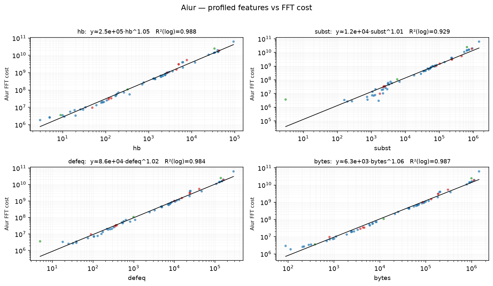
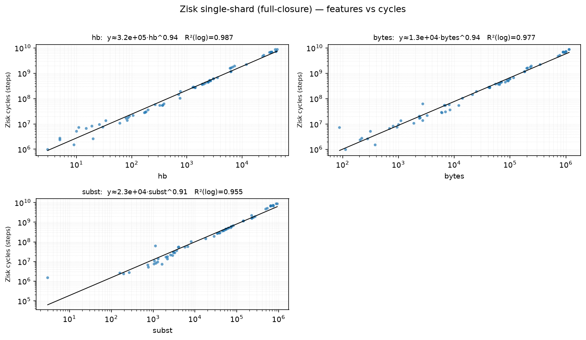
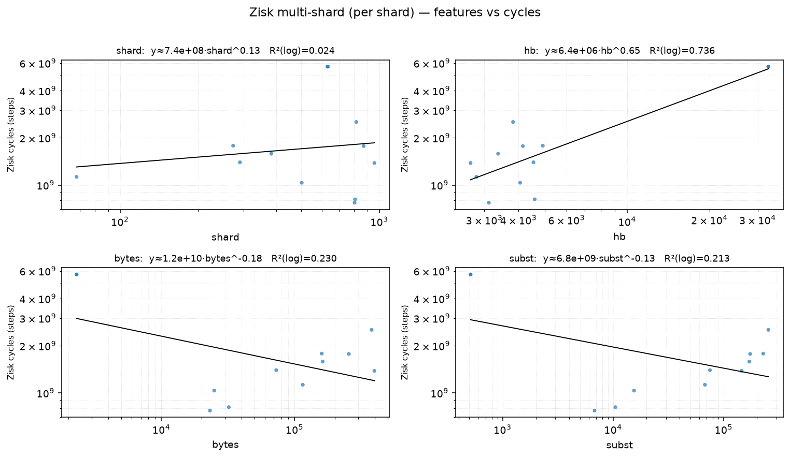
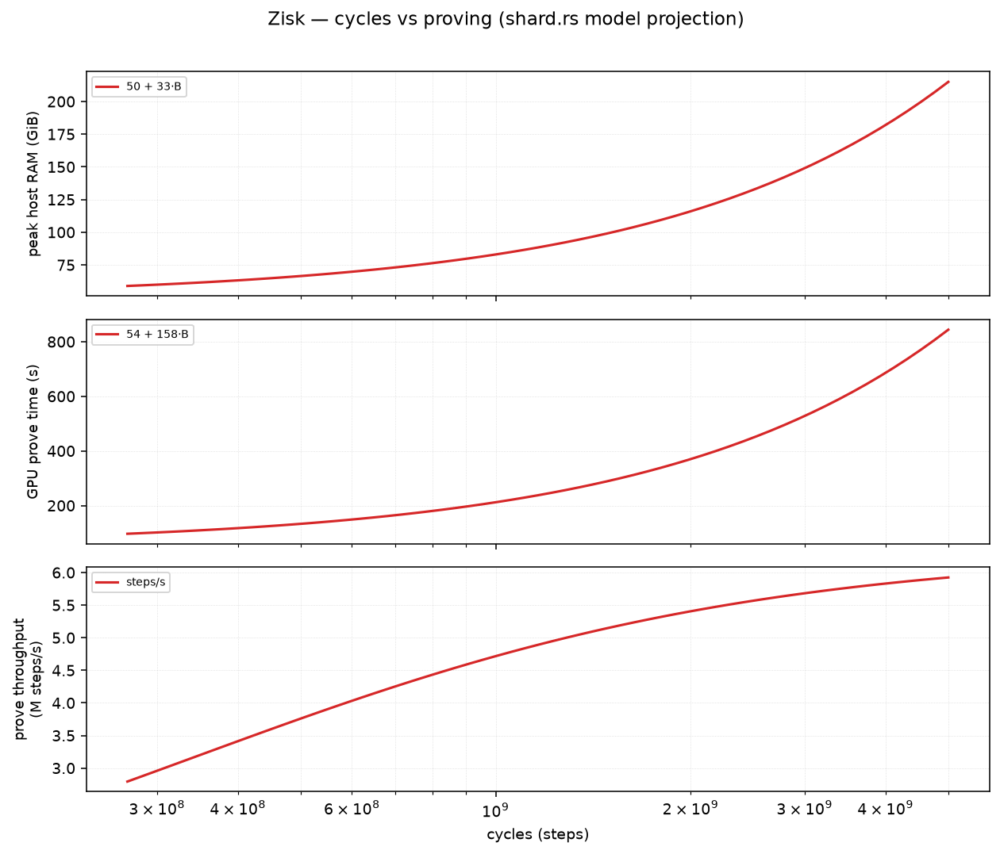
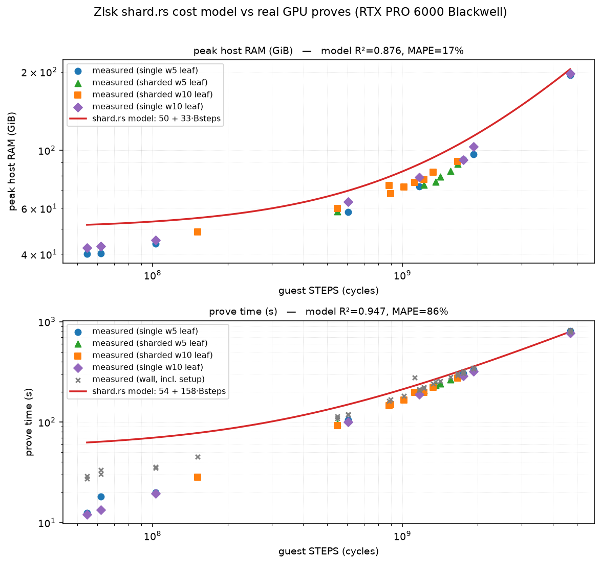

# Benchmarks/Statistics

A small, general-purpose Python project for **modelling and plotting measured
benchmark data** for the proving stacks — currently **Aiur** (FFT-cost) and
**Zisk** (zkVM cycles). Two regimes per system:

1. **profiled features → cost** — predict the deterministic cost (Aiur FFT /
   Zisk cycles) from cheap out-of-circuit profiler counters (`hb`, `subst`,
   `defeq`, `bytes`), so you can pick benchmark targets by budget before running.
2. **cost → runtime** — predict execution / proving **time, throughput, and RAM**
   from the cost.

## Layout

```
benchstats/        # the package: load.py, fit.py, plot.py, __main__.py (CLI)
data/
  aiur/  cost.csv             FFT cost + exec/prove time + peak RAM, per constant
         features.csv         native profiler features + measured FFT
         predicted_vs_actual.csv
  zisk/  single_shard.csv     full-closure single-constant: features + cycles
         multi_shard.csv      per-shard: features + cycles
         prove_real.csv       real GPU proves: steps, prove time, peak RAM
docs/    aiur-cost-dataset.md        FFT → exec/prove/RAM models + the full table
         aiur-fft-cost-model.md      predicting FFT from features (cost drivers, ceiling)
         aiur-predicted-vs-actual.md per-constant predicted vs actual
         zisk-prove-validation.md    shard.rs model vs real GPU proves (R²)
figures/ # rendered PNGs (gitignored — regenerate and view with `kitten icat`)
```

## Usage

The `nix develop` dev shell provides `python3` with matplotlib, so just:

```bash
python3 -m benchstats all          # render every graph to figures/
python3 -m benchstats aiur-runtime # or one graph; add --svg for vector
```

Outside Nix, `pip install matplotlib` into a venv first.

## Graph catalogue

| command | graph | data | status |
|---|---|---|---|
| `aiur-predictor` | profiled `hb/subst/defeq/bytes` vs **FFT** (one panel each, power-law fit) | `data/aiur/features.csv` | ✅ n=65 |
| `aiur-runtime` | **FFT** vs exec {time, throughput, RAM}; and vs prove {time, throughput, RAM} (two figures, stacked panels) | `data/aiur/cost.csv` | ✅ n=98; RAM is the *process* peak (execute+prove — for completers the peak is in prove, so exec-phase RAM isn't separated) |
| `zisk-predictor` | profiled features vs **cycles**, single-shard **and** multi-shard (two figures) | `data/zisk/{single,multi}_shard.csv` | ✅ single n=66, multi n=12 |
| `zisk-runtime` | **cycles** vs prove {time, throughput, RAM} — projection of the `shard.rs` model | constants read from `shard.rs` | ✅ model projection (no fit) |
| `zisk-prove-validate` | the **actual `shard.rs` model** (`50+33·B` RAM, `54+158·B` time) vs **real GPU proves**, with R² | `data/zisk/prove_real.csv` | ✅ n=31 leaves (single + sharded, witness 5 & 10); RAM R²=0.88, time R²=0.95; witness=10 ≈ no RAM change — see `docs/zisk-prove-validation.md` |

> `zisk-runtime` and `zisk-prove-validate` read the model **constants from the
> in-repo planner** (`crates/kernel/src/shard.rs`, the single source of truth) via
> `benchstats/shard_model.py` — they plot the code's model, never a fitted one.
> Override with `--shard-rs <path>` (defaults to the in-repo file; falls back to
> `~/ix/crates/kernel/src/shard.rs` outside a full worktree).

## Figures

Rendered to `figures/` by `python3 -m benchstats all` and committed for reference
(regenerate any time — they're deterministic from the data + `shard.rs`).

### Aiur
| profiled features → FFT | FFT → execution | FFT → proving |
|---|---|---|
|  |  |  |

### Zisk
| features → cycles (single-shard) | features → cycles (multi-shard) |
|---|---|
|  |  |

| cycles → proving (`shard.rs` model projection) | **`shard.rs` model vs real GPU proves** |
|---|---|
|  |  |

## Data provenance

- **Aiur FFT cost** (`computeStats.totalFftCost`) and exec/prove/RAM: the on-tree
  `bench-typecheck --ixe` / `ix check --stats-out` (full-closure `verify_claim`).
- **Native profiler features** (`hb/subst/defeq/bytes`): the `ix` repo's
  `only_const_profile` example (`IX_PROFILE_COUNTERS=1`, out of circuit).
- **Zisk cycles** and the prove-time/RAM model: `zisk-host --execute` and the
  shard-prover measurements — see `ix` repo `docs/zisk-cycle-cost-model.md`,
  the companion to `docs/aiur-fft-cost-model.md`.

Regenerate the underlying data with the commands in those docs; this project
just models and plots it.
