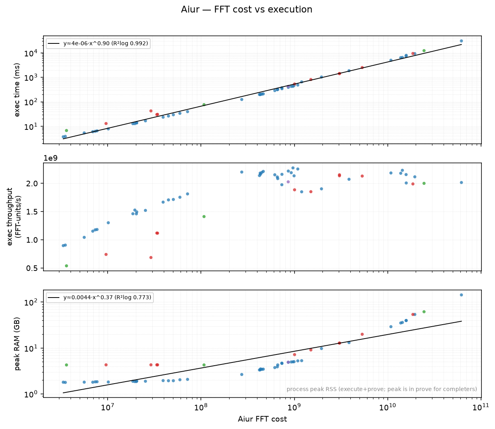
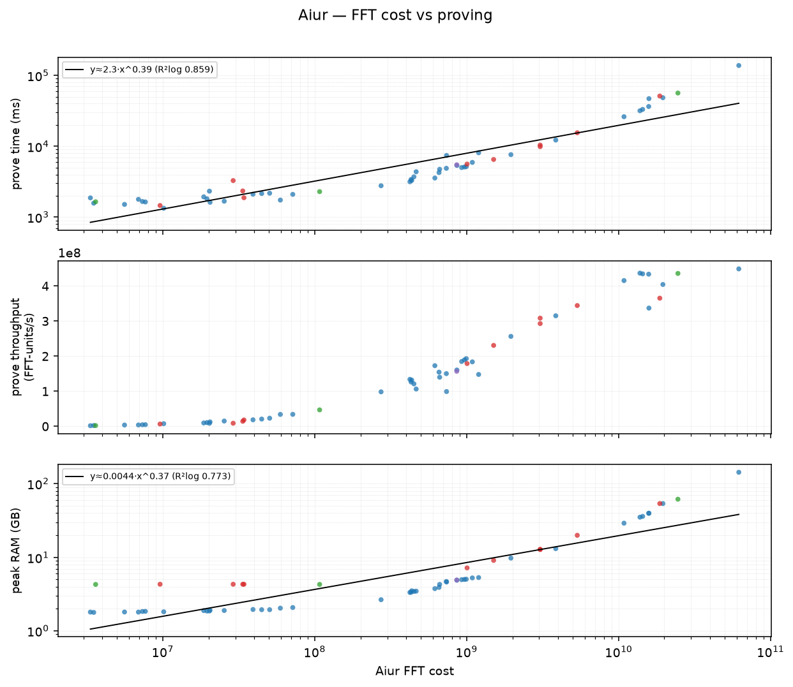

# Aiur FFT cost → execution time, proving time, and RAM

This benchmark relates an Aiur computation's **FFT cost** — a cheap, deterministic structural measure (`Ix.Aiur.Statistics.computeStats.totalFftCost`, summed over all constrained circuits) — to the wall-clock cost of running and proving it. The workload is a **full-closure typecheck** through the IxVM kernel's `verify_claim` entrypoint (`Ix.Claim.check addr none`), which re-typechecks every constant in the target's transitive closure. Each row is one Lean constant. Measured on `main` (`ad7e383`), a 32-core / 250 GB host.

**Why it's useful:** from a constant's FFT cost alone you can predict its execution time, proving time, and peak RAM before running it — useful for choosing benchmark targets that fit a timeout or memory budget.

**Predicting the FFT cost itself** (without running the Aiur prover) — from cheap out-of-circuit profiler features (`hb`/`subst`/`defeq`/`bytes`) — is documented in the companion **`aiur-fft-cost-model.md`** (this directory): the exact formula `Σ width·h·log₂h`, the per-circuit cost drivers (BLAKE3←bytes, instantiation←subst, memory←defeq, plus the unpredicted big-Nat `klimbs` family), and a cheap `n·log₂n` model at R²≈0.976.

**Dataset:** 61 points, each a distinct constant *shape*, spanning FFT cost **1.86e+06 → 6.18e+10**, plus 6 that exceeded available RAM. The `env` column is the defining **library** (40 Init, 3 Std, 6 Mathlib, 1 Lean, 11 IxVM test fixtures) — by each constant's *defining module*, which can differ from its name's namespace (e.g. `Lean.Name.hash` is `Init.Prelude`; `ByteSlice.ofByteArray` is `Std.Data.ByteSlice`).

## Models (n=61)

| quantity | formula | R² | notes |
|---|---|---|---|
| Execution time | `exec_ms ≈ 4.903e-07 · fft` (through origin) | 0.9989 | ≈ 0.490 ms per million FFT-units. Near-perfectly linear. |
| Proving time | `prove_ms ≈ 2865 + 2.211e-06 · fft` | 0.9956 | ≈ 2.21 ms per million FFT-units above a ~1.45 s floor (FRI/commitment setup). Mildly sublinear. |
| Peak RAM | `peakGB ≈ 3.27 + 2.333e-09 · fft` | 0.9940 | ≈ **2.44 GB per billion FFT-units** (n=39). Full-closure ceiling ~90–100 B FFT on a 250 GB host. |

Library doesn't matter to cost — Init/Std/Lean/Mathlib all land on the same lines; the cost is the closure's checking work (lazy `.ixe` load just avoids the ~104 GB eager whole-env load that would otherwise gate Mathlib).

## Data points (sorted by FFT cost)

| # | constant | env | shape | FFT cost | FFT (×10⁹) | exec (ms) | prove (ms) | peak RAM (GB) |
|--:|---|---|---|--:|--:|--:|--:|--:|
| 1 | `Nat` | Init | inductive type | 1,857,523 | 0.002 | 2.3 | 1,451.0 | — |
| 2 | `Eq.rec` | Init | recursor | 2,575,400 | 0.003 | 2.5 | 1,696.6 | — |
| 3 | `IxVMInd.Tree` | IxVM | nested inductive | 2,633,415 | 0.003 | 3.0 | 2,091.9 | — |
| 4 | `Trans.mk` | Init | structure constructor | 2,911,629 | 0.003 | 2.8 | 2,269.8 | — |
| 5 | `Array.toList` | Init | array→list conversion | 3,332,563 | 0.003 | 3.7 | 1,873.4 | 1.8 |
| 6 | `Acc.rec` | Init | accessibility recursor | 3,505,064 | 0.004 | 3.9 | 1,575.8 | 1.8 |
| 7 | `Std.Time.Month.Offset.ofNat` | Std | calendar offset | 3,607,673 | 0.004 | 6.7 | 1,649.5 | 4.3 |
| 8 | `IxVMInd.Tree.rec` | IxVM | nested recursor | 4,858,321 | 0.005 | 4.0 | 2,349.2 | — |
| 9 | `Sum.elim` | Init | sum eliminator | 5,589,905 | 0.006 | 5.4 | 1,514.0 | 1.8 |
| 10 | `Prod.map` | Init | product map | 6,904,183 | 0.007 | 6.0 | 1,786.0 | 1.8 |
| 11 | `Option.bind` | Init | monadic bind | 7,329,183 | 0.007 | 6.2 | 1,664.4 | 1.8 |
| 12 | `IxVMPrim.nat_succ_lit` | IxVM | primitive: successor | 7,330,826 | 0.007 | 4.6 | 2,080.3 | — |
| 13 | `WellFounded.fix` | Init | well-founded fixpoint | 10,125,144 | 0.010 | 7.8 | 1,337.2 | 1.8 |
| 14 | `Nat.add` | Init | function reduction | 13,343,000 | 0.013 | 8.2 | 3,006.0 | — |
| 15 | `List.foldr` | Init | list fold | 18,579,757 | 0.019 | 12.7 | 1,935.8 | 1.9 |
| 16 | `List.range` | Init | list generator | 20,251,801 | 0.020 | 13.9 | 2,327.3 | 1.9 |
| 17 | `IxVMPrim.nat_ble_lit` | IxVM | primitive: Bool predicate (≤) | 23,016,526 | 0.023 | 12.2 | 2,889.5 | — |
| 18 | `IxVMPrim.nat_mul_big` | IxVM | primitive: multiplication | 24,580,879 | 0.025 | 12.6 | 2,871.7 | — |
| 19 | `IxVMInd.Even` | IxVM | mutual inductive | 26,482,492 | 0.026 | 13.3 | 3,081.6 | — |
| 20 | `IxVMInd.Even.rec` | IxVM | mutual recursor | 32,164,273 | 0.032 | 15.6 | 2,942.8 | — |
| 21 | `Nat.factorial` | Mathlib | factorial | 33,562,426 | 0.034 | 30.0 | 2,341.7 | 4.3 |
| 22 | `Int.add` | Init | integer addition | 44,714,703 | 0.045 | 26.2 | 2,156.1 | 1.9 |
| 23 | `BitVec.toFin` | Init | bitvec→fin | 50,437,466 | 0.050 | 29.4 | 2,178.5 | 1.9 |
| 24 | `Nat.add_comm` | Init | arithmetic theorem | 56,084,908 | 0.056 | 26.6 | 3,301.9 | — |
| 25 | `USize.toNat` | Init | fixed-width→nat | 71,607,481 | 0.072 | 39.5 | 2,095.9 | 2.1 |
| 26 | `Nat.decEq` | Init | decidable equality | 71,921,625 | 0.072 | 33.0 | 3,163.0 | — |
| 27 | `ByteSlice.ofByteArray` | Std | byte-slice construction | 107,574,377 | 0.108 | 76.2 | 2,292.2 | 4.3 |
| 28 | `Nat.decLe` | Init | decidable order | 209,641,496 | 0.210 | 84.9 | 3,534.9 | — |
| 29 | `Nat.strongRecOn` | Init | strong recursion | 273,068,854 | 0.273 | 124.1 | 2,777.1 | 2.7 |
| 30 | `IxVMPrim.nat_div_lit` | IxVM | primitive: division | 405,607,545 | 0.406 | 164.7 | 4,705.1 | — |
| 31 | `Int.emod` | Init | integer mod | 422,940,733 | 0.423 | 197.9 | 3,157.9 | 3.3 |
| 32 | `Array.foldl` | Init | array fold | 449,323,126 | 0.449 | 204.8 | 3,712.2 | 3.4 |
| 33 | `Nat.sub_le_of_le_add` | Init | order theorem | 567,575,653 | 0.568 | 231.3 | 5,009.3 | — |
| 34 | `IxVMPrim.bv_to_nat_lit` | IxVM | primitive: BitVec→Nat | 635,780,327 | 0.636 | 283.4 | 5,208.2 | — |
| 35 | `Int.gcd` | Init | integer gcd | 657,502,637 | 0.658 | 311.2 | 4,257.2 | 3.9 |
| 36 | `IxVMPrim.nat_gcd_lit` | IxVM | primitive: gcd (recursive) | 665,518,356 | 0.666 | 265.0 | 5,203.1 | — |
| 37 | `Array.map` | Init | array map | 734,574,964 | 0.735 | 371.8 | 4,888.7 | 4.7 |
| 38 | `String.Internal.append` | Init | string concatenation | 793,580,333 | 0.794 | 335.1 | 5,273.9 | — |
| 39 | `Lean.Expr.replace` | Lean | expr traversal | 859,625,514 | 0.860 | 424.2 | 5,485.9 | 4.9 |
| 40 | `Lean.Name.hash` | Init | name hashing | 861,742,653 | 0.862 | 388.6 | 5,366.6 | 4.9 |
| 41 | `BitVec.umod` | Init | bitvec modulo | 926,177,790 | 0.926 | 423.2 | 5,012.8 | 5.0 |
| 42 | `Nat.repr` | Init | number→string | 966,452,765 | 0.966 | 425.1 | 5,104.1 | 5.0 |
| 43 | `GCDMonoid.gcd` | Mathlib | monoid gcd | 1,005,736,276 | 1.006 | 533.5 | 5,620.5 | 7.2 |
| 44 | `String.intercalate` | Init | string join | 1,089,240,518 | 1.089 | 483.2 | 5,925.9 | 5.3 |
| 45 | `IxVMPrim.nat_land_lit` | IxVM | primitive: bitwise-and | 1,138,665,214 | 1.139 | 497.4 | 6,952.5 | — |
| 46 | `_private.Init.Prelude.0.Lean.extractMainModule._unsafe_rec` | Init | unsafe recursor | 1,197,925,029 | 1.198 | 578.0 | 6,904.8 | — |
| 47 | `Char.toLower` | Init | char case map | 1,198,467,414 | 1.198 | 647.8 | 8,104.5 | 5.3 |
| 48 | `Nat.Prime.two_le` | Mathlib | primality proof | 1,504,045,298 | 1.504 | 812.1 | 6,519.0 | 9.1 |
| 49 | `Nat.gcd_comm` | Init | gcd-commutativity theorem | 1,954,958,779 | 1.955 | 1,027.5 | 7,624.7 | 9.8 |
| 50 | `Finset.sum` | Mathlib | finite sum | 3,045,189,408 | 3.045 | 1,415.5 | 10,396.1 | 12.8 |
| 51 | `Int.emod_emod_of_dvd` | Init | omega/inference theorem | 3,856,852,693 | 3.857 | 1,861.3 | 12,239.9 | 13.1 |
| 52 | `Vector.append` | Init | vector append lemma | 4,023,268,168 | 4.023 | 1,718.6 | 14,612.3 | — |
| 53 | `Polynomial.eval` | Mathlib | polynomial evaluation | 5,342,731,754 | 5.343 | 2,509.5 | 15,517.5 | 19.9 |
| 54 | `Fin.foldl` | Init | finite-range fold | 10,853,255,199 | 10.853 | 4,970.2 | 26,124.9 | 29.1 |
| 55 | `List.mergeSort` | Init | merge sort | 13,825,318,985 | 13.825 | 6,346.1 | 31,659.1 | 35.1 |
| 56 | `Array.binSearch` | Init | binary search | 14,397,133,548 | 14.397 | 6,453.2 | 33,123.7 | 36.0 |
| 57 | `Array.qsort` | Init | quicksort | 15,781,689,533 | 15.782 | 7,322.5 | 36,384.2 | 39.7 |
| 58 | `Multiset.sort` | Mathlib | multiset sort | 18,670,960,624 | 18.671 | 9,385.2 | 51,109.6 | 53.8 |
| 59 | `String.split` | Init | string splitting | 19,578,088,286 | 19.578 | 9,255.2 | 48,419.9 | 53.8 |
| 60 | `Std.Time.Week.Offset.ofMilliseconds` | Std | time-unit conversion (ms→week) | 24,577,209,792 | 24.577 | 12,290.1 | 56,386.4 | 61.6 |
| 61 | `Vector.extract_append` | Init | vector extract/append lemma | 61,830,646,478 | 61.831 | 30,695.5 | 137,766.9 | 143.2 |

Peak RAM is the full-process high-water RSS (execute + prove), reported where captured.

### Provenance

FFT cost is deterministic *for a given toolchain*. Rows measured on current HEAD (`ad7e383`) reproduce exactly via `bench-typecheck` — verified bit-identical for `List.mergeSort`/`Array.qsort`/`String.split`, and all Std/Mathlib rows. The foundational small-`Nat`, `IxVM*`, and append rows were measured on a **pre-`#450` snapshot** and read **~1 % high** vs current main (`#450` "Nat-layer FFT cuts", the current HEAD commit, lowered them after — e.g. `Nat.add_comm` 56.08 M here vs **55.50 M** now). This ≲1 % shift on a few small constants doesn't affect the fits.

## Exceeded available memory

These could not complete: the full-closure typecheck grew past the host's safe memory limit and was stopped before exhausting RAM. What drives memory is the total reduction work of the whole closure — not the headline constant (e.g. `Matrix.det` pulls the whole commutative-algebra hierarchy; `Std.HashMap.insert` pulls the `DHashMap`/`AssocList` well-founded-recursion proofs). `Std.HashMap.insert` OOMs the same way **even over the lazy `.ixe`** (the cost is checking work, not env loading), which is why `aiur-bench.yml` excludes it. These can be characterized with the native Rust kernel (`ix check-rs`) or out-of-circuit (`ix profile`), or measured in Aiur via **subject-only** checking (`verify_const`, deps trusted) — a different, much cheaper workload.

| constant | env | peak RAM before stop (GB) |
|---|---|--:|
| `Std.Tactic.BVDecide.BVExpr.bitblast.goCache_Inv_of_Inv._mutual` | Std | 186 |
| `String.toList` | Init | 212 |
| `Matrix.det` | Mathlib | 215 |
| `Substring.toString` | Init | 215 |
| `Std.Time.PlainTime.addMinutes` | Std | 215 |
| `String.foldl` | Init | 216 |

## Reproducing with main's benchmark infra

Reproducible with the on-tree `bench-typecheck` (the same tool `aiur-bench.yml` drives) over a lazily-loaded `.ixe`:

```
lake build ix bench-typecheck
# Init/Std env (also has the Std.* and ByteSlice/Std.Time constants):
ix compile Benchmarks/Compile/CompileInitStd.lean --out initstd.ixe
bench-typecheck --ixe initstd.ixe Array.qsort String.split Std.Time.Week.Offset.ofMilliseconds --json out.json --texray
# Mathlib env (lazy load keeps RAM modest — Multiset.sort 18.7B fft -> ~54 GB):
ix compile Benchmarks/Compile/CompileMathlib.lean --out mathlib.ixe
bench-typecheck --ixe mathlib.ixe Finset.sum Polynomial.eval Multiset.sort --json out.json --texray
python3 fit_fft.py ../data/aiur/cost.csv
```

Pass the bare constant name — **not** a library-prefixed one: the library isn't part of the `Lean.Name`, so `Init.Nat.add_comm` / `Std.Array.qsort` resolve to "not found". `bench-typecheck` emits `fft-cost` (deterministic), `execute-time`, `prove-time`, `constants` (closure size), and — with `--texray` — the proving-phase `peak-rss` that `aiur-bench.yml` tracks. The `IxVM*` rows are test fixtures from `Tests/Ix/IxVM.lean` (reproducible via `ix check <name>` over the IxTests env, pinned in `kernelCheckEntries`).

Columns in `../data/aiur/cost.csv`: `name, fft_cost, exec_us, prove_ms, proof_bytes, peak_rss_kb, source, env`. Fit script: `python -m benchstats`.

## Plotting the relationships

`python3 -m benchstats aiur-runtime` renders two figures (points coloured by `env`):

- `figures/aiur_exec_vs_fft.png` — FFT cost vs **execution**: time, throughput, peak RAM (stacked panels sharing the FFT x-axis).
- `figures/aiur_prove_vs_fft.png` — FFT cost vs **proving**: time, throughput, peak RAM.




The `nix develop` dev shell provides `python3` with matplotlib (outside Nix, `pip install matplotlib` into a venv). `benchstats` fits the **full raw CSV** (n=98), so its overlaid coefficients (e.g. `prove ≈ 2958 + 2.23e-6·fft`) differ slightly from the collapsed n=61 headline models above, which are fit on the deduplicated distinct-shape set.
