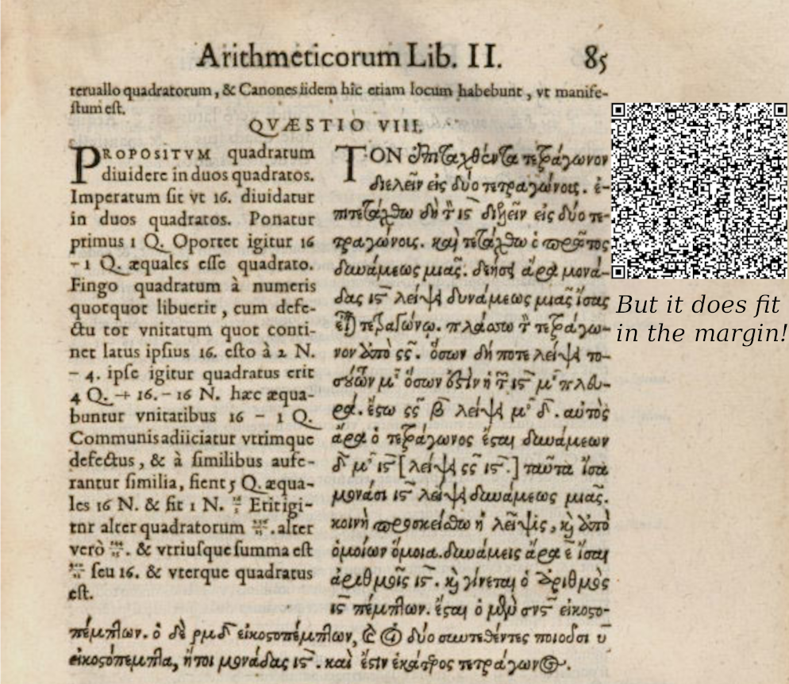

# Ix: a zero-knowledge proof-carrying code platform

> We have just folded space from Ix. Many machines on Ix. New machines.


-----------

The Ix platform enables the compilation of [Lean
4](https://github.com/leanprover/lean4) programs into zero-knowledge succinct
non-interactive arguments of knowledge (zk-SNARKs). This allows the execution
and typechecking of any Lean program to be verified by performing a
sub-100-millisecond operation against an approximately 1 kilobyte certificate,
regardless of the size of the original Lean program. In fact, the correctness of
the entire [mathlib](https://github.com/leanprover-community/mathlib4) library
of formal mathematics, containing around 2 million lines of code, may be
compiled in this way into a single kilobyte sized cryptographic certificate.

We call this technique zero-knowledge proof-carrying code or **zkPCC**, as an
extension of the well-known [proof-carrying
code](https://en.wikipedia.org/wiki/Proof-carrying_code) paradigm. Instead
of a host system verifying formal proofs carried by an application as in
proof-carrying code, in **zkPCC** the host or user verifies a cryptographic
zero-knowledge proof generated from the typechecking of that formal proof. This
greatly improves the runtime cost of this verification operation (potentially
even up to O(1) depending on the specific zk-SNARK protocol used) and minimizes
the complexity of locally dependent tooling (e.g. build systems for the formal
proof language).

Additionally, while in proof-carrying code an application must reveal the proof
artifact that demonstrates some formal property to the user, in **zkPCC** this
proof artifact may be kept private, which opens up new possibilities for economic
transactions over proofs.

> :warning: **This repository is a pre-alpha work in progress and should not be used for any purpose.**

## Use Cases

Our expectation is that Ix, and **zkPCC** in general, will allow applications to frictionlessly ship
security guarantees to their users. Some possible use cases could be:

- Software written in compiled languages like Rust can attach to their binaries
  proofs of type signatures or other formal properties verified by tools
  [Aeneas](https://github.com/AeneasVerif/aeneas). Given mature
  certified compilation infrastructure (e.g. a future
  [CompCert](https://en.wikipedia.org/wiki/CompCert) equivalent in Lean4),
  proofs that the compilation occurred correctly can also be attached, which
  would mitigate supply-chain attacks, such as those famously described by Ken
  Thompson in [Reflections on Trusting
  Trust](https://www.cs.cmu.edu/~rdriley/487/papers/Thompson_1984_ReflectionsonTrustingTrust.pdf).
  This would also enable secure decentralized binary caching, saving on the need
  for duplicative local recompilation or expensive continuous integration
  software.
- In operating systems, hardware based process isolation costs [25%-33% overhead
  in terms of processor
  cycles](https://research.cs.wisc.edu/areas/os/Seminar/schedules/papers/Deconstructing_Process_Isolation_final.pdf).
  This means everytime you buy a laptop, cell phone, web server, you have to pay
  for a third more computing power, because we don't know how to safely run
  applications in protection ring 0. By reducing verification overhead and
  improving portability over proof-carrying code, **zkPCC** potentially enables more
  sophisticated software-based process isolation.
- Decentralized platforms like the [Ethereum blockchain](https://ethereum.org/)
  could publish [formal specifications of their protocol](https://github.com/ConsenSys/eth2.0-dafny)
  and then require clients, layer-2s, zkVMs, etc. to publish **zkPCC** proofs
  that their current specific version satisfies such specifications. Such proofs
  could be verified on-chain, and even programmatically gate certain protocol updates
  (e.g. version X validates that version X+1 is a correct update).
- Individual smart contracts can publish on-chain proofs of their [formal
  models](https://ethereum.org/en/developers/docs/smart-contracts/formal-verification/)
  or proofs showing that their bytecode was generated from particular sources
  (currently a trusted block explorer feature).
- Cryptographic projects like the [risc0 zkVM](https://risczero.com/)
  could include a proof of the correctness of their [Lean 4 formal
  model](https://github.com/risc0/risc0-lean4) alongside (or aggregated within)
  every proof produced by their zkVM.

-----------

### Example: Embedding Fermat's Last Theorem in Fermat's Margin Note

In or around 1637, the mathematician Pierre Fermat conjectured the following:

> 1. It is impossible to separate a cube into two cubes, or a fourth power into two
> fourth powers, or in general, any power higher than the second, into two like
> powers.
> 2. I have discovered a truly marvelous proof of this
> 3. which this margin is too narrow to contain.

The first part of this statement famously evaded proof for over 350 years before
finally being demonstrated by Andrew Wiles in 1994. Mathematicians and
historians of mathematics have also long debated the second part, whether
Fermat's claim that he possessed a proof of the first part is credible, which
seems unlikely given the complexity and modern mathematical infrastructure used
by the Wiles proof of the first part. Rarely discussed, however, is the third
part, which is in fact a statement of proof theory, specifically one which
proposes a information theoretic lower bound to the size of the proof of a
particular proposition.

The specific margin in question is [page 85 in the 1621 edition of Diophantus'
Arithmetica](https://en.wikipedia.org/wiki/Fermat's_Last_Theorem#/media/File:Diophantus-II-8.jpg),
which is a folio volume with dimensions [353mm tall by 225mm wide by 40mm deep](https://www.sophiararebooks.com/pages/books/6237/diophantus-of-alexandria/arithmeticorum-libri-sex-et-de-numeris-multangulis-liber-unus-nunc-primum-graece-latine-editi). Leaving the precise dimensions of the margins as an exercise to the reader,
it is trivial to show the proposition is false regardless of margin size, or
the size of the proof (up to very large bounds) if one permits the proof to
printed in the margin using arbitrarily small text, using microfilm,
photolithography, etc. It is more interesting to assume that what Fermat meant
was that the margin is too narrow to contain a proof written in Fermat's own
handwriting.

Happily, we have an example of text we know would satisfy this constraint,
Fermat's margin note itself! In Latin, the note reads:

> Cubum autem in duos cubos, aut quadratoquadratum in duos quadratoquadratos & generaliter nullam in infinitum ultra quadratum potestatem in duos eiusdem nominis fas est dividere cuius rei demonstrationem mirabilem sane detexi. Hanc marginis exiguitas non caperet.

At 262 characters, and 8-bits per character, this is 2096 bits, or 262 bytes.
This is quite small, but fortunately not quite as small as a [Groth16 proof over
BN254](https://2π.com/23/bn254-compression/):

> A Groth16 proof has two G1 points and one G2. In the BN254 pairing curve these take 64 and 128 bytes respectively uncrompressed totaling 256 bytes for a proof.

So if we can show that a Groth16 proof of *a* proof of the first part of
Fermat's Last Theorem is constructible, we will have clearly - though
non-constructively- disproven the third part. 

[A Lean 4 formalization of Fermat's Last
Theorem](https://github.com/ImperialCollegeLondon/FLT) is in progress, and gives
the statement as:

```lean4
theorem PNat.pow_add_pow_ne_pow
    (x y z : ℕ+)
    (n : ℕ) (hn : n > 2) :
    x^n + y^n ≠ z^n :=
  PNat.pow_add_pow_ne_pow_of_FermatLastTheorem FLT.Wiles_Taylor_Wiles x y z n hn
```

Currently, as the dependencies of this theorem contain `sorry` holes, we cannot
feed it through `ix` (which only works over complete program graphs). Once the
formalization is complete, however, you will be able to do

```
> ix store FLT.lean PNat.pow_add_pow_ne_pow
e53c3d4bad8538e152a89d8bf75be178a3876252744961b9a087fe3973545c20
> ix prove --check e53c3d4bad8538e152a89d8bf75be178a3876252744961b9a087fe3973545c20
b44236ba17ad7445ae3eac48a8ba86ba00f08c069237b08451e311b688146e7e
```

to generate a [Binius](https://www.irreducible.com/binius) proof that the
theorem typechecks. With a Groth16 circuit that recursively proves verification
of Binius proofs, i.e. a Groth16 final SNARK for Binius, the construction is
complete, and we can embed a proof of Fermat's Last Theorem in Fermat's Margin
Note.



-----------

## Architecture

Ix consists of the following core components:

- [The Ix compiler](https://github.com/argumentcomputer/ix/blob/main/Ix/CompileM.lean),
  which transforms Lean 4 programs into a format called `ixon`, [the ix object
  notation](https://github.com/argumentcomputer/ix/blob/main/docs/Ixon.md),
  which is an alpha-invariant content-addressable serialization or wire format.
  The compiler also includes a decompiler to convert `ixon` objects back into
  Lean programs (by preserving the alpha-relevant metadata in a separate ixon
  object and re-merging the computationally relevant and irrelevant parts).
- The [Aiur zkDSL](https://github.com/argumentcomputer/ix/tree/main/Ix/Aiur)
  which is a first-order functional programming language that generates Binius
  circuits.
- The [Archon
  library](https://github.com/argumentcomputer/ix/tree/main/Ix/Archon), which
  provides high-level abstractions and FFI bindings in Lean for the Binius
  libraries in Rust, as well as other Rust dependencies.
- The IxVM (not yet released), which implements reduction and typechecking
  of `ixon` (including ingress and egress from and to binary data).
- Binius precompiles for the IxVM, including the Blake3 hash function and Lean4
  primitives. This work has been [upstreamed](https://github.com/IrreducibleOSS/binius/pulls?q=is%3Apr+Blake3+is%3Aclosed) to Binius where possible.
- Integration with the [iroh p2p network](https://www.iroh.computer/) so that
  different ix users can easily share `ixon` data between themselves.


## Build & Install

- Build and test the Ix library with `lake build` and `lake test`

- Run the Ix CLI with `lake exe ix`. Install the binary with `lake run install`
    - `ix store <lean-file>` will compile a lean program into the ix store as
      ixon data
    - `ix store get <address>` will print the value of ixon data at the given
      address

### Nix

#### Prerequisites

- Install [Nix](https://nixos.org/download/)

- Enable [Flakes](https://zero-to-nix.com/concepts/flakes/)
  - Add `experimental-features = nix-command flakes` to `~/.config/nix/nix.conf`
    or `/etc/nix/nix.conf`
  - Add `trusted-users = root MYUSER` to `/etc/nix/nix.conf`
  - Then restart the Nix daemon with `sudo pkill nix-daemon`

- *Recommended*: Install [Cachix](https://docs.cachix.org/installation). This
  will use our cached nix flake artifacts, saving you from recompiling Lean and
  other dependencies from scratch, which can take a substantial amount of time.
  - Run `nix profile install --accept-flake-config nixpkgs#cachix`
  - Enable the cache with `cachix use argumentcomputer`
  - When building, you should see `querying <...> on
    https://argumentcomputer.cachix.org`

#### Build

Build and run the Ix CLI with `nix build` and `nix run`.

To build and run the test suite, run `nix build .#test` and `nix run .#test`.

#### Cache Troubleshooting

If the Nix build hangs with a message like `building lean-stage0`, it's not
finding the cached packages and will likely take >15 minutes to build the Lean
compiler from source. Ctrl+C and check the following:

- Note that caching is only provided for `x86_64-linux` and `aarch64-darwin` at
  the moment
- Make sure `substituters` and `trusted-public-keys` have been added to
  `~/.config/nix/nix.conf`
- Try restarting the Nix daemon again
- Check the given derivation is present in the cache, see the [Cachix FAQ](https://docs.cachix.org/faq#why-is-nix-not-picking-up-on-any-of-the-pre-built-artifacts)
- Check the Lean version is supported at
  https://github.com/argumentcomputer/lean4-nix/tree/dev/manifests
