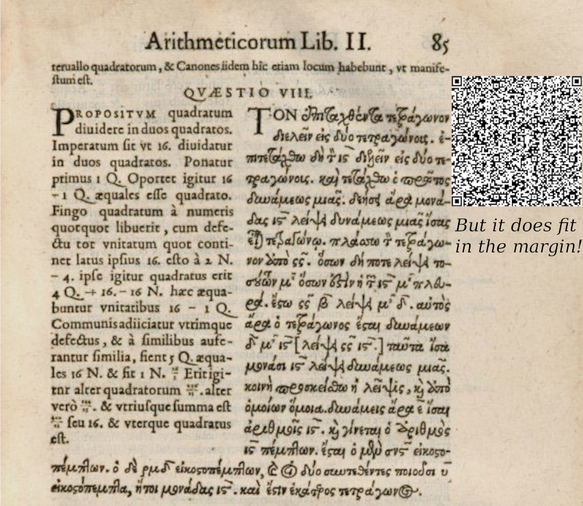

# Ix: a zero-knowledge proof-carrying code platform

> We have just folded space from Ix. Many machines on Ix. New machines.


-----------

The Ix platform enables the compilation of [Lean
4](https://github.com/leanprover/lean4) programs into zero-knowledge succinct
non-interactive arguments of knowledge (zk-SNARKs). This allows the execution
and typechecking of any Lean program to be verified by performing a
sub-100-millisecond operation against an approximately 1 kilobyte certificate,
regardless of the size of the original Lean program. In fact, the correctness of
the entire [mathlib](https://github.com/leanprover-community/mathlib4) library
of formal mathematics, containing around 2 million lines of code, may be
compiled in this way into a single kilobyte sized cryptographic certificate.

We call this technique zero-knowledge proof-carrying code or **zkPCC**, as an
extension of the well-known [proof-carrying
code](https://en.wikipedia.org/wiki/Proof-carrying_code) paradigm. Instead
of a host system verifying formal proofs carried by an application as in
proof-carrying code, in **zkPCC** the host or user verifies a cryptographic
zero-knowledge proof generated from the typechecking of that formal proof. This
greatly improves the runtime cost of this verification operation (potentially
even up to O(1) depending on the specific zk-SNARK protocol used) and minimizes
the complexity of locally dependent tooling (e.g. build systems for the formal
proof language).

Additionally, while in proof-carrying code an application must reveal the proof
artifact that demonstrates some formal property to the user, in **zkPCC** this
proof artifact may be kept private, which opens up new possibilities for economic
transactions over proofs.

> :warning: **This repository is a pre-alpha work in progress and should not be used for any purpose.**

## Use Cases

Our expectation is that Ix, and **zkPCC** in general, will allow applications to frictionlessly ship
security guarantees to their users. Some possible use cases could be:

- Software written in compiled languages like Rust can attach to their binaries
  proofs of type signatures or other formal properties verified by tools such as
  [Aeneas](https://github.com/AeneasVerif/aeneas). Given mature
  certified compilation infrastructure (e.g. a future
  [CompCert](https://en.wikipedia.org/wiki/CompCert) equivalent in Lean4),
  proofs that the compilation occurred correctly can also be attached, which
  would mitigate supply-chain attacks, such as those famously described by Ken
  Thompson in [Reflections on Trusting
  Trust](https://www.cs.cmu.edu/~rdriley/487/papers/Thompson_1984_ReflectionsonTrustingTrust.pdf).
  This would also enable secure decentralized binary caching, saving on the need
  for duplicative local recompilation or expensive continuous integration
  software.
- In operating systems, hardware based process isolation costs [25%-33% overhead
  in terms of processor
  cycles](https://research.cs.wisc.edu/areas/os/Seminar/schedules/papers/Deconstructing_Process_Isolation_final.pdf).
  This means everytime you buy a laptop, cell phone, web server, you have to pay
  for a third more computing power, because we don't know how to safely run
  applications in protection ring 0. By reducing verification overhead and
  improving portability over proof-carrying code, **zkPCC** potentially enables more
  sophisticated software-based process isolation.
- Decentralized platforms like the [Ethereum blockchain](https://ethereum.org/)
  could publish [formal specifications of their protocol](https://github.com/ConsenSys/eth2.0-dafny)
  and then require clients, layer-2s, zkVMs, etc. to publish **zkPCC** proofs
  that their current specific version satisfies such specifications. Such proofs
  could be verified on-chain, and even programmatically gate certain protocol updates
  (e.g. version X validates that version X+1 is a correct update).
- Individual smart contracts can publish on-chain proofs of their [formal
  models](https://ethereum.org/en/developers/docs/smart-contracts/formal-verification/)
  or proofs showing that their bytecode was generated from particular sources
  (currently a trusted block explorer feature).
- Cryptographic projects like the [risc0 zkVM](https://risczero.com/)
  could include a proof of the correctness of their [Lean 4 formal
  model](https://github.com/risc0/risc0-lean4) alongside (or aggregated within)
  every proof produced by their zkVM.

-----------

### Example: Embedding Fermat's Last Theorem in Fermat's Margin Note

In or around 1637, the mathematician Pierre Fermat conjectured the following:

> 1. It is impossible to separate a cube into two cubes, or a fourth power into two
> fourth powers, or in general, any power higher than the second, into two like
> powers.
> 2. I have discovered a truly marvelous proof of this
> 3. which this margin is too narrow to contain.

The first part of this statement famously evaded proof for over 350 years before
finally being demonstrated by Andrew Wiles in 1994. Mathematicians and
historians of mathematics have also long debated the second part, whether
Fermat's claim that he possessed a proof of the first part is credible, which
seems unlikely given the complexity and modern mathematical infrastructure used
by the Wiles proof of the first part. Rarely discussed, however, is the third
part, which is in fact a statement of proof theory, specifically one which
proposes an information theoretic lower bound to the size of the proof of a
particular proposition.

The specific margin in question is [page 85 in the 1621 edition of Diophantus'
Arithmetica](https://en.wikipedia.org/wiki/Fermat's_Last_Theorem#/media/File:Diophantus-II-8.jpg),
which is a folio volume with dimensions [353mm tall by 225mm wide by 40mm deep](https://www.sophiararebooks.com/pages/books/6237/diophantus-of-alexandria/arithmeticorum-libri-sex-et-de-numeris-multangulis-liber-unus-nunc-primum-graece-latine-editi). Leaving the precise dimensions of the margins as an exercise to the reader,
it is trivial to show the proposition is false regardless of margin size, or
the size of the proof (up to very large bounds) if one permits the proof to
printed in the margin using arbitrarily small text, using microfilm,
photolithography, etc. It is more interesting to assume that what Fermat meant
was that the margin is too narrow to contain a proof written in Fermat's own
handwriting.

Happily, we have an example of text we know would satisfy this constraint,
Fermat's margin note itself! In Latin, the note reads:

> Cubum autem in duos cubos, aut quadratoquadratum in duos quadratoquadratos & generaliter nullam in infinitum ultra quadratum potestatem in duos eiusdem nominis fas est dividere cuius rei demonstrationem mirabilem sane detexi. Hanc marginis exiguitas non caperet.

At 262 characters, and 8-bits per character, this is 2096 bits, or 262 bytes.
This is quite small, but fortunately not quite as small as a [Groth16 proof over
BN254](https://2π.com/23/bn254-compression/):

> A Groth16 proof has two G1 points and one G2. In the BN254 pairing curve these take 64 and 128 bytes respectively uncompressed totaling 256 bytes for a proof.

So if we can show that a Groth16 proof of *a* proof of the first part of
Fermat's Last Theorem is constructible, we will have clearly - though
non-constructively- disproven the third part.

[A Lean 4 formalization of Fermat's Last
Theorem](https://github.com/ImperialCollegeLondon/FLT) is in progress, and gives
the statement as:

```lean4
theorem PNat.pow_add_pow_ne_pow
    (x y z : ℕ+)
    (n : ℕ) (hn : n > 2) :
    x^n + y^n ≠ z^n :=
  PNat.pow_add_pow_ne_pow_of_FermatLastTheorem FLT.Wiles_Taylor_Wiles x y z n hn
```

Currently, as the dependencies of this theorem contain `sorry` holes, we cannot
feed it through `ix` (which only works over complete program graphs). Once the
formalization is complete, however, you will be able to do

```
> ix store FLT.lean PNat.pow_add_pow_ne_pow
e53c3d4bad8538e152a89d8bf75be178a3876252744961b9a087fe3973545c20
> ix prove --check e53c3d4bad8538e152a89d8bf75be178a3876252744961b9a087fe3973545c20
b44236ba17ad7445ae3eac48a8ba86ba00f08c069237b08451e311b688146e7e
```

to generate a [multi-STARK](https://github.com/argumentcomputer/multi-stark)
proof that the theorem typechecks. With a Groth16 circuit that recursively proves
verification of such proofs, i.e. a Groth16 final SNARK, the construction is complete,
and we can embed a proof of Fermat's Last Theorem in Fermat's Margin Note.



-----------

## Architecture

Ix consists of the following core components:

- [The Ix compiler](https://github.com/argumentcomputer/ix/blob/main/Ix/CompileM.lean),
  which transforms Lean 4 programs into a format called `ixon`, [the ix object
  notation](https://github.com/argumentcomputer/ix/blob/main/docs/Ixon.md),
  which is an alpha-invariant content-addressable serialization or wire format.
  The compiler also includes a decompiler to convert `ixon` objects back into
  Lean programs (by preserving the alpha-relevant metadata in a separate ixon
  object and re-merging the computationally relevant and irrelevant parts).
- The [Aiur zkDSL](https://github.com/argumentcomputer/ix/tree/main/Ix/Aiur)
  which is a first-order functional programming language that generates
  multi-STARK circuits.
- The IxVM (not yet released), which implements reduction and typechecking
  of `ixon` (including ingress and egress from and to binary data).
- Integration with the [iroh p2p network](https://www.iroh.computer/) so that
  different ix users can easily share `ixon` data between themselves.

## Benchmarks

Compiler performance benchmarks are tracked at https://bencher.dev/console/projects/ix/plots

## Usage

### Prerequisites

- Install Clang to enable Bindgen, then set `LIBCLANG_PATH` per https://rust-lang.github.io/rust-bindgen/requirements.html

### Build

- Build and test the Ix library with `lake build` and `lake test`
- Install the `ix` binary with `lake run install`, or run with `lake exe ix`

### Testing

**Lean tests:** `lake test`

- `lake test -- <suite>` runs one or multiple primary test suites. Primary suites: `ffi`, `byte-array`, `ixon`, `claim`, `commit`, `canon`, `keccak`, `sharing`, `graph-unit`, `condense-unit`
- `lake test -- --ignored` runs only the expensive test suites: `shard-map`, `rust-canon-roundtrip`, `serial-canon-roundtrip`, `parallel-canon-roundtrip`, `graph-cross`, `condense-cross`, `compile`, `decompile`, `rust-serialize`, `rust-decompile`, `commit-io`, `aiur`, `aiur-hashes`, `ixvm`
    - Most tests require at least 32 GB RAM
    - The `compile` and `decompile` tests require 128 GB RAM
    - `aiur` and `aiur-hashes` generate ZK proofs and use significant CPU
- `lake test -- --ignored <ignored-suite>` runs one or multiple expensive suites by name
- `lake test -- --include-ignored` runs both primary and expensive test suites
- `lake test -- --include-ignored <ignored-suite>` runs all primary suites plus one or multiple expensive suites
- `lake test -- cli` runs CLI integration tests
- `lake test -- rust-compile` runs the Rust cross-compilation diagnostic

**Rust tests:** `cargo test` or `cargo nextest run`

### Proving under SP1

The Ix kernel typechecker has an SP1 guest at `sp1/guest/` driven by a host at
`sp1/host/`. The workflow is two steps: first compile a Lean program to a `.ixe`
serialized `Ixon.Env`, then feed that file to the SP1 host to either execute or
prove the typecheck.

**Nix users only:** enter the SP1 dev shell first to pick up `cargo-prove` and
the succinct Rust toolchain:

```
nix develop .#sp1
```

Non-Nix users: install the SP1 toolchain manually per the
[SP1 docs](https://docs.succinct.xyz/docs/sp1/getting-started/install).

1. **Compile a `.ixe` from a Lean file.** `ix compile` takes the Lean source
   as a positional argument and writes the serialized `Ixon.Env`; `--out` sets
   the output path (default: the lowercased input stem plus `.ixe`). For a
   small demo env:

   ```
   lake exe ix compile Tests/MinimalDefs.lean --out minimal.ixe
   ```

   For a larger, realistic env compile one of the `Benchmarks/Compile`
   targets, then scope proving to a single constant with `--constant`
   (step 2):

   ```
   lake exe ix compile Benchmarks/Compile/CompileInit.lean --out init.ixe
   ```

2. **Execute or prove under SP1.** From `sp1/host/`, run the host with `--ixe`
   pointing at the file produced above:

   ```
   cd sp1/host
   # Execute the kernel typecheck in the SP1 VM (no proof), prints failures + cycles
   RUST_LOG=info cargo run --release -- --execute --ixe ../../minimal.ixe
   # Generate and verify a compressed SP1 proof of the same typecheck (CPU)
   WITHOUT_VK_VERIFICATION=1 RUST_LOG=info cargo run --release -- --ixe ../../minimal.ixe
   # Prove a single constant out of a larger env (Anon-only): the host resolves
   # the name and ships only that constant's closure sub-env. Full-closure by
   # default; add --skip-deps for a subject-only check (deps trusted).
   WITHOUT_VK_VERIFICATION=1 RUST_LOG=info cargo run --release -- --ixe ../../init.ixe --constant Nat.add_comm
   ```

   With no `--ixe`, the host runs against an empty `Ixon.Env`.

   **Verifying-key bypass (`WITHOUT_VK_VERIFICATION=1`).** Proving currently
   requires this environment variable; `--execute` does not. The guest hashes
   via the patched BLAKE3's `BLAKE3_COMPRESS` precompile (see
   [`argumentcomputer/BLAKE3` branch `sp1`](https://github.com/argumentcomputer/BLAKE3/tree/sp1)),
   whose recursion shapes aren't in the SP1 prover's bundled `vk_map.bin`.
   Without the bypass, proving aborts with `vk not allowed` / `vk_root
   mismatch`. The host is built with the SP1 fork's `experimental` feature,
   which honors this variable on both the prover and the light-node verifier.
   Drop it once a production `vk_map.bin` is regenerated with the new chip.

   **Kernel modes.** The default is Anon mode (metadata-erased kernel with
   lazy on-demand ingress — matches Aiur's `kernel_check_test` semantics).
   Pass `--meta` to run Meta mode (preserves names + dup-level-param check;
   eager full-env ingress). Both prove the same structural typecheck; Meta
   is strictly more constrained but slightly more expensive in cycles.

   **GPU proving (pre-production; depends on the SP1 fork).** Build with the
   `cuda` feature and set `SP1_PROVER=cuda`. Beyond the stock SP1 CUDA
   prerequisites (an NVIDIA GPU with CUDA 12+), the BLAKE3_COMPRESS precompile
   needs two prebuilt binaries that cannot come from a crate registry and must
   be produced from a local checkout of the `argumentcomputer/sp1` fork's
   `blake3-precompile` branch. Set `SP1_FORK_DIR` to that checkout. Skipping
   either step does not fail loudly — you get `invalid syscall number` (stale
   runner) or a hang/`ConnectionRefused` (missing gpu-server).

   1. **Runner-binary.** The host spawns execution children from
      `sp1-core-executor-runner-binary`, which embeds the JIT syscall dispatch;
      a stock/stale one panics `invalid syscall number` on BLAKE3_COMPRESS.
      Build it from the fork and point the host at it:

      ```
      (cd "$SP1_FORK_DIR" && cargo build --release -p sp1-core-executor-runner-binary)
      export SP1_CORE_RUNNER_OVERRIDE_BINARY="$SP1_FORK_DIR/target/release/sp1-core-executor-runner-binary"
      ```

   2. **GPU server.** Install the fork's `sp1-gpu-server` once into
      `~/.sp1/bin` via `$SP1_FORK_DIR/sp1-gpu/scripts/install-fork-gpu-server.sh`.
      The server extracts its own embedded runner to
      `/tmp/sp1-native-runner-bin-{HASH}` *only if no file is already there*, so
      pre-write the fork's runner-binary to that path to win the race (the hash
      is in the server binary: `strings ~/.sp1/bin/sp1-gpu-server | grep -oE
      'sp1-native-runner-bin-[0-9a-f]{64}'`).

   With both in place:

   ```
   WITHOUT_VK_VERIFICATION=1 SP1_PROVER=cuda RUST_LOG=info \
     cargo run --release --features cuda -- --ixe ../../minimal.ixe
   ```

   On an RTX PRO 6000 a `nataddcomm.ixe` compressed proof takes ~14 s on GPU vs
   ~466 s on CPU. `WITHOUT_VK_VERIFICATION=1` is required as above; none of this
   is production-safe until `vk_map.bin` is regenerated with the new chip. See
   the [SP1 CUDA docs](https://docs.succinct.xyz/docs/sp1/generating-proofs/hardware-acceleration/cuda)
   for the base CUDA prerequisites.

   **CUDA startup race (`scripts/cuda-runner.sh`).** `sp1/.cargo/config.toml`
   wires every binary through `scripts/cuda-runner.sh`, which works around an
   SP1 6.x CUDA-prover startup race: the SDK only retries the gpu-server socket
   connect for ~1 s (CUDA init can take longer), `kill_on_drop` SIGKILLs the
   server leaving an orphaned `/tmp/sp1-cuda-*.sock` → `ConnectionRefused`, and
   the NVIDIA driver holds contexts for tens of seconds after a SIGKILL so a
   fast retry hangs in `cuInit`. The runner cleans the stale socket and retries
   with progressive backoff. It is a pass-through no-op when `SP1_PROVER` is not
   `cuda`.

### Proving under Zisk

The Ix kernel typechecker also has a Zisk guest at `zisk/guest/` driven by a
host at `zisk/host/`. The workflow mirrors the SP1 one — first compile a Lean
program to a `.ixe`, then feed it to the Zisk host to either execute or prove
the typecheck.

**Nix users only:** enter the Zisk dev shell first to pick up `cargo-zisk`,
`ziskemu`, and the RISC-V toolchain needed to build the guest:

```
nix develop .#zisk
```

Non-Nix users: install Zisk manually per the
[Zisk install docs](https://0xpolygonhermez.github.io/zisk/getting_started/installation.html).

1. **Compile a `.ixe` from a Lean file.** Same as for SP1:

   ```
   lake exe ix compile Tests/MinimalDefs.lean --out minimal.ixe
   ```

2. **Execute or prove under Zisk.** From `zisk/`, run the host with `--ixe`:

   ```
   cd zisk
   # Execute the kernel typecheck in the Zisk VM (no proof), prints cycles
   RUST_LOG=info cargo run --release -- --execute --ixe ../minimal.ixe
   # Run the constraint checker without generating a proof
   RUST_LOG=info cargo run --release -- --verify-constraints --ixe ../minimal.ixe
   # Generate and verify a VadcopFinal proof of the same typecheck (CPU)
   RUST_LOG=info cargo run --release -- --ixe ../minimal.ixe
   # Check a single named constant out of a larger env. The host resolves the
   # name and ships only its closure sub-env (lazy fault-in, no whole-env load).
   # By default this is the FULL-CLOSURE typecheck — the constant and its whole
   # dependency closure (matching the Aiur `bench-typecheck --constant`).
   # Composes with --execute (cycles only) and plain prove.
   RUST_LOG=info cargo run --release -- --execute --ixe ../init.ixe --constant Nat.add_comm
   RUST_LOG=info cargo run --release -- --ixe ../init.ixe --constant Nat.add_comm
   # Add --skip-deps for a subject-only check (deps trusted, not re-checked):
   RUST_LOG=info cargo run --release -- --execute --ixe ../init.ixe --constant Vector.extract_append --skip-deps
   ```

   `--constant` / `--skip-deps` are the same flags the Aiur `bench-typecheck`
   uses, so the two backends share one vocabulary. `--skip-deps` trusts
   dependencies rather than re-checking them, so it is far cheaper than the
   full-closure default — reserve it for constants too expensive to
   full-closure-check that also can't be sharded (e.g. `Vector.extract_append`
   over Init/Std). See [`docs/zisk-cycle-cost-model.md`](docs/zisk-cycle-cost-model.md)
   for the measured cost models across constant shapes.

   With no `--ixe`, the host runs against an empty `Ixon.Env`. The host's
   `build.rs` invokes `zisk_sdk::build_program("../guest")`, so `cargo run`
   transparently rebuilds the guest ELF whenever its sources change.

   **Kernel mode.** The Zisk host runs Anon mode only (metadata-erased
   kernel with lazy on-demand ingress); there is no `--meta` flag.

   **GPU proving.** Pass `--gpu` at runtime — Zisk's prover backend ships
   with CUDA support by default (the `cpu-only` Cargo feature is opt-out
   and is not set here):

   ```
   RUST_LOG=info cargo run --release -- --gpu --ixe ../minimal.ixe
   ```

   Requires a CUDA-capable GPU and the matching CUDA runtime libraries
   visible to the linker (`LD_LIBRARY_PATH`). The Nix `.#zisk` shell wires
   these up automatically; for non-Nix setups follow the
   [Zisk install docs](https://0xpolygonhermez.github.io/zisk/getting_started/installation.html).

   **CUDA JIT cache (`CUDA_CACHE_MAXSIZE`).** The driver caches compiled
   proving kernels (PTX→SASS, under `~/.nv/ComputeCache`) and reuses them
   across processes — that's what keeps a second run warm. The default cap
   (~1 GB) is small enough that as a run JITs more kernel variants (bigger
   envs, more state-machine shapes) it forces LRU eviction and intermittent
   re-JIT cold spikes mid-run. Pin it to the 4 GB hard max to remove that
   failure mode (cost is only disk):

   ```
   export CUDA_CACHE_MAXSIZE=4294967296   # 4 GB
   ```

   **Warm-batch proving and cold-start.** On the Zisk v0.18 branch the first
   GPU proof on a machine paid a large one-time JIT cold-start (PTX→SASS,
   ~126 s cold vs ~12 s warm for `nataddcomm.ixe` on an RTX PRO 6000). At
   Zisk v1.0.0-alpha that per-process JIT penalty is gone: cold ≈ warm, both
   **~17.6-17.9 s** for the same `nataddcomm.ixe` proof on the same GPU
   (inner-proof phase ~14 s — note that is slower than v0.18's ~9 s warm
   figure; upstream prover/recursion changes, not the blake3 port). The one
   remaining true first-run cost is one-time and on-disk, not per-process:
   the first GPU prove against a freshly generated proving key materializes
   ~40 GB of `*_gpu` const/consttree variants under `~/.zisk/provingKey`.
   `--ixe` is still repeatable, so several inputs can be proved in one warm
   process. Keeping `CUDA_CACHE_MAXSIZE` pinned (above) remains harmless but
   is no longer load-bearing. By default proving is stateful with no
   checkpointing — if a run is killed it loses in-flight shard proofs and
   restarts from the first shard; use a proof store (`--store-dir`, see
   *Sharding large environments* below) to make a sharded run resumable.

   ```
   RUST_LOG=info cargo run --release -- --gpu \
     --ixe ../nataddcomm.ixe --ixe ../stringappend.ixe
   ```

   **Memlock limit (Linux).** Zisk's assembly emulator `mmap`s ROM and
   trace buffers with `MAP_LOCKED`, so the per-process locked-memory
   rlimit (`ulimit -l`) must be high enough to back the trace. Many
   Linux distros default to a low memlock limit; the Linux kernel
   itself sets non-privileged processes to `RAM / 8`, which is still
   too small for larger envs. Symptom: `mmap(rom) errno=11=Resource
   temporarily unavailable` followed by `Shmem creation … failed with
   exit status: 255` during `STARTING_ASM_MICROSERVICES`.

   *Per-shell (does not survive new logins or reboot):*

   ```
   sudo prlimit --memlock=unlimited:unlimited --pid $$
   ulimit -l   # confirm: prints 'unlimited'
   ```

   *Persistent (recommended; both edits needed because `systemd` and
   PAM apply rlimits on different paths — `DefaultLimitMEMLOCK` only
   reaches services systemd spawns directly, interactive shells go
   through PAM):*

   ```
   # 1. systemd-spawned services
   sudo sed -i 's|^#DefaultLimitMEMLOCK=.*|DefaultLimitMEMLOCK=infinity|' \
       /etc/systemd/system.conf

   # 2. PAM session limits (applied to login shells, sudo, etc.)
   sudo tee /etc/security/limits.d/99-memlock.conf >/dev/null <<'EOF'
   *               soft    memlock         unlimited
   *               hard    memlock         unlimited
   EOF

   # Apply: log out of every login shell and back in (no reboot needed).
   # Verify in a new shell:
   ulimit -l                              # → unlimited
   cat /proc/$$/limits | grep "locked"    # → unlimited / unlimited
   ```

   Matches the Zisk
   [installation docs](https://0xpolygonhermez.github.io/zisk/getting_started/installation.html).

   **Heap cap.** The Zisk zkVM has a hard 512 MB RAM cap
   ([`RAM_SIZE`](https://github.com/0xPolygonHermez/zisk/blob/v1.0.0-alpha/core/src/mem.rs#L111)),
   of which ~510 MB is usable heap, and isn't configurable without
   rebuilding the proving setup. Envs whose deserialized in-memory
   representation exceeds that won't fit (full `TutorialDefs.lean` pulls in
   Lean stdlib + Batteries + LSpec, around 1 GB resident). For bigger envs,
   prefer the SP1 backend (default 24 GB runtime cap
   [`DEFAULT_MEMORY_LIMIT`](https://github.com/succinctlabs/sp1/blob/v6.2.0/crates/core/executor/src/opts.rs#L25),
   configurable via `MEMORY_LIMIT` env var up to a ~1 TB JIT ceiling
   [`MAX_JIT_LOG_ADDR`](https://github.com/succinctlabs/sp1/blob/v6.2.0/crates/primitives/src/consts.rs#L11)),
   or scope to a single constant with `--constant <name>` (all backends),
   which resolves the name and ships only that constant's closure sub-env to the
   guest. By default it re-checks the full dependency closure; add `--skip-deps`
   to check it **subject-only** (dependencies trusted and lazily faulted in, not
   re-typechecked) — so individual constants of a large env still fit the cap,
   even ones whose full-closure typecheck would not. To prove a large env in
   full under Zisk, shard it (see
   *Sharding large environments* below): each shard ships only its own closure
   sub-env, so the pieces fit the cap even when the whole env does not.

   **Host RAM cap (`--max-witness-stored`).** Distinct from the in-guest
   heap cap above, the prover side (Zisk's `proofman`) holds in-flight
   witness traces in host RAM during `CALCULATING_CONTRIBUTIONS`. Peak
   host RAM per shard ≈ `fixed-overhead + N × avg-witness-size`, where
   `N` is the `max_witness_stored` setting. With the Blake3f precompile the
   Ix kernel typecheck workload measures roughly `40 GB + N × 16 GB` on
   typical 200–300 kB anon-byte shards — e.g. `N = 10` peaks near 200 GB
   (a `--shard-bytes 250000 --max-witness-stored 10` mergesort run completes
   under a 200 GiB guard without tripping it). An earlier pre-Blake3f figure
   of ~25 GB per witness is stale; the precompile shrank the witness.

   The `zisk-host` CLI defaults to `--max-witness-stored 5` (Zisk's
   built-in default is 10, tuned for larger-memory boxes). Override per
   machine:

   | Host RAM | `--max-witness-stored` | Notes                                                  |
   | -------- | ---------------------- | ------------------------------------------------------ |
   | ≤ 128 GB | `3`                    | Override down; consider smaller shards too             |
   | 256 GB   | `5` (project default)  | Comfortable margin on the typical setup                |
   | 512 GB   | `10` (Zisk default)    | Override up for maximum prover parallelism             |
   | ≥ 1 TB   | `10` (Zisk default)    | Override up; default is conservative for this workload |

   Lowering the cap roughly linearly bounds peak RAM but throttles
   prover parallelism (~10–30 % slower in practice). Raise it if your
   machine has more RAM headroom; lower it if you OOM during
   `CALCULATING_CONTRIBUTIONS`. Not relevant for `--execute` or
   `--verify-constraints` modes.

3. **Sharding large environments.** A whole large env (e.g. all of
   `Init`) does not fit a single Zisk proof: it overruns both the 512 MB
   guest heap and, more bindingly, the prover's minimal-trace shared-memory
   ceiling (64 GB per job on the assembly path). Sharding splits the env's
   type-checking work into pieces that are proven independently — each
   shipped with only its own dependency closure — and then folded into one
   aggregate proof. This is a two-part workflow: produce a shard manifest
   (a `.ixes` file), then prove it with `--shard-plan`.

   **(a) Produce a shard manifest.** A manifest partitions the env's
   per-constant work, packing shards to a resource cap by real
   type-checking cost and cutting where cross-shard dependencies are fewest.

   Profiling runs the kernel over the env (slow) and writes a `.ixprof`
   cost map; sharding is instant graph work on that map, so it is cheap to
   re-tune without re-profiling. Both steps are `ix` CLI subcommands:

   ```
   # Profile once (slow): init.ixe → init.ixprof (cost map + delta graph).
   lake exe ix profile init.ixe
   # Shard (instant): init.ixprof → init.ixes manifest. With no budget flags
   # it bin-packs to the fewest shards that each fit this box's RAM (peak
   # prover RAM ≈ `50 + 33 × cycles_billions` GB, targeting ~85 % of total).
   lake exe ix shard init.ixprof
   # Or pick a per-shard budget / a fixed count instead:
   #   --max-ram 256   --max-cycles 4500000000   --shards 16
   ```

   `ix shard` also reports the shard count, total predicted cycles, and a
   prove-time estimate from the measured leaf model (`54 s + 158 s·Bsteps`
   per shard). Sharded proving is sequential today, so the estimate assumes
   one prover; `--parallelism N` divides the wall-clock for a future N-prover
   setup (the sequential total is always shown alongside).

   **(b) Prove the manifest.** Pass the `.ixes` to the host with
   `--shard-plan` alongside the same `--ixe` it was built for. Each shard
   becomes one leaf proof (built over only that shard's closure sub-env),
   and the leaves fold up the manifest's aggregation tree into a single root
   proof:

   ```
   cd zisk
   RUST_LOG=info cargo run --release -- --gpu \
     --ixe ../init.ixe --shard-plan ../init.ixes
   ```

   **Resumable proving (`--store-dir`).** A proof store makes a sharded run
   restartable and lets proofs be reused across runs and envs:

   ```
   RUST_LOG=info cargo run --release -- --gpu \
     --ixe ../init.ixe --shard-plan ../init.ixes \
     --store-dir ../init-store --require-closed
   ```

   - `--store-dir DIR`: each completed shard proof is banked to
     `DIR/proofs/<n>.{proof,cover,asm}` as it finishes. **Re-run the same
     command to resume** — shards already covered by the store are skipped
     (not re-proven) and folded into the aggregate instead. Reuse is
     trustless: a stored proof is re-verified in-circuit at aggregation,
     never trusted by the host. Proofs are content-addressed, so a constant
     proven in one env is reused in any other env that contains it.
   - `--no-reuse`: ignore the store for this run (the "no sharing" baseline);
     the existing store is neither read nor overwritten.
   - `--require-closed`: error *before* proving unless every typing
     dependency of every certified constant is either proven in this run or
     already in the store — axioms are the only permitted residual. Turns
     "result modulo axioms" from a printed hope into an enforced
     precondition. Pairs with `--plan` for a no-prove check.

   **Other shard modes and tuning flags.**

   - *Static partitioning without a manifest:* `--shard-consts N` (N work
     items per shard) or `--shard-bytes B` (pack contiguous items until
     serialized bytes exceed `B`). Simpler, but not balanced by real
     type-checking cost — `--shard-plan` is the performant path.
   - `--plan`: print the planned partition and exit, no proving.
   - `--execute`: run the shards in the VM only and print per-shard cycle
     counts — use it to measure a shard's true cycle cost (e.g. to pick or
     recalibrate a cycle budget) without proving.
   - `--only-shard K`: prove just the 1-indexed shard `K` (skips
     aggregation) for smoke-testing a single shard.
   - `--dump-input FILE`: write one shard's guest stdin to `FILE` for
     standalone profiling with `ziskemu` or `cargo-zisk`.
   - `--agg-arity A` (default 16): how many child proofs each aggregation
     step folds at once.

### Nix

#### Prerequisites

- Install [Nix](https://nixos.org/download/)

- Enable [Flakes](https://zero-to-nix.com/concepts/flakes/)
  - Add `experimental-features = nix-command flakes` to `~/.config/nix/nix.conf`
    or `/etc/nix/nix.conf`
  - Add `trusted-users = root MYUSER` to `/etc/nix/nix.conf`
  - Then restart the Nix daemon with `sudo pkill nix-daemon`

#### Build

Build and run the Ix CLI with `nix build` and `nix run`.

This will prompt you to optionally enable the Garnix cache, which can also be done by passing `--accept-flake-config` to the Nix command. Then when building, you should see `copying path '/nix/store/<...>' from https://cache.garnix.io`

To build and run the test suite, run `nix build .#test` and `nix run .#test`.
