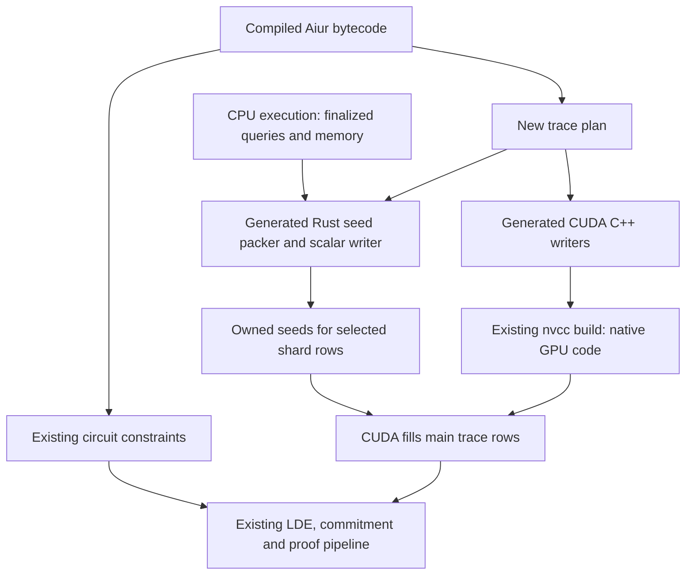

# Aiur GPU trace codegen: implementation plan

Research against the local ix and multi-stark working trees, 2026-09-15,
including the 176-byte BLAKE3 seed implementation and its completed join
comparison. The general emitter described here is not implemented.
Measurements below come from existing runs.

## Recommendation

Emit CUDA C++ ahead of time and compile it through the existing nvcc build.
The useful compiler boundary is a **trace plan**: bytecode annotated with
the exact columns to write and the external values to obtain from the
execution record. Generate Rust seed preparation, a Rust scalar row writer,
and CUDA row writers from that plan.

This extends the current implementation naturally. The substantial new work
is deriving the trace plan and preparing seeds efficiently. Changing the
output language would leave those problems in place.

**Completion means:** every constrained function in the compiled IxVM,
MultiStark and aggregation programs has a generated trace writer, including
grouped circuits. Memory and byte-table circuits have reusable primitive
writers. Adding an Aiur function requires code generation and a rebuild,
without a handwritten CUDA implementation of that function. A new bytecode
operation still needs one compiler lowering, just as it does for Rust.

CPU execution remains responsible for the query record. The new backend
constructs main traces from that record; existing GPU code still handles
lookup evaluation, LDEs, commitments, quotient computation and FRI. Runtime
compilation of arbitrary new programs is outside this ahead-of-time design.

Two qualifications to the original proposal:

- The existing Lean emitter generates **execution** functions. They execute
  callees and update query records, memory, and multiplicities. Its traversal,
  local-variable naming and Rust formatting are reusable, but trace emission
  needs the semantics in `trace.rs` and `Compiler/Layout.lean`.
  [Execution emitter][execution-emitter], [trace population][trace-ops].
- The BLAKE3 guard currently checks **structural equality of the bytecode and
  layout**, including the bound self-call index. There is no body hash today.
  Preserve that compatibility requirement; a versioned digest is an optional
  representation of it. [Current guard][guard].

## Where this fits



One generated writer handles one constrained function's row. An Aiur call
reads its recorded result into auxiliary columns; it does not launch or
recursively execute another GPU kernel. Rows for constrained callees are
proved separately, and lookup messages connect the caller and callee.
[Call population][trace-ops], [call and return constraints][constraints].

The existing `TraceGenerator` already supplies the required integration:
owned immutable seeds, dimensions, host memory accounting, CPU row generation,
and synchronous generation into an admitted device buffer. The CUDA backend
also regenerates row tiles for lookups after releasing the original matrix.
No new prover runtime or trace-source interface is required for the first
generated provider. [TraceGenerator][generator], [lookup recovery][recovery].

## The shared compiler representation

Introduce a target-independent `FunctionTracePlan` after bytecode
deduplication and constrained-function selection. It contains:

| Part | Information |
| --- | --- |
| Values | Local value IDs, field-expression degrees, optional integer bounds and dependencies |
| Writes | Explicit input, selector and auxiliary column offsets |
| External reads | Call outputs, stored pointers, loaded values, IO results and external hints |
| Control flow | Matches, default witnesses, returns, yields and continuation merges |
| Seed schema | Logical values, encoding widths, byte offsets, alignment and variant guards |
| Contract | Function layout, bytecode identity and seed/writer ABI version |

Generate three products from the same plan: the Rust seed packer, a scalar
Rust row writer and the CUDA row writer. The scalar writer isolates compiler
errors from device errors; the existing bytecode trace builder remains the
independent correctness oracle.

Make `Compiler/Layout.lean` expose its allocation decisions to this pass.
Reuse its degree rules and branch maxima instead of maintaining a third
independent column allocator. Lift/reuse `Op.outputCount` as shared bytecode
metadata where useful, and check that its output count agrees with the
layout step's value-stack change. Check the final planned layout against
the layout already attached to the bytecode.

Keep the structured target representation used by the Rust emitter. Add a
small CUDA expression/statement formatter; reusing the Rust execution
emitter verbatim would replay calls and mutate records. The generated
packer instead takes immutable record/IO references. Its lowered pure
expressions must call value-only helpers, never execution helpers that
increment lookup multiplicities. [Execution emitter][execution-emitter],
[layout rules][layout-ops].

## Seed preparation is the main performance risk

The current packed BLAKE3 seed contains the same logical 129 inputs,
32 recorded outputs and one multiplicity as the previous 162-field-word
seed. Its recursive
branch returns the recursive call's outputs unchanged. Consequently, the
parent's output supplies all 32 call-result columns without reconstructing
the callee's input key on the CPU. [Seed packer][seeds], [terminal call][tail-call].

| Per real row | Bytes |
| --- | ---: |
| Previous seed: 162 canonical field words | 1,296 |
| Current seed: multiplicity, stage, input/output bytes, explicit padding | 176 |
| Expanded main trace: 533 field columns | 4,264 |

The new code checks stage and byte bounds before narrowing, keeps the
multiplicity as a canonical `u64`, and checks Rust/CUDA sizes and offsets at
compile time. Seed bytes fall by 86.4%. The completed join-33 comparison
measured proving at 24.756 s versus 27.177 s without CUPTI, an 8.9% reduction,
with the same proof and trace-piece boundaries. These are single replays,
not a full Mathlib throughput measurement. The general compiler's BLAKE3
acceptance target is this packed representation. [Packing benchmark][packing-benchmark].

That shortcut needs to be recognized by the compiler. A generic packer that
always recomputes call arguments would repeat the BLAKE3 mixing arithmetic
on the CPU just to find the result that is already available.

For other functions, inputs and final outputs can be insufficient. For example:

```text
a = call f(x)
b = load(a)
return b[0] + 1
```

The final output does not identify all of `a` and `b`. The packer must retrieve
`f(x)` from the function query table, then retrieve memory at the resulting
pointer. If the key for `f` is itself the result of substantial arithmetic,
some CPU recomputation remains necessary. QueryMap stores keys, results, and
multiplicities; it does not contain a per-row log of intermediate operations.
[QueryMap][querymap], [call, store, load and IO population][trace-ops].

Recommended preparation rules:

| Operation | Seed preparation | CUDA writer |
| --- | --- | --- |
| Pure field/byte arithmetic | Compute only what is needed to retrieve external values or select their branch | Compute required intermediates and write the specified columns |
| Call with outputs | Read the callee result, or use a statically established alias to the parent's recorded output | Copy result words to their columns and locals |
| Call with no outputs | No result words needed | Existing lookup graph handles the call relation |
| Store | Find the already recorded pointer by stored values and memory-table size | Write that pointer |
| Load | Read the recorded memory row using size and pointer base | Write the loaded values |
| IO reads | Resolve metadata/data from the finalized IO buffer | Write the resolved words |
| Deterministic field/byte hints | Resolve on CPU only if needed by preparation | Compute using matching integer/field semantics |
| BigUint division hint | Use the existing read-only helper to recover the two result pointers; use an established output alias when possible | Write the two pointers as witness columns |

BigUint is a concrete expensive case: its current trace helper reconstructs
the big integers, performs division again, and resolves the recorded list
pointers. Moving that work into a seed packer would not remove its CPU cost.
It nevertheless gives complete opcode coverage without implementing an
arbitrary-precision divider in CUDA. Measure this cost separately before
considering extra execution-time observations. [Hint recovery][biguint].

Start with a fixed seed stride per function. Assign explicit offsets to
external results, reuse seed space across mutually exclusive branches, and
zero unused slots. Fixed strides make arbitrary row ranges and wrapped lookup
halos straightforward. The stride is the maximum for the function, so a
large rare branch can still make seeds expensive.

Include all function inputs that occupy trace columns. Include recorded
outputs only where the row plan needs them, such as a returned-call alias;
there is no requirement to duplicate every function result in every seed.
Branch-dependent external reads stay inside their corresponding branches.

Perform two dependency analyses on the plan:

1. Keep computations needed for trace columns and branch selectors in the row
   writer. Values used only by assertions or lookup expressions can often be
   reconstructed by the existing constraint graph.
2. Keep only computations needed for record/IO keys and relevant control flow
   in the seed packer. Resolve direct returned-call aliases before this step.

For valid execution records, a terminal call returned unchanged has exactly
the parent's recorded output. Applying that optimization preserves the
caller/callee lookup constraints. More complicated output relationships need
their own analysis; final outputs should not be treated as a general-purpose
replacement for intermediate results.

Capturing an extra execution log or putting query hash tables on the GPU
would change the memory and runtime design substantially. Neither is needed
for the complete first implementation. If profiling later justifies logging
hard-to-recover hint results, charge those bytes to the existing record
reservation and per-record ceiling. Log per unique query, with explicit
handling of unconstrained-to-constrained promotion, rather than per dynamic
call. That is a separate optimization with a memory cost.

### Compact seed generation

Implement a canonical `u64` encoding first, then a schema pass that chooses
`u8`, `u16`, `u32` or full field words for individual seed values. Derive
bounds from byte operations, constants, branch conditions and value flow.
For speculative compact variants, generate checked guards and retain a
full-width generated variant. A narrowing failure must never truncate a
value. Explicit fallbacks may use the reference builder during rollout;
the complete compiler must not depend on byte-sized inputs for correctness.
Choose a codec for an entire member span; if its guards fail, use the
full-width variant for that span without changing query order.

Group wide fields first for alignment, emit every offset from one schema,
and initialize explicit padding. Generate matching Rust/CUDA layout
assertions. Keep multiplicities full-width: existing tests deliberately use
`G::NEG_ONE`, so an apparent small-counter convention is insufficient.

BLAKE3 must compile to the 176-byte seed without a function-name special
case. Returned-call alias analysis removes CPU mixing from its packer;
bounded seed encodings provide its bytes. The stage bound used by an
optimized variant must be emitted as a checked contract, not inferred
merely from the fact that the function matches on stage 7.

## Column allocation must be explicit

The number of bytecode results differs from the number of trace columns:

| Operation | Values produced | Auxiliary columns |
| --- | ---: | ---: |
| Add/subtract field elements | 1 | 0 |
| Multiply field elements | 1 | 0 or 1, depending on expression degree |
| Test a field element for zero | 1 | 0 for a constant; otherwise 2 |
| U8 add/subtract | 2: byte and carry/borrow | 1 |
| Unconstrained U32 add/add3 | 5: four bytes and carry | 4 |
| U32 less-than | 1 | 12 |

Here, *degree* tracks whether an expression contains a product of variable
values. The compiler inserts an auxiliary column when needed to keep the
constraint expressions small. A writer must follow this allocation exactly.
The execution emitter's `Op.outputCount` alone cannot determine it.
[Layout rules][layout-ops], [execution result counts][output-count].

For branches, allocate offsets during code generation. For example, if two
arms require two and five auxiliary cells starting at offset `b`, reserve
five cells for the shared region. With one yielded value, its merge column
is `b + 5`, and the continuation starts at `b + 6` on either yielding path.
Taking the shorter arm leaves three zero cells. Returning from an arm skips
the continuation entirely.

Also preserve:

- Default-arm inverse witnesses, one per explicit case value, in case order.
- Branch and continuation selectors, including nested matches and yields.
- Separate auxiliary and lookup offsets; function return occupies lookup slot 0.
- Compiler-provided `shared_aux` and `shared_lookups`, checked against the
  computed plan before emitting code.
- Zero padding and unused columns.

The compiler already calculates branch maxima, and `MatchContinue` carries
the shared sizes. Use those facts to emit constant column addresses instead
of rebuilding a dynamic column interpreter inside each GPU thread.
[Shared-layout calculation][shared-layout], [row control flow][trace-control].

Every allocated witness column remains part of the output, even if its
value has no later program use. Dead-value elimination can remove temporary
calculations and unnecessary record keys; it must not remove required trace
writes or change commitment bytes. Assertions, IO writes and debug operations
have no row writes, but their inputs may still be needed elsewhere in the
plan. Unconstrained call outputs still occupy auxiliary columns even though
those calls do not emit a lookup.

## Grouped functions and runtime ownership

The existing provider accepts singleton circuits only. Generalization must
account for grouped circuits: they take the maximum input and auxiliary
widths across members, but sum member selector widths. Function writers can
use column offsets relative to supplied selector and auxiliary bases.
[Circuit layout][circuit-layout].

Keep each member's rows in the existing order. An owning generator can keep
one seed span per member and split requested device tiles at member boundaries
and at the padded-height wrap. Dispatch happens per span, not per row. This
allows function-specific kernels without a large device-side switch.
Initially, a group with an unsupported member can use the reference builder
for the entire circuit. This is a rollout mechanism, not the completed
coverage target. Preserve row order when choosing seed encodings; do not
sort rows by codec or branch. [Current row ordering][row-order].

The generic preparation entry point needs `&IOBuffer` as well as the query
record. The current BLAKE3-only `prepare` signature omits it. Adapt
`prepare_shard_witness` to supply that immutable input to generated packers
and dispatch every `CircuitType`, not just singleton function circuits.

### Memory and byte-table coverage

These circuits are runtime primitives rather than Aiur functions. Maintain
one small primitive implementation per family, independent of how many
Aiur programs use it:

| Family | Frozen source and device writes | Required invariant |
| --- | --- | --- |
| Memory of width `n` | Pack multiplicity and `n` values; derive selector and pointer from the table base and row offset | Preserve every row in the pointer interval, including zero multiplicities; preserve segment-boundary lookups |
| Bytes1 | Copy the three multiplicity columns into its 256-row main trace | Preprocessed byte values and operations remain part of the existing key |
| Bytes2 | Copy the ten multiplicity columns into its 65,536-row main trace | Preserve the fixed table order and full field multiplicities |
| Unassigned byte tables in a trace shard | Generate a zero main trace with the normal table dimensions | The tables remain present in every shard, with nonzero counts assigned exactly as before |

Memory seeds are close to the size of the trace, and byte-table multiplicities
already are the main trace. Their benefit can be avoiding redundant host
construction and lookup payloads rather than arithmetic acceleration.
Both byte-table builders currently construct lookup payloads even on the
trace-only path; the generated path should return shape-only lookups directly.
Verify this independently of the performance benefit for function circuits.
[Memory rows][memory], [Bytes1][bytes1], [Bytes2][bytes2],
[shard dispatch][shard-dispatch].

Both CPU and CUDA row writers must consume the same frozen seed representation.
The source must support regeneration without consulting mutable query state.
Preserve device selection, bounded uploads, completion before returning the
borrowed output buffer, empty circuits, and wrapped halo rows.
[Current CUDA wrapper][cuda-wrapper], [device view][device-view].

Keep the existing shape-only lookup path: the generated writer fills the
main trace; the backend derives lookup messages from the circuit graph.
Normal CPU proving still needs ordinary lookup payloads and the reference
witness path. Round two continues to regenerate seeds and commitments under
the current retention policy. [Current runtime behavior][runtime-doc].

**Bound temporary uploads in bytes as well as rows.** The packed 65,536-row
BLAKE3 tile occupies 11 MiB; one halo seed adds 176 bytes. Four shared pinned
slots currently reserve at most 44 MiB plus 704 bytes. With wider generated
seeds, the same row count could allocate much more. Main-trace admission
currently budgets the trace, LDE, configured reserve and an additional
128 MiB; it does not ask the generator for its temporary device-memory
requirement. `host_bytes()` describes retained host storage only.
[Current admission][admission], [TraceGenerator][generator].

Use one shared uploader implementation, compiled once, with four portable
pinned slots and an explicit byte capacity per slot. A 16 MiB slot is a
reasonable initial policy: it accommodates the packed BLAKE3 tile and bounds
the whole pinned pool to 64 MiB. Derive rows per upload from seed stride,
remaining output rows and the byte bound, including halo requests. A seed
too large for one slot must report an unsupported/resource condition.

Acquire the staging lease before allocating device seed storage. Hold it
until stream completion, including error cleanup. This also bounds live
device seed allocations across concurrent callbacks. Do not instantiate a
separate pinned pool in every generated translation unit. The initial path
can fit within the existing temporary-memory envelope; larger scratch or
overlapped upload designs require provider scratch accounting in backend
admission first.

`host_bytes()` must include all owned seed buffers at capacity and span
metadata. Retain the current round-one release and round-two regeneration
policy. Additional seeds do not cross the batch barrier, and this work does
not reintroduce Merkle retention.

## Build and compatibility changes

Proposed artifacts:

| Location | Responsibility |
| --- | --- |
| `Ix/Aiur/Stages/TracePlan.lean` | Annotated row plan, external-value dependencies and seed schema |
| `Ix/Aiur/Stages/TraceCodegen.lean` | Rust packer/scalar writer, CUDA writer and registry emission |
| `crates/aiur/src/gpu_trace/generated/` | Generated Rust modules and program registry |
| `crates/aiur/cuda/generated/` | Generated CUDA functions and deterministic source manifest |
| `crates/aiur/cuda/trace_runtime.cu` | Shared bounded uploader, leases and launch/error handling |
| `crates/aiur/cuda/trace_primitives.cuh` | Small reusable byte/word witness operations |
| multi-stark CUDA field header/build metadata | Expose the existing Goldilocks arithmetic helpers to both builds |

Keep generated trace artifacts in `aiur`, alongside the current provider,
so `ixvm-codegen` can continue depending on `aiur` without a dependency cycle.
The explicit Lean codegen command writes these checked-in artifacts. Cargo
does not run a Lean compiler that first needs the Rust library being built.

1. Extend the explicit code-generation command and its `--check` mode to
   cover Rust, CUDA, ABI metadata and the source manifest. Emit member
   writers from the final deduplicated function library. Construct grouped
   circuit spans at runtime from those writers and the actual member/layout
   table. Grouping does not change function bytecode or IDs, so it need not
   duplicate kernels. Test both production grouping and singleton circuits.
   Keep emission deterministic; the environment variable disabling grouping
   must not silently change generated files. [Codegen command][codegen-command].
2. Extend `crates/aiur/build.rs` to compile the generated source manifest and
   track its files and headers. Keep CUDA feature gating, static linking and
   per-thread stream flags. For this machine, the existing architecture
   selection accepts `MULTI_STARK_CUDA_ARCHS=120`, producing
   `-gencode=arch=compute_120,code=sm_120`. [Build path][build].
3. Extend Lake's Rust-library dependency filter. It currently includes `.rs`
   files and Cargo manifests, but omits `.cu` and headers. Cargo's own change
   tracking only helps after Lake actually invokes Cargo. Include generated
   CUDA inputs and the manifest so a CUDA-only edit rebuilds the linked
   library. [Lake dependency filter][lake-build].
4. Keep kernels and their device helpers self-contained within compilation
   units, with inline helpers included from headers. Aiur calls read seeds,
   so they do not require cross-file device calls. Partition functions into
   modest translation units rather than spawning a compiler for every tiny
   function. Keep the shared uploader in one implementation file.
5. Extract the backend's existing Goldilocks helpers into a shared header
   and expose its include directory through Cargo build metadata, including
   the manifest's `links` declaration needed to pass that metadata to the
   dependent build. Avoid a hardcoded sibling-checkout include path. Scalar
   packer/writer tests must run without CUDA; nvcc and device symbols remain
   feature-gated.

Keep the guard based on compiled semantics: operations, constants, operands,
branch order, layouts, and correctly bound call targets. Add a seed/writer ABI
version. Validate compatibility once when registering a compiled system,
rather than rebuilding a reference body for every shard.

Use a versioned canonical fingerprint of the function library initially:
function order, entry/constrained flags, layouts, every operation/constant,
ordered branches, call-target indices and memory sizes. Generate and test
the same encoding in Lean and Rust. Keep the legal grouping separate and
validate its members, merged widths and selector offsets at registration.
This binds packers to the correct callee query tables while allowing the
same member writer in grouped and singleton circuits.

This stricter whole-library contract is simpler than introducing callee
relocations immediately. Cross-program kernel deduplication can follow once
normalized plan identity and explicit call bindings are tested. A name or
matching width is never sufficient. The fingerprint and seed ABI describe
implementation compatibility and do not change the proof format.

## Generated arithmetic and performance

Correct generated code may be slower than the handwritten BLAKE3 writer.
The current kernel combines byte operations into native 32-bit arithmetic
and uses precomputed inverses for its seven nonterminal stage values.
A literal sequence of generic field operations will not automatically have
those properties. [Handwritten writer][cuda-writer].

Build reusable optimizations into the trace plan:

- Preserve packed 32-bit values across byte decomposition/reassembly when
  the intervening operations permit it. Emit byte and carry columns at their
  prescribed offsets even when the calculation uses a native word operation.
- Fold constants and precompute inverse tables for small, proven or guarded
  finite domains. General inverses still need the exact field operation,
  including the reference convention for zero.
- Remove computations used only by a discarded record-key calculation after
  applying returned-call aliases. Keep all allocated witness writes.

These are rules for bytecode patterns and value bounds, with no BLAKE3-name
dispatch. Begin with exact generic operations and add the rules needed to
reach the existing packed provider's performance.

General field operations need canonical Goldilocks arithmetic modulo
`2^64 - 2^32 + 1`; ordinary wrapping `uint64_t` arithmetic is insufficient.
Extract the backend helpers as described above and test their boundary
behavior against `G`. Byte and word optimizations must preserve the reference
operation semantics or establish the required bounds.
[Device arithmetic][field], [byte operations][byte-ops].

Start with the current one-thread-per-row mapping and straight-line locals.
Inspect compiler register, stack and spill reports for the large functions.
Change the mapping or split a kernel only when those reports and a measured
slowdown justify it. Keep the first vertical slice small; compiling all
constrained functions across all three programs is a later completion gate,
not a prerequisite for validating the compiler design.

## Implementation sequence

Each step produces a reviewable result and has a concrete exit condition.
Temporary coverage limits must be visible in the generated report.

| Step | Implementation | Exit condition |
| --- | --- | --- |
| 1. Trace plan and CPU oracle | Expose layout annotations, model control flow and external reads, emit immutable Rust preparation and scalar rows | Exact cell parity on focused fixtures, including unequal branches, nested continuations and call-result-to-load dependencies |
| 2. Generated BLAKE3 | Add the CUDA formatter, shared arithmetic/uploader, build manifest, registry and compatibility check; implement returned-call aliases and compact seeds | Emit the 176-byte seed and all 533 columns without a handwritten function body; match the packed provider's correctness and useful performance |
| 3. Complete bytecode lowering | Cover every operation and control variant, including IO, stores/loads, unconstrained call outputs and BigUint hint recovery; provide full-width variants | Compile every constrained function in IxVM, MultiStark and aggregation; an unhandled opcode is a codegen error with a function/operation diagnostic |
| 4. All circuit families | Assemble grouped spans, add memory/byte primitives, pass IO through preparation and dispatch all circuit types | Strict generated mode completes production-grouped fixtures with no unsupported-circuit fallback; row/lookup/proof bytes agree |
| 5. Performance and replacement | Add coverage/cost reporting, optimize the most expensive generated plans, compare the two frozen workloads below, then remove the handwritten BLAKE3 body and writer | Verified proofs, complete coverage, useful wall/CPU savings and bounded memory; adding another Aiur function requires no function-specific CUDA code |

Step 2 should retain the current provider as a temporary comparison target.
After its replacement is validated, keep frozen benchmark binaries and the
independent bytecode builder as references; maintaining two BLAKE3 source
implementations would defeat the purpose of this work.

Implement an explicit generated mode and a strict validation mode. Strict
mode rejects missing writers, compatibility mismatches and accidental CPU
fallbacks, with the circuit/member and reason. A normal rollout can retain
the reference fallback. A later automatic mode may choose CPU work for tiny
circuits when measurements justify it; that is a cost policy, not missing
compiler coverage.

### Correctness gates

The existing bytecode builder is the independent oracle. Compare every
canonical trace cell against both the generated scalar and CUDA writers;
matching only function outputs would miss misplaced witnesses.

- **Operations and branches:** exercise all opcode variants and relevant
  field/byte boundaries, multiple default inverse witnesses, unequal branch
  widths, nested `MatchContinue`, yields and early returns. Check both
  final columns and layout/dependency annotations.
- **External values:** cover call-result-to-load chains, returned-call
  aliases, constrained and unconstrained calls, stores with nonzero pointer
  bases, IO and BigUint hints. Confirm preparation leaves the record and
  multiplicities unchanged.
- **Representation:** test compact guards and full-width variants, large
  canonical multiplicities, explicit padding, empty spans, power-of-two
  padding, partial ranges and wrapped lookup halos. Function rows filter
  zero multiplicities; memory pointer intervals retain them.
- **Groups and primitives:** use different member input/auxiliary widths and
  selector counts. Check member boundaries and fixed byte-table dimensions,
  including unassigned zero tables and memory segment boundaries.
- **Compatibility and build:** mutate bytecode, callee bindings, layouts and
  ABI versions. Test canonical fingerprint agreement between Lean and Rust,
  deterministic `codegen --check`, CUDA/header-only rebuild tracking and
  CPU-only compilation without nvcc.
- **Runtime lifetime:** reuse the current multi-device/concurrent-callback
  tests and verify staging is released after failures. Producers must not
  allocate GPU memory. Exercise both proving rounds, release at the barrier,
  and lookup regeneration after forced LDE spill, including tiny halo tiles.

Finish with the existing sharded proof test and byte-for-byte proof comparison
under identical settings. These are compiler/runtime correctness gates;
do not substitute a large Mathlib run for the focused tests.

### Coverage and bounded performance measurements

Emit a static report mapping program, circuit/member IDs and stable semantic
names to main width, seed stride, external-read count and codec variants.
Include constrained functions with no rows in a particular test workload.
Use this map to identify the frozen claim's expensive circuits 12, 106, 107,
42 and 119 instead of guessing their names from numeric IDs.

At runtime record, per circuit/member:

- Real/padded rows, generated or reference dispatch and any fallback reason.
- Seed preparation time, record/IO reads and expensive hint recovery.
- Seed bytes retained and uploaded, expanded main-trace bytes, generation
  calls and time, including lookup regeneration.
- Exposed consumer waits and GPU kernel-idle intervals, rather than treating
  all overlapping CPU trace time as available wall-time savings.

Use two workloads: the existing representative **claim 9** and **join 33**.
Compare the frozen packed BLAKE3 baseline against the complete generated path
using the same records, trace-piece boundaries, device, compiler settings and
concurrency. Run a focused profile for attribution and an ordinary timed
replay for wall time; repeat only if a failure or an ambiguous result warrants
it. No shard-count or budget sweep is needed for this comparison.

Report proof wall time, CPU time, transfer volume, peak host/device memory,
seed-preparation cost and compiler resource reports together. Track build time
and binary size as all functions are enabled. Require identical verified
proofs and useful net savings after seed preparation, upload and repeated
generation. A faster row kernel alone does not meet that performance gate.

## Expected impact on GPU utilization

Broader trace generation is the best-supported next direction, but existing
data does not establish that it will raise whole-run utilization to 90%.
The representative claim profile predates packed seeds:

| Observation | Implication |
| --- | --- |
| Kernels active for 37.13 of 66.15 proving seconds, or 56.1% | There are substantial gaps inside proving |
| 175.60 GiB uploaded, of which 18.12 GiB was BLAKE3 seeds | Broader generation/compact transport can address traffic outside BLAKE3; the remainder also contains traffic other than removable main traces |
| CPU trace construction spans 38.75 s; witness preparation overlaps only 7.68 s outside the four consumer stages | Much of preparation is already overlapped; its total duration is not a wall-time saving estimate |
| Stage-one commitment has 13.83 s with no kernel running | Generation and transport can help, but host commitment work also needs attribution |
| FRI/opening has 5.21 s with no kernel running | Trace coverage does not directly address every proving gap |

[Profile and methodology][profile]. These intervals overlap; do not add them.
Kernel busy fraction within one proof, whole-run sampled GPU utilization and
SM occupancy are different measurements.

The completed packed-seed experiment gives a concrete scale: an 86.4%
reduction in BLAKE3 seed traffic produced an 8.9% reduction in join proving
time, with unchanged peak live device allocations. That supports the direction
without implying a proportional utilization increase. [Packing benchmark][packing-benchmark].

As a rough illustration, if the claim's kernel time stayed at 37.13 s,
90% busy time would require proving to finish in about 41.3 s. That removes
about 25 of its 29 kernel-idle seconds. Generated row work changes kernel
time too, so this is an illustration of the size of the gap, not a forecast.

Seed packing still runs on the CPU, record queries may require computation,
and CPU execution still precedes proof supply. The final dependent joins and
wraps leave other devices idle even with complete trace coverage. Faster
proving can also make execution supply the next bottleneck.

Judge this work first by lower proof wall time and fewer exposed idle gaps.
Afterward, the profile can determine whether to improve costly seed recovery,
overlap proof phases or reduce recursive-tail cost. Two simultaneous full
proofs need explicit memory admission: the representative claim's 63.63 GiB
live peak would total 127.26 GiB if duplicated, exceeding the device capacity.
That concurrency work is separate from the compiler and need not block it.

[execution-emitter]: /home/sam/repos/ix/Ix/Aiur/Stages/Codegen.lean:375
[trace-ops]: /home/sam/repos/ix/crates/aiur/src/trace.rs:440
[guard]: /home/sam/repos/ix/crates/aiur/src/gpu_trace/mod.rs:66
[constraints]: /home/sam/repos/ix/crates/aiur/src/constraints.rs:302
[generator]: /home/sam/repos/multi-stark/src/witness.rs:9
[recovery]: /home/sam/repos/multi-stark/cuda/kernels.cu:3384
[seeds]: /home/sam/repos/ix/crates/aiur/src/gpu_trace/mod.rs:78
[tail-call]: /home/sam/repos/ix/crates/aiur/src/gpu_trace/blake3_body.rs:753
[querymap]: /home/sam/repos/ix/crates/aiur/src/querymap.rs:249
[biguint]: /home/sam/repos/ix/crates/aiur/src/execute.rs:1251
[layout-ops]: /home/sam/repos/ix/Ix/Aiur/Compiler/Layout.lean:158
[output-count]: /home/sam/repos/ix/Ix/Aiur/Stages/Codegen.lean:335
[shared-layout]: /home/sam/repos/ix/Ix/Aiur/Compiler/Lower.lean:392
[trace-control]: /home/sam/repos/ix/crates/aiur/src/trace.rs:332
[circuit-layout]: /home/sam/repos/ix/crates/aiur/src/bytecode.rs:13
[row-order]: /home/sam/repos/ix/crates/aiur/src/trace.rs:188
[memory]: /home/sam/repos/ix/crates/aiur/src/memory.rs:115
[bytes1]: /home/sam/repos/ix/crates/aiur/src/gadgets/bytes1.rs:157
[bytes2]: /home/sam/repos/ix/crates/aiur/src/gadgets/bytes2.rs:284
[shard-dispatch]: /home/sam/repos/ix/crates/aiur/src/shard.rs:349
[cuda-wrapper]: /home/sam/repos/ix/crates/aiur/cuda/blake3_trace.cu:149
[device-view]: /home/sam/repos/multi-stark/src/cuda/mod.rs:248
[runtime-doc]: /home/sam/repos/ix/docs/aiur-gpu-trace-generation.md
[admission]: /home/sam/repos/multi-stark/src/cuda/witness.rs:75
[codegen-command]: /home/sam/repos/ix/Ix/Cli/CodegenCmd.lean:70
[build]: /home/sam/repos/ix/crates/aiur/build.rs:34
[lake-build]: /home/sam/repos/ix/lakefile.lean:78
[cuda-writer]: /home/sam/repos/ix/crates/aiur/cuda/blake3_trace.cu:74
[field]: /home/sam/repos/multi-stark/cuda/kernels.cu:80
[byte-ops]: /home/sam/repos/ix/crates/aiur/src/gadgets/bytes2.rs:449
[profile]: /home/sam/repos/ix/bench/prover-profile-2026-09-15/README.md
[packing-benchmark]: /home/sam/repos/ix/bench/blake3-seeds-2026-09-15/README.md
