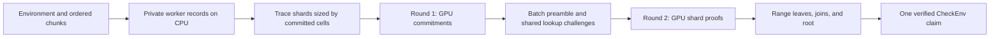

# Aiur GPU handoff before the Mathlib runs

> **Status (2026-09-11, end of day):** superseded. This handoff describes the one-claim chunk pipeline (`ix prove --distributed`) as of the 9:28 Init result. Later that day the branch moved to env-shard claims (min-cut manifest, trace shards per claim, executions ahead of the prover, direct joins with a join executing ahead, root wraps), which proved Mathlib end to end in 2:45:22 on one GPU. Its risks (record residency, the first execution wave, range leaves) belong to the chunk model, which is parked. Current commands, results and handoff: `docs/aiur-gpu-plan-status.md` (opening summary and the Handoff section). Kept for the queue22 evidence and the kernel-commit fingerprints.

2026-09-11. Based on queue22, the completed queue23 follow-up, and a read of
the ix/multi-stark snapshots below, plus the in-progress retention trim
observed during review. No new proving jobs or test suites were launched
for this handoff.

**Init completes Stage 1 in 5:46.65 and Stage 2 in 3:41.35: 9:28.00 of proving
wall time, with both outputs verified and all 56,621 constants certified with
zero undischarged assumptions. Full Mathlib validation remains outstanding.**
The main remaining risks are execution-record residency, large first range
leaves, and the first wave of executions before record sizes are known.

## Code and build state to carry forward

| Repository | Reviewed local branch and commit | Published branch head observed during this handoff |
|---|---|---|
| ix | `sb/aiur-trace-sharding-gpu`, `e7a7e88edcc3d6b61dc5072fc03cb375826744b2` | `5e94bdca7ffa9fc157618ac385bc216b5fdd1862` |
| multi-stark | `sb/trace-sharding-gpu`, `f15a6c4d1672a5815eab0fa8a48683f8bd078f92`, checkout `/home/ubuntu/multi-stark-ts` | `ac144be2eb670aa081ec3800614454f3c036b7b5` |

An additional retention-trimming change is currently uncommitted in ix
`crates/ffi/src/aiur/protocol.rs`; its queue24 validation had no completed
result at the 2026-09-11T16:17:13+00:00 snapshot. It is described separately below and is not included
in the queue22 results or the ix commit pin above.

**Sharing the published branch names alone currently misses the latest work.**
The committed ix dependency still pins multi-stark `ac144be2`. The local
`Cargo.toml` override selects `/home/ubuntu/multi-stark-ts`, and `Cargo.lock`
is correspondingly modified. Current ix calls `LookupValues::shape_only`,
introduced after that published dependency pin; the old pin also lacks the
two latest CUDA kernel changes.

Before reproducing from a clean checkout on another machine, publish the
reviewed commits and update ix's dependency pin and lockfile to the selected
multi-stark revision, replacing the machine-local override. Those publication
and dependency changes have not been performed by this handoff. Source links
below name local commits and may not resolve on GitHub until publication.

Queue22 used the frozen `ix-cuda-gpu2` binary built at 15:43–15:45 UTC. Its
SHA-256 is
`02653fce9bf372f6fab1f61bd47dfce735d7c2c2b6130380108d27ed701a9b50`.
The build log predates the final ix commit and does not embed source SHAs;
the table above identifies the code reviewed, rather than claiming an
embedded commit identity for that binary. Input fingerprints, exact results,
and copied-log hashes are in the
[queue22 snapshot](../bench/trace-sharding-gpu-2026-09-11/queue22/snapshot.json).

The current host reports Ubuntu 24.04.4, Xeon Platinum 8559C, **16 physical
cores / 32 logical CPUs**, about 249 GiB RAM, and an RTX PRO 6000 Blackwell
Server Edition reporting 97,887 MiB VRAM, driver 595.71.05. THP is `always`.
The current default `nvcc` resolves to CUDA 13.2.78. The CUDA microbenchmark
notes name 13.3; queue22's build log does not identify the compiler path, so
capture the resolved compiler and architecture settings in the next run.
Earlier notes describing this host as “32 cores” count logical CPUs.

## The resulting architecture



A **chunk** is a worker's owned portion of the environment. A **trace shard**
is a bounded portion of that record's circuit rows. A **batch** contains all
trace shards of all records and carries one whole-environment claim. Stage 2
recursively verifies that batch through a **range tree**; its nodes can
themselves be trace-sharded. Chunk count, trace-shard count, and range width
control different costs.

There are three overlaps: several independent CPU records execute ahead of
the batch prover; one shard witness is prepared while the previous shard
proves; and, with one range job, the next recursion node executes while the
current node proves. Stage 1 and Stage 2 remain separate commands, so the
first Stage 2 leaf's execution is still exposed.

## Major ix changes

| Change | Resulting behavior and code |
|---|---|
| Trace planning and witness slicing | Records are partitioned into circuit-row ranges using padded committed-cell costs. Function rows can be split; memory ranges preserve pointer order and expose boundary terms through the lookup argument. Byte tables contribute a fixed planning floor. `AIUR_MAX_PIECE_LOG_HEIGHT` bounds piece height; queue22 uses 24 instead of the code default 22. [Planner](https://github.com/argumentcomputer/ix/blob/e7a7e88edcc3d6b61dc5072fc03cb375826744b2/crates/aiur/src/shard.rs). |
| Batch verification in Rust and Aiur | Verify the shared transcript, exactly one expected application claim, admissible memory-closure messages, disjoint memory intervals, and bounded total heights. Opened-row widths are pinned to the verifying key. This is a protocol/verifier change, not merely a GPU scheduling change. [Native policy](https://github.com/argumentcomputer/ix/blob/e7a7e88edcc3d6b61dc5072fc03cb375826744b2/crates/aiur/src/shard.rs#L401), [recursive verifier](https://github.com/argumentcomputer/ix/blob/e7a7e88edcc3d6b61dc5072fc03cb375826744b2/Ix/MultiStark/Verifier.lean#L831). |
| Distributed execution over private records | `ix prove --distributed` assigns constants to owners. Cross-owner calls are deferred and their multiplicities absorbed by the owner's record. The records' trace shards prove one `CheckEnv` claim. This uses private single-writer records; it does not revive the earlier shared concurrent record. [Driver](https://github.com/argumentcomputer/ix/blob/e7a7e88edcc3d6b61dc5072fc03cb375826744b2/crates/ffi/src/aiur/protocol.rs#L1377). |
| Dependency-ordered chunks | `ix shard --ordered` makes contiguous chunks in dependency order. Caller groups determine when a record can commit. Init's eight ordered chunks form eight singleton groups; cyclic layouts can require several records resident together. `--distributed --plan-only` exposes the layout before execution. [Chunk construction](https://github.com/argumentcomputer/ix/blob/e7a7e88edcc3d6b61dc5072fc03cb375826744b2/crates/kernel/src/shard.rs). |
| Execution lookahead and host record retention | The driver executes ahead, retains records for round two when possible, and evicts records with the furthest next use. Charges come from optional manifest measurements, otherwise the largest record measured this run, otherwise zero. The last review added completed-worker harvesting and eviction before required executions as well as speculative ones. [Workers](https://github.com/argumentcomputer/ix/blob/e7a7e88edcc3d6b61dc5072fc03cb375826744b2/crates/ffi/src/aiur/protocol.rs#L1626). |
| Range-sum recursion and node lookahead | Shapes 10/11/12 verify a batch range, join adjacent ranges and residuals, then close the whole batch into the outer claim. With `--trace-shards --range 0`, width starts at `ceil(K / (2 * jobs))`. One-job levels prepare one node ahead; reported leaf budget failures halve a derived width and retry. [Range driver](https://github.com/argumentcomputer/ix/blob/e7a7e88edcc3d6b61dc5072fc03cb375826744b2/crates/ffi/src/aiur/aggregate.rs#L1542), [range statements](https://github.com/argumentcomputer/ix/blob/e7a7e88edcc3d6b61dc5072fc03cb375826744b2/crates/aiur/src/range.rs). |
| Full pointer namespace per record | Record `r` now starts at `r * 2^32`, giving each width's table a full 32-bit index space. Kernel pointer comparisons require the same namespace and compare low bits; the RB-tree retains full keys. The interpreter and generated stores reject allocation beyond the namespace. [Namespace implementation](https://github.com/argumentcomputer/ix/blob/e7a7e88edcc3d6b61dc5072fc03cb375826744b2/Ix/IxVM/Core.lean#L31). |
| Device/host planning gates and lookup omission | With `AIUR_TRACE_SHARD_MAX_CELLS`, the prepared-proof path always plans to cells and separately checks the host projection, even if an unsplit proof would fit host RAM. Impossible host budgets are rejected before repeated planning. CUDA runs can omit host lookup payloads; a backend that tries to consume them fails explicitly. [Preparation/gates](https://github.com/argumentcomputer/ix/blob/e7a7e88edcc3d6b61dc5072fc03cb375826744b2/crates/aiur/src/synthesis.rs#L901), [witness mode](https://github.com/argumentcomputer/ix/blob/e7a7e88edcc3d6b61dc5072fc03cb375826744b2/crates/aiur/src/trace.rs#L43). |

Other necessary changes include correct grouped-circuit RAM accounting,
statement-frame ordering so inlining preserves assertions, regenerated IxVM
and verifier code, and `ix aggregate --texray` instrumentation. The relevant
fixes have regression coverage in the source; full validation of every new
failure path is not established by queue22 alone.

## Major multi-stark changes

The GPU fork includes the batch work from `sb/trace-sharding`, followed by
allocation, pipeline, lookup-witness, and kernel changes:

| Area | Implementation and significance |
|---|---|
| Shared-challenge batch protocol | All round-one headers and allowed public messages enter the preamble before sampling lookup challenges. Each shard binds its index and continues under those challenges; residuals plus public-message contributions must sum to zero. Aiur supplies the application policy on those messages. A batch-of-one uses a different transcript from the older standalone proof protocol. [Batch API](https://github.com/argumentcomputer/multi-stark/blob/f15a6c4d1672a5815eab0fa8a48683f8bd078f92/src/batch.rs). |
| Streaming two-round API | `batch_round_one` consumes witnesses as a stream and returns a barrier; `batch_round_two` completes it from retained state or regenerated witnesses. Regeneration must reproduce the round-one header. Deterministic grinding makes regeneration/repeated-proof comparisons reproducible even with nonzero proof-of-work. |
| Witness/prover overlap | A rendezvous channel runs commitment/proving on a worker thread while the caller builds the next witness. It keeps at most one witness ahead and preserves tracing-span nesting. [Pipeline implementation](https://github.com/argumentcomputer/multi-stark/blob/f15a6c4d1672a5815eab0fa8a48683f8bd078f92/src/batch.rs#L647). |
| CUDA allocation and upload reuse, `ac144be2` | Retain freed allocations in the stream-ordered pool; recycle resident-LDE managed control blocks through slabs; stage uploads of at least 8 MiB through four persistent 64 MiB pinned buffers. This reduces remapping, registration, and synchronizing control-block allocation. [Change](https://github.com/argumentcomputer/multi-stark/commit/ac144be2eb670aa081ec3800614454f3c036b7b5). |
| Shape-only lookup witness, `231942a0` | Carry dimensions without host multiplicity/argument arrays when CUDA derives them from committed traces. Host stage-two paths reject the missing payload rather than treating it as an empty lookup argument. [Change](https://github.com/argumentcomputer/multi-stark/commit/231942a092945d4fccd302d13a3bdc607337cc4d). |
| Short-row BLAKE3, `ff3237c0` | Messages of 1–1024 bytes use one thread per row; longer rows retain the existing warp path. Synthetic full-commitment gains were about 18–21% for the affected narrow shapes. [Experiment and checks](https://github.com/argumentcomputer/multi-stark/blob/f15a6c4d1672a5815eab0fa8a48683f8bd078f92/docs/cuda-blake3-short-rows.md). |
| Wide NTT and LDE passes, `f15a6c4d` | Existing fused radix stages apply to widths of at least eight columns at any height. Resident LDE clears only the padded tail and omits a redundant final canonicalization pass. Synthetic wide/mixed full commitments improved about 24–25%; unaffected shapes changed little. A more elaborate fused-preparation trial was removed after inconsistent commitment results. [Experiment and checks](https://github.com/argumentcomputer/multi-stark/blob/f15a6c4d1672a5815eab0fa8a48683f8bd078f92/docs/cuda-lde-pass-reduction.md). |

**Host record retention and GPU commitment retention are different.** Stage 1
uses `Retention::Regenerate` for GPU shard commitments. Queue22 nevertheless
retained all eight host records, so it rebuilt witnesses/commitments without
re-executing the kernel in round two. The generic prepared-proof retention
selector still uses a host phase model; do not interpret that selector as a
complete VRAM admission policy. Queue22's Stage 2 logs also show Regenerate.

## Queue22 results and their limits

The [archived queue summary](../bench/trace-sharding-gpu-2026-09-11/queue22/queue22.log)
records a successful build, proof addresses, verification verdicts, and the
following results. Both commands used `AIUR_TRACE_ONLY_LOOKUPS=1`,
`AIUR_MAX_PIECE_LOG_HEIGHT=24`, and a 1.5 billion committed-cell cap. Stage 1
used eight ordered chunks and `--max-ram 200`; Stage 2 used one job,
`--max-ram 100`, `--trace-shards --range 0`, and `--no-cache`. Both ran under
`MemoryMax=230G`, `MemoryHigh=220G`, plus the historical runlib RSS watchdog.

| Quantity | Stage 1 | Stage 2 |
|---|---:|---:|
| Command wall time | **346.65 s / 5:46.65** | **221.35 s / 3:41.35** |
| Process peak RSS from `time -v` | **173.72 GiB** | **53.27 GiB** |
| Sampled maximum VRAM | 66,757 MiB | 57,059 MiB |
| Shape | 8 records → 56 trace shards | 2 leaves of 28, 1 join, 1 root |
| Trace shards per unit | 10 / 8 / 7 / 7 / 7 / 6 / 6 / 5 | 12 / 13 / 8 / 3 |
| Round-two kernel re-executions | **0** | Not applicable to the distributed-record cache |
| Output bytes | 140,913,000 | 9,462,628 (9.02 MiB) |
| Verification | Whole-environment composed verdict passed | 56,621 constants; 0 undischarged assumptions |

The 568 s total sums the two timed proving commands. It excludes their
separate verification commands and queue gaps; the queue's start-to-finish
timestamps span about 9:43. Peak VRAM is sampled device usage, not a
continuous allocation maximum. The utilization samples average about 45%
and 36%; they are not SM occupancy measurements.

Stage 1's slowest initial execution took 91.2 s before record 0 could feed
the prover. Stage 2 reported leaf execution of 41.3 and 52.6 s, join execution
of 26.0 s, and a 218.4 s tree wall. Its `proven in` timers start before node
execution and can include pipeline waiting: **do not add node timings or
subtract them as if they were independent GPU-only durations.** Likewise,
`query-record peak` is an analytic planned-prover peak, not measured RSS.

The comparable namespace-kernel Stage 1 run took 386.09 s and 177.22 GiB:
queue22 reduces wall time about **10.2%** and produces the same batch address.
The earlier Stage 2 range-28 run took 226.51 s. It had the same tree shape
but used a different batch and older ix binary; its root address differs.
Treat its roughly five-second difference as a historical comparison, not
an isolated CUDA-kernel A/B or evidence that both stages' proof bytes stayed
unchanged. The library's controlled compatibility tests are separate evidence.

The frozen artifacts are:

- Batch: `998137ac31de1b3f53e3a6383420978005d50d7c1b4ff8d7d8bf867d4db385d8`.
- Root: `5fba7bc2dfce5617348f188cd6e837a5487af62b9532c1550444a0d01edc002a`.
- Original inputs, binaries, and logs: `/home/ubuntu/benchdata/trace-shards-gpu/`.
- Proof objects: `/home/ubuntu/.ix/store/`, addressed by the hashes above.
  The evidence directory copies text logs and fingerprints, not large inputs,
  binaries, or proof objects.

### Follow-up: queue23 confirms the cold-start caveat

[Queue23](../bench/trace-sharding-gpu-2026-09-11/queue22/queue23.log) finished at
16:04 UTC using the same binary, eight chunks, and `--max-ram 100`. It verified
the same batch in **5:41.91**, with **174.87 GiB** peak RSS and no round-two
re-executions. It is a successful proof under the external cap, **not evidence
of a 100 GiB process bound or a successful eviction/re-execution stress test**.
All eight cold executions could start before any size was measured.

### In progress after queue23: trim without waiting for admission

A later working-tree change adds `Workers::trim` after each harvest. The
queue22/23 code evicts to admit more work; when the cold wave already ran
all eight workers, no further admission forced it to release the excess
records. The new code also releases eligible resident records until charged
content fits the record budget, choosing furthest next use first and
protecting the record currently handed to the prover. It adds release logs.

Queue24 (`gpu3-dist8-ram100`) began at 16:10:47 UTC to measure this change.
No completed result was available at the 2026-09-11T16:17:13+00:00 snapshot. The
[captured source diff](../bench/trace-sharding-gpu-2026-09-11/queue22/post-queue23-retention-trim.patch)
is a record of this work in progress. Its effect on re-execution count,
wall time, and RSS must be recorded before treating it as validated. Trimming
retained records still does not cap a growing execution or the initial cold
wave's peak. Update the source pin and validation record when it lands.

## Memory and scheduling rules for Mathlib

| Control | What it actually governs |
|---|---|
| Ordered manifest / chunk count | Ownership, dependency groups, duplicated memoization, and per-record size. Trace sharding does not reduce the size of an executing record. |
| `--exec-jobs` | Speculative execution concurrency and the initial cold wave; the default uses available logical CPUs. Set it explicitly for Mathlib. Required dependency executions can still force progress. |
| Stage 1 `--max-ram` | Admission/retention using measured record content plus IO and current RSS. With 1.5e9 cells, 200 GiB leaves about 177.4 GiB for records after reserving two witnesses and 256 MiB upload staging. This is not an allocation-time hard cap. |
| Stage 1 `--cells`; Stage 2 `AIUR_TRACE_SHARD_MAX_CELLS` | Per-trace-shard committed-cell planning bound. Keep both at the tested 1.5e9 initially. These do not cap whole execution records or every possible device allocation. |
| Stage 2 `--max-ram / --jobs` | Host projection gate for each prepared node. The projection includes CPU-style phase terms and exceeded observed GPU-run RSS substantially in Init. Preparation executes the node before this gate. |
| `--range 0` | Derives two initial leaves per node slot. Only a returned leaf slot-budget error triggers automatic halving. A CUDA failure, process OOM kill, or failing join/root is not handled by that retry. Explicit `--range N` is not automatically reduced. |
| Cgroup / watchdog | External process-memory enforcement. The historical watchdog can kill before the cgroup limit. The retry helper recognizes exit 137; check actual termination and wrapper behavior rather than treating any printed exit field as success. |

Retained records are released before a required execution when possible,
but required work still runs if no releasable record makes enough room.
Already-running executions can grow beyond their charge; record content is
not allocator capacity or RSS. Keep a hard external cap and examine actual
resident memory, eviction/re-execution counts, and the first-record tail.

The first Mathlib attempt used 256 ordered chunks and failed because worker
0's width-3 table needed **237,803,403 entries**, exceeding its old
`2^32 / 256 = 16,777,216` namespace. The new per-record namespace addresses
that limit. The subsequent `stage1b.log` is **incomplete**: its wrapper was
terminated by SIGTERM and produced no batch. Its displayed `Exit status: 0`
does not establish success. There is no completed Mathlib result for this
handoff's final code. Original records are in
`/home/ubuntu/benchdata/mathlib-gpu/`.

## Run and validation sequence

First resolve the publication/dependency pin above and preserve a built
binary per experiment. The existing build entry point is:

```sh
IX_CUDA=1 LIBCLANG_PATH=/usr/lib/llvm-18/lib \
  MULTI_STARK_CUDA_ARCHS=120 lake build ix
```

Record both repository SHAs, working-tree diffs, binary/input SHA-256 hashes,
resolved `nvcc --version`, driver, THP state, and explicit environment flags.
`sm_120` is specific to this Blackwell card. The build emits native cubins;
record the toolkit/runtime and driver used for the next binary.

The existing Mathlib inputs are `mathlib.ixe`, `mathlib-ordered-256.ixes`, and
`mathlib-1.ixes`. From a dedicated run directory, with `IX` set to the pinned
binary's absolute path, the intended sequence is:

```sh
set -euo pipefail
export AIUR_TRACE_ONLY_LOOKUPS=1 AIUR_MAX_PIECE_LOG_HEIGHT=24
export AIUR_TRACE_SHARD_MAX_CELLS=1500000000

"$IX" prove --ixe mathlib.ixe --ixes mathlib-ordered-256.ixes \
  --distributed --plan-only --no-index

systemd-run --user --scope -q -p MemoryMax=230G -p MemoryHigh=220G -- \
  /usr/bin/time -v "$IX" prove --ixe mathlib.ixe \
    --ixes mathlib-ordered-256.ixes --distributed --cells 1500000000 \
    --max-ram 200 --exec-jobs 4 --texray --no-index > stage1.log 2>&1

# Set BATCH to the successful Stage 1 output address before continuing.
"$IX" verify --ixe mathlib.ixe --ixes mathlib-1.ixes "${BATCH:?set BATCH}"

systemd-run --user --scope -q -p MemoryMax=230G -p MemoryHigh=220G -- \
  /usr/bin/time -v "$IX" aggregate --ixe mathlib.ixe \
    --ixes mathlib-1.ixes --no-cache --jobs 1 --max-ram 100 \
    --trace-shards --range 0 --texray "$BATCH" > stage2.log 2>&1

# Set ROOT to the successful Stage 2 root address before continuing.
"$IX" verify --aggregate --ixe mathlib.ixe --ixes mathlib-1.ixes "${ROOT:?set ROOT}"
```

Four execution jobs and these budgets are starting points from the existing
Mathlib recipe, not a measured successful Mathlib configuration. If capped
Stage 1 dies, retry at two jobs, then one; a single oversized record requires
smaller chunks or addressing the worker-0 claim walk. An optional
`--exec-only --out-ixes` pass supplies measurements, but costs an execution
of every chunk and needs the same external protection.

For Stage 2, inspect the derived initial leaf width. Mathlib can make that
first leaf much larger than Init's 28. If execution is killed before the
budget gate returns, restart with a smaller explicit `--range`; in-process
halving cannot catch a killed process. Keep one node job on this single GPU
for the initial run. Record retries as extra work, not part of a successful
first-attempt timing.

Existing validation evidence is narrower than a fresh complete test pass:

- Queue22 verifies both real Init outputs; queue23 verifies the same Stage 1
  batch under the lower nominal budget.
- The saved namespace test rerun shows executor/interpreter agreement and
  rejection of mixed namespaces. Its first attempt failed on an unbound
  `U64` in the test setup; the later rerun passed. Saved Rust Aiur results
  report 30 passed / 1 ignored, and codegen checks report all three generated
  programs current. These logs predate the final review commit.
- The multi-stark LDE experiment note reports 71 CUDA library tests passing,
  memcheck/initcheck without errors, and a verified 17,213-byte proof identical
  to CPU/BLAKE3-only output. These are recorded checks, not tests rerun here.
- Source regressions cover batch tampering, changed regeneration headers,
  memory interval policy, opened-row widths, assertion ordering, namespaces,
  and range digest/coverage/claim binding. Queue22 does not exercise a failed
  range-width retry or substantial retained-record eviction.

Declare Mathlib complete only after a batch is produced and verified, the
range root is produced and independently verified against the matching
environment/manifest, and the verdict reports the full expected constant
count with zero undischarged assumptions. Preserve execution tails, round-two
re-executions, actual host/device peaks, proof sizes, and all failed attempts.
No Mathlib wall-time extrapolation from Init is established yet.

Further performance work follows the measured bottleneck: record balance and
CPU execution supply; fewer range-node floors with bounded residency; then
fresh profiling before additional CUDA kernel work. Multi-GPU orchestration,
cross-command Stage 1/Stage 2 overlap, and direct trace generation into pinned
storage remain future work. The broader history is in
[GPU plan status](aiur-gpu-plan-status.md), and the protocol design is in
[trace sharding](aiur-trace-sharding.md).
