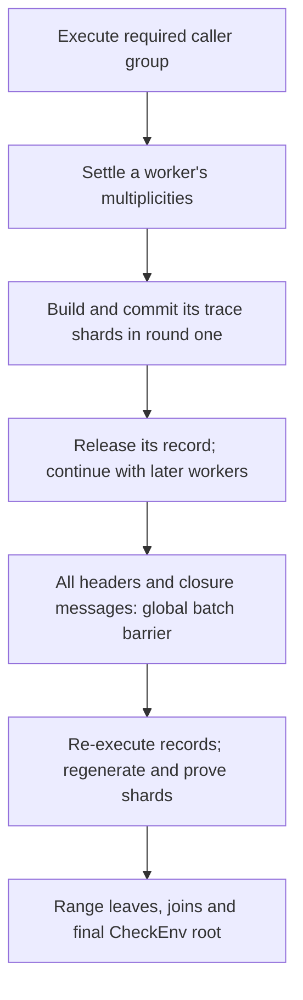

# GPU performance recommendations for distributed Aiur execution

2026-09-10. Source review and recommendations; no builds, tests or benchmarks
were run for this document.

Base implementation: ix `sb/aiur-distributed-execution` at
[`e3a2972080e1c29d1d4ca2b54db48a053033d821`][ix-revision] and multi-stark
`sb/trace-sharding` at
[`9322ec062c78a51843f78ea23119ea5a65b19b16`][ms-revision].
The ix revision pins that exact multi-stark revision. These branches were read
in isolated clones; the existing workspace and its implementation changes were
preserved. This document builds on the branch's [handoff][handoff],
[results][results] and [performance audit][audit].

**Implementation policy: do not copy pil2-stark code.** Use pil2-stark only as
a conceptual reference. Independently reimplement worthwhile algorithms and
scheduling techniques within Aiur/multi-stark, using their existing field,
transcript, commitment format and ownership model. These recommendations do
not propose copying, translating, vendoring or adding a dependency on
pil2-stark implementation code.

The priority is to feed a resident GPU continuously while reducing duplicated
execution and trace work. The current branch already provides the essential
single-claim distributed execution and range recursion. GPU integration should
build on those mechanisms.

**What is already implemented.** These are source findings, not new performance
measurements:

| Mechanism | Current implementation | Remaining performance work |
| --- | --- | --- |
| Concurrent execution for one claim | Private worker records, deferred `check_owned` calls, corrected multiplicities and disjoint pointer namespaces | Tune ownership layout, admission and duplicated work |
| Streaming first commitment pass | Records are supplied and planned incrementally; multi-stark accepts an iterator of shards | Overlap trace witness generation with GPU work |
| Record release and regeneration | Drop each supplied record after its round-one shards; execute it again for round two | Budgeted record caching and sufficient execution lookahead |
| CPU execution prefetch | Execute the next worker while the current record is committed/proven; `--no-prefetch` disables it | Measure GPU starvation and admit additional lookahead only when useful |
| Dependency-ordered chunks | `ix shard --ordered`; `--distributed --plan-only` reports caller groups | Balance record size, execution cost and caller dependencies |
| Range-sum recursion | `ix aggregate --range N`; range leaves, joins and final root | GPU admission, ready-node scheduling, caching and verifier work |
| Grouped row estimates and piece padding | Group member counts are summed; large circuits use full power-of-two pieces plus a remainder | Calibrate heights and packing for the actual GPU |

Sources: [worker driver][workers], [record supplier][supplier],
[two-call batch prover][batch], [trace planner][planner] and
[range recursion][range-circuit].

**Chunks are execution partitions of one claim.** A chunk is an ownership
partition from the manifest, executed into one private record. Its traces may
produce many trace shards. All workers' trace shards join one batch proving
one whole-environment `CheckEnv` claim. They do not require the old sequence
of separate environment claims, frontier unions and assumption discharge.

Parallelism comes from the new deferred-call mechanism, not concurrent mutation
of one `QueryRecord`. Calls at the designated ownership boundary return no
value and can be deferred; the owning record supplies the corresponding lookup
rows. Preserve that boundary and the namespace/closure rules when optimizing.
This is not a general facility for splitting arbitrary memoized calls among
threads. [Execution representation][execution]

The present dependency chain is:

CPU execution of the next worker already overlaps C and F. The GPU can begin
round-one commitments before every chunk has executed, provided the current
record's callers have finished and its multiplicities are final. It cannot
finish round-two proofs before the global header/message barrier.

Within a chunk, the complete record is still needed before its trace plan and
witnesses are produced. Also, mutually calling chunks can force a whole caller
group to execute before the first commitment. Streaming therefore depends on
the ownership layout; it does not make arbitrary manifests have a two-record
memory bound. [Supplier lifecycle][supplier], [caller ordering and prefetch][workers]

**Measurements and their scope.** Stage 1 below means the complete leaf/batch
proof from `ix prove`: execution, planning and both STARK batch rounds.
Stage 2 means recursive aggregation by `ix aggregate`. The internal
`stark/stage1_commit` span is only the main-trace commitment operation and
must not be confused with either of these whole stages.

The earlier GPU run used ix `ab627cd6` and multi-stark `2042565b`, before
the distributed implementation. It is useful evidence about the CUDA backend,
not a benchmark of the current pipeline:

| Earlier Init GPU run | Recorded result |
| --- | ---: |
| Configuration | One record, 40 trace shards, 1.5 billion cells/shard, piece cap 2^24, Regenerate |
| Execution | About 6.2 minutes in the proving run |
| Complete STARK batch | About 625 seconds |
| Whole Stage 1 | 16:44.90 |
| Host peak / sampled VRAM peak | About 112 GiB / 66.5 GB |
| Stage 1 proof / native verification | 53.8 MB / successful, about 11.6 seconds |
| Stage 2 | Not included |

The 3.4 TB unsharded CPU peak was a model projection. The recorded GPU run had
no spill. Its query record stayed on the host, but main trace matrices were
uploaded; device-generated lookup and quotient data need not make the same
host-to-device trip. [Earlier GPU run notes](aiur-trace-sharding-gpu-plan.md)

A subsequently completed log on that GPU host reports a CPU Stage 1 of
31:38.26 and a 25.24-minute STARK batch. However, it has **36 trace shards
against the GPU run's 40**. The raw ratios, approximately 1.9x overall and
2.4x for STARK, are not a controlled same-plan CPU/GPU speedup. The script's
intention to use identical settings does not override the actual plans.

The corrected branch's documented measurements are on a different machine:
64 logical CPU cores, about 495 GB RAM, no GPU. They establish that distributed
execution and a small final proof already work:

| Current branch's documented CPU configuration | Stage 1 | Stage 2 | Final proof |
| --- | --- | --- | --- |
| Four min-cut chunks, 71 trace shards, 1.8 billion cells, prefetch | 28:16, 159 GiB peak | Serial range tree in a 100 GiB slot: 25:45, 88.5 GiB peak | 6.95 MiB, verified |
| Eight ordered chunks, 95 trace shards, same cell budget | 37:25, 113 GiB peak | Not rerun on this leaf | Not reported |
| Prior env model on the same CPU code, nine env shards | 33:21, 347 GiB peak | 14:19, 197 GiB peak | 5.86 MiB, verified |

The branch also records four-worker execution around 107 seconds, and an
eight-worker execution-only run around 101 seconds. Those are distinct runs,
not GPU timings. The user's prior `ix shard refine` result of Init execution
under a minute remains a useful performance baseline; compare equivalent
inputs and CPU resources when targeting it. Six-minute single-record execution
is not a fixed architectural floor. [Detailed measurements and caveats][results]

The under-10-MB expectation concerns the final recursive root. A roughly
50–160 MB intermediate batch does not contradict it. The verified 6.95 MiB
CPU root demonstrates that outcome for the measured distributed Init batch;
GPU Stage 2 time and Mathlib-scale root size still need measurement.

**Recommended work, in priority order.**

1. **Make host and device admission explicit across both stages.**

   Keep `--cells` as a device work cap, but add a measured VRAM budget and
   reserve space for all live committed rounds, Merkle/FRI scratch, cached
   resources and allocator headroom. A shard fitting its main trace alone
   is insufficient. Use one GPU admission mechanism shared by base proving
   and recursion.

   The distributed CLI defaults `--cells` to zero, meaning one trace shard
   per record. Its worker driver receives `--exec-jobs` but no
   `--max-ram` budget. A thread-count limit therefore does not enforce a
   host-memory limit. Charge executing records, completed caller records,
   prefetched records, IO, current/next witnesses, pinned buffers and retained
   metadata to one host budget. [CLI wiring][prove-cli], [worker state][workers]

   Add equivalent cell/device budgeting to aggregation. Currently its
   environment-variable cell override is consulted inside the
   `peak > max_bytes` host gate. A recursion job can fit that host estimate
   yet exceed VRAM, and automatic retention is selected from a host model.
   Enforce the device cap independently of that gate and make retention
   decisions account for actual device storage. Fix the infeasible
   `plan_shards_within` path with an early record-floor rejection and a
   minimum feasible piece check before generating enormous plans.
   [Budget gate][budget-gate], [planner][planner]

   The old run's approximately 44 bytes of peak VRAM per committed cell is
   an initial calibration. A 1.6–1.7-billion-cell budget on the 96 GB card is
   a candidate to test, not a demonstrated limit for every shape. Start with
   the already measured 1.5-billion-cell setting and recalibrate base and
   recursion shapes separately. Treat spill/fallback as a failure of a
   benchmark intended to measure resident GPU throughput.

2. **Remove repeated allocation and pinning from the commitment path.**

   Reuse managed control blocks, keep a bounded device pool warm across
   synchronization, and recycle pinned host buffers. Prefer generating
   traces into reusable pinned storage when that avoids both registration
   and a staging copy. Release/reuse a buffer only after its consuming CUDA
   event completes. Stream-ordered allocation already exists; the task is
   to fix resource lifetime and reuse around it.

   The earlier partial Nsight capture points here:

   | CUDA API | Summed call duration | Calls |
   | --- | ---: | ---: |
   | `cudaMallocManaged` | 80.1 s | 71 |
   | `cudaMallocAsync` | 31.9 s | 314 |
   | `cudaHostRegister` | 23.5 s | 22 |
   | `cudaHostUnregister` | 17.1 s | 22 |

   These are overlapping host API durations, potentially including waits,
   from a capture containing only part of round one after execution.
   They cannot be added as wall-time savings, extrapolated to the whole
   batch, or used to establish a 1.2-second commitment floor. The current
   CUDA source still contains the managed allocation and per-trace
   registration sites. [CUDA commitment code][cuda-commit]

   Record transparent huge page settings, allocator configuration, page
   faults and NUMA placement during comparisons. Existing CPU reports make
   these worthwhile controlled experiments; they do not establish a
   universal pinning multiplier or justify treating one host setting as
   mandatory for all machines.

3. **Eliminate unnecessary host lookup witness materialization.**

   The resident CUDA graph path evaluates lookup messages from the main
   trace. Give it a metadata-only lookup representation and skip allocating,
   zeroing and filling host lookup payloads that it will not consume.
   Preserve dimensions, slot layout and other metadata it does consume.

   Make this a backend capability with an explicit fallback contract.
   Simply enabling a CUDA feature or skipping writes into an allocated
   `LookupValues` buffer is insufficient: CPU and hybrid paths may read
   that payload. Either produce it lazily when required or enforce and check
   the resident graph path before relying on its absence.

   Local prototypes in the older checkout skip lookup writes but still
   allocate the builder; they are not this completed optimization. Keep
   meaningful CPU and CUDA negative tests instead of treating a forged host
   lookup witness as equivalent to a forged trace on every backend.

4. **Add trace witness lookahead to both new batch APIs.**

   The current `batch_round_one` consumes and commits each witness
   synchronously. `batch_round_two` likewise regenerates a witness before
   committing/proving it. The iterator API enables streaming but does not
   itself create CPU/GPU overlap. Build witness k+1 while the GPU handles
   shard k, initially with one prepared witness and one GPU proof in flight.
   [Batch loops][batch]

   Implement this around the two-call APIs used by
   `prove_record_supplier`, not only the older `prove_batch_with`
   convenience function. Preserve deterministic shard indices, final
   multiplicities, record ownership and the regenerated-header equality
   check. Budget the additional witness together with the already existing
   next-record execution. Ensure producer errors stop and drain work.

   SP1 provides a useful design reference: CPU trace generation writes
   directly into pooled pinned storage, completed traces are uploaded as
   they become available, and a shared GPU permit limits concurrent proofs.
   Start with whole-witness lookahead; consider per-matrix upload as a
   subsequent step if the timeline shows useful overlap.
   [SP1 trace generation][sp1-trace], [SP1 shared permit][sp1-builder]

5. **Tune distributed execution for GPU consumption rate.**

   Use dependency-ordered ownership so caller groups remain small. Compare
   four and eight ordered chunks on Init before attributing the existing
   min-cut/ordered timing difference to chunk count alone. Balance chunks
   by execution work and retained bytes; worker 0 also performs the claim
   walk and may benefit from a smaller owned partition.

   On Mathlib, 10–20 chunks is a starting hypothesis, not a known sufficient
   count. Choose count and concurrent lookahead from the largest record,
   caller-group residency, namespace capacity and duplicated memoized work.
   Keep the single batch and claim. There is no requirement to return to
   230–240 independently aggregated environment claims.

   Measure how long the GPU waits for each execution. One-record prefetch
   may stop being enough after GPU proving gets faster: ordered CPU runs
   reported roughly 55–100 seconds per round-two execution. Permit a bounded
   queue or multiple future executions only when dependencies and host
   capacity allow it. Preserve deterministic ownership/order and reserve
   CPU resources for trace generation as well as execution.

   The driver also rebuilds a worker's incoming multiplicities by scanning
   every completed worker's deferred map. At large worker/call counts,
   aggregate these counts by owner as execution completes, preserving
   exact addition and settlement rules. Measure this separately from kernel
   execution. [Deferred-call settlement][workers]

6. **Separate record caching from GPU commitment retention.**

   The distributed supplier currently forces `Retention::Regenerate`,
   releases a record after round one and re-executes it for round two.
   There are three separate costs: kernel re-execution, trace witness
   regeneration, and repeated main commitment.

   A bounded host cache of selected complete records can avoid expensive
   kernel re-execution without keeping their LDEs on the GPU. Prioritize
   records by exposed re-execution time per retained byte after accounting
   for prefetch. This may be attractive on Init; retaining all Mathlib
   records defeats the streaming objective.

   Separately evaluate commitment retention for small recursion nodes that
   truly fit beside their proving workspace. Do not select GPU
   `Retain` from available host RAM or retain every large batch's device
   state across the barrier.

   A dedicated round-one path that computes only the required header can
   reduce unnecessary surviving buffers and cleanup. It still must compute
   the correct LDE/Merkle commitment; it does not remove the shared-challenge
   barrier or make the second commitment free.

7. **Optimize resident LDE and Merkle work together.**

   The old 625-second batch spent about 196 seconds building witnesses and
   275 seconds in main commitments. That 75% is the first target, but main
   commitment includes real GPU work. It is incorrect to classify only
   lookup, quotient and FRI as GPU phases. Recorded main LDE volume was
   about 5.9 times quotient LDE volume, so 3.4-second main and 0.9-second
   quotient spans are not equal-volume comparisons.

   Independently prototype the useful pil2-stark concepts: more FFT stages
   per kernel launch, compact twiddle representation, cache-sized column
   groups, fused coset expansion/zero handling, and workspace reuse across
   operations with non-overlapping lifetimes. Compare layouts including
   transpose and hash-gather costs. Preserve multi-stark's Goldilocks
   arithmetic, evaluation order, canonical representation and Blake3
   commitments. [Conceptual NTT reference][pil-ntt],
   [conceptual workspace reference][pil-starks]

   Do not optimize NTT in isolation. In the partial capture, Blake3 row
   hashing was about 44% of summed kernel duration and radix-8 stages about
   40%; row hashing and gathering each had thousands of launches.
   Investigate batching/fusing those paths as well.

   Benchmark the production resident LDE-to-Merkle pipeline at its actual
   blowup, heights and widths. The existing transfer-inclusive DFT numbers
   and LDE rows marked CPU fallback do not measure that path.

   The current ix planner already uses full power-of-two pieces plus a
   remainder. Tune its default 2^22 cap for the GPU, using 2^24 as a measured
   historical candidate. Optimize padded cells, active widths, GPU time
   and recursive child bytes together; shard count alone is not the
   objective. The old 68-to-40 reduction is not another gain to claim
   against a baseline already using 2^24.

8. **Optimize the implemented range tree as part of the GPU product.**

   Measure a GPU range leaf, join and root, then the complete Stage 2 on the
   same distributed batch. The CPU root already meets the Init size target.
   The open GPU question is how quickly, and with how much host/device
   memory, the tree produces it.

   Replace fixed batches and level barriers with a queue of ready nodes;
   start a parent once its adjacent children finish. Persist and authenticate
   individual nodes for reuse, keyed by batch identity, range and verifier
   identity. Enforce one admission budget across outer aggregation jobs,
   range nodes, prefetched execution and GPU resources.
   [Current tree scheduler][range-driver]

   Keep one GPU proof active initially while preparing later nodes on CPU.
   More `--jobs` can otherwise create competing large device allocations.
   The corrected CPU measurements show joins have a substantial verifier
   floor, around 205 GB projected unsharded, and require multiple trace
   shards in a 100 GiB host slot. Smaller ranges create more nodes paying
   that floor. Cut contiguous ranges by measured verifier work/child bytes,
   rather than assuming fewer shards per leaf is always better.

   Range leaves and the final root currently authenticate and parse the
   full batch preamble; joins operate on their children's range statements.
   Reducing repeated full-preamble work needs an authenticated compact
   context and coordinated transcript/verifier changes. It is a later
   protocol optimization, not an unchecked host cache.
   [Range circuits][range-circuit]

   SP1's specialized recursion trace generation is another useful direction:
   after profiling Aiur range execution and witnesses, independently add
   fast paths for the dominant fixed verifier operations. Do not assume a
   small public range statement automatically gives a small or cheap
   recursive STARK. [SP1 recursion trace generation][sp1-recursion]

   Eventually stream completed round-two shard proofs into ready range
   leaves. Today the batch API collects all proofs before returning and
   aggregation is a separate command; that cross-stage overlap requires
   an explicit proof-output/scheduling interface.

**How the upstream GPU designs inform this work.** SP1's transferable lesson is
CPU/GPU overlap, reusable pinned storage, resident data and specialized recursion.
It does not move all ordinary execution or trace generation to the GPU.
Its field and proof architecture differ from Aiur, so kernel throughput figures
are not directly transferable.

Zisk's proofman stack supplies conceptual examples of reserved GPU workspaces,
compact input expansion on device and event-controlled reuse of host buffers.
Compact uploads may be useful after unnecessary host lookup payloads are removed;
compare total CPU packing, transfer and GPU unpack cost.
[Zisk packed inputs][zisk-packed], [proofman workspace planning][proofman-layout],
[pil2-stark expansion/workspace concepts][pil-starks]

CUDA graphs and multiple GPUs are subsequent options once the first GPU is
well supplied. Use one owner of each device's budget and persistent resources.
Distribute the existing commitment/proof work while preserving the common
barrier and deterministic result order; do not duplicate whole-environment
execution on every GPU as the default scaling strategy. Faster GPUs will make
CPU starvation and record movement more visible.

SP1/Zisk speedup reports are motivation for an ambitious target, not a matched
Aiur benchmark. A 10x improvement over an equivalent CPU pipeline is worth
targeting. Achieving it requires attention to execution, witness production,
allocation, device kernels and recursion together. The older single-record
run is not an architectural ceiling.

**Validation and the next measurements.** The first new GPU experiment should
use the two revisions at the top of this document and a distributed Init batch,
with a CPU comparison using the same input, ownership manifest, actual trace
plan, grouping and proof parameters. Record those identities and the real
shard counts; the existing 36-versus-40 discrepancy shows why CLI settings
alone are insufficient.

Establish Stage 1 and Stage 2 separately, then measure changes incrementally:
allocation/pinning reuse, lookup payload removal, witness lookahead, and their
combination. Measure execution/cache policies and kernel changes separately
so overlapping gains are not multiplied together. Local older-checkout
prototypes for allocation reuse and witness lookahead need adaptation to the
reviewed branches; their presence is not a measured speedup here.

Report execution work and wait time, both commitment passes, witness time,
kernel/DMA timelines, spill events, peak host/pinned/device bytes, padded
cells, active widths, recursion node counts and final root size. Distinguish
native proof-check latency from input loading and full verification-command
wall time.

For storage, scheduling and GPU arithmetic changes, require matching main and
lookup values/commitments against CPU references, regenerated-header equality,
and complete claim-bound verification through the range root. Include deferred
calls across records, nonzero pointer bases, padding, failure cleanup and CPU
fallback behavior. Preserve production security parameters; reducing FRI queries
or proof-of-work is a separate security choice, not a performance optimization
to include silently.

Witness lookahead alone was modeled at roughly 438 seconds for the old
625-second batch. That estimate illustrates why pipelining is useful but
insufficient for a 10x goal. It is neither a forecast for the new 71/95-shard
distributed batches nor a lower bound after allocation and kernel changes.
Use a matched CPU/GPU comparison and complete Stage 2 to judge progress.

Evidence files read locally: `~/benchdata/trace-shards-gpu/init-gpu-c15.log`,
`init-cpu-c15.log`, `chain.sh`, `init-r1_cuda_api_sum.csv`,
`init-r1_cuda_gpu_kern_sum.csv`, `init-r1_cuda_gpu_mem_time_sum.csv` and
`dft-bench.csv`. Current-branch CPU results above are attributed to its
checked-in result documents; they were not rerun for this review.

[ix-revision]: https://github.com/argumentcomputer/ix/commit/e3a2972080e1c29d1d4ca2b54db48a053033d821
[ms-revision]: https://github.com/argumentcomputer/multi-stark/commit/9322ec062c78a51843f78ea23119ea5a65b19b16
[handoff]: https://github.com/argumentcomputer/ix/blob/e3a2972080e1c29d1d4ca2b54db48a053033d821/docs/trace-sharding-handoff.md
[results]: https://github.com/argumentcomputer/ix/blob/e3a2972080e1c29d1d4ca2b54db48a053033d821/docs/trace-sharding-results-2026-09-09.md
[audit]: https://github.com/argumentcomputer/ix/blob/e3a2972080e1c29d1d4ca2b54db48a053033d821/docs/trace-sharding-performance-audit.md
[workers]: https://github.com/argumentcomputer/ix/blob/e3a2972080e1c29d1d4ca2b54db48a053033d821/crates/ffi/src/aiur/protocol.rs#L1352
[supplier]: https://github.com/argumentcomputer/ix/blob/e3a2972080e1c29d1d4ca2b54db48a053033d821/crates/aiur/src/synthesis.rs#L490
[execution]: https://github.com/argumentcomputer/ix/blob/e3a2972080e1c29d1d4ca2b54db48a053033d821/crates/aiur/src/execute.rs#L31
[batch]: https://github.com/argumentcomputer/multi-stark/blob/9322ec062c78a51843f78ea23119ea5a65b19b16/src/batch.rs#L480
[planner]: https://github.com/argumentcomputer/ix/blob/e3a2972080e1c29d1d4ca2b54db48a053033d821/crates/aiur/src/shard.rs
[prove-cli]: https://github.com/argumentcomputer/ix/blob/e3a2972080e1c29d1d4ca2b54db48a053033d821/Ix/Cli/ProveCmd.lean#L338
[budget-gate]: https://github.com/argumentcomputer/ix/blob/e3a2972080e1c29d1d4ca2b54db48a053033d821/crates/aiur/src/synthesis.rs#L832
[cuda-commit]: https://github.com/argumentcomputer/multi-stark/blob/9322ec062c78a51843f78ea23119ea5a65b19b16/cuda/kernels.cu#L2183
[range-circuit]: https://github.com/argumentcomputer/ix/blob/e3a2972080e1c29d1d4ca2b54db48a053033d821/Ix/Aggr/Circuit.lean#L857
[range-driver]: https://github.com/argumentcomputer/ix/blob/e3a2972080e1c29d1d4ca2b54db48a053033d821/crates/ffi/src/aiur/aggregate.rs#L1502
[sp1-trace]: https://github.com/succinctlabs/sp1/blob/a3f98a36431af2d5c0789702b3b6510565a4f391/sp1-gpu/crates/jagged_tracegen/src/lib.rs#L719
[sp1-builder]: https://github.com/succinctlabs/sp1/blob/a3f98a36431af2d5c0789702b3b6510565a4f391/sp1-gpu/crates/prover_components/src/builder.rs#L103
[sp1-recursion]: https://github.com/succinctlabs/sp1/blob/a3f98a36431af2d5c0789702b3b6510565a4f391/sp1-gpu/crates/tracegen/src/recursion/mod.rs
[zisk-packed]: https://github.com/0xPolygonHermez/zisk/blob/b08d856c0f72b21d94fc49151deefaf8e7419b79/pil/src/packed_info.rs
[proofman-layout]: https://github.com/0xPolygonHermez/pil2-proofman/blob/0f3fef8cd1897df469532996e72e0c84ef69d6fb/common/src/gpu_stream_layout.rs
[pil-starks]: https://github.com/0xPolygonHermez/pil2-proofman/blob/0f3fef8cd1897df469532996e72e0c84ef69d6fb/pil2-stark/src/starkpil/starks_gpu.cu
[pil-ntt]: https://github.com/0xPolygonHermez/pil2-proofman/blob/0f3fef8cd1897df469532996e72e0c84ef69d6fb/pil2-stark/src/goldilocks/src/ntt_goldilocks.cu#L1261
