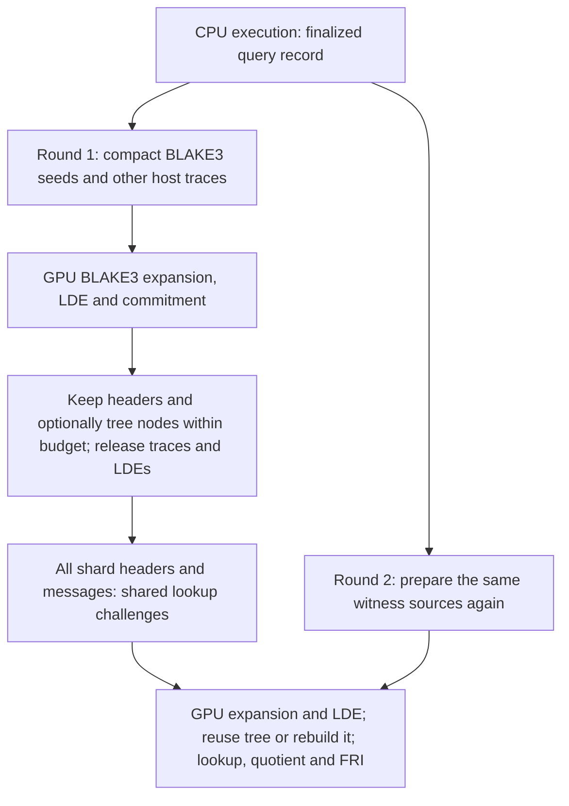

# GPU generation of Aiur BLAKE3 traces

2026-09-14 design, retained as a record of the original proposal. The
BLAKE3 GPU writer is implemented. The optional Merkle-tree cache described
below was tested and then removed: retaining all 91 Init trees with a
24 GiB allowance used more device memory without improving runtime in the
measured run. Tree-retention sections below are historical proposals, not
remaining implementation or enablement requirements.

See the [current implementation notes](aiur-gpu-trace-generation.md),
[retention results](../bench/tree-cache-2026-09-15/README.md), and
[CPU/GPU trace comparison](../bench/gpu-trace-regenerate-2026-09-15/README.md).
The original source review covered ix `8057152c` and multi-stark
`f15a6c4d1672a5815eab0fa8a48683f8bd078f92`.

**Decision.** Keep GPU main-trace generation for `blake3_compress` opt-in.
Integrate with the single-process resident workers implemented in §3.4 of
the [multi-GPU design][resident-workers]. CPU execution semantics, shard
planning, within-proof witness lookahead and `Retention::Regenerate` remain.
Other circuits use their host trace builders. Round one keeps only headers;
round two regenerates main traces, LDEs and Merkle trees. Cross-round tree
and LDE caches are outside the current implementation.

**Runtime dependency.** The branch runs one process with one resident prover
session per GPU, one central ready queue, `--exec-jobs` preparation threads,
and a bounded hand-off of one prepared task beside each running proof. Each
execution receives its existing share of the worker's record budget, with
the `exec_jobs + 2` divisor accounting for prepared and proving items.
Each session retains its IxVM and
aggregation systems across tasks. Shared plan/statement metadata and verified
children remain available to the scheduler. Use the existing scheduler's
state transitions and preparation/proving split; the trace generator does
not introduce another scheduler or another allocation budget.

CPU preparation produces host-owned records, compact seeds, and ordinary
host traces under bounded admission. The selected session takes its GPU
proving permit before uploading seeds or generating device traces. A task's
device allocations stay with that session through commitment, lookup,
quotient, FRI, and recovery. Device traces are not moved between workers.
Release the permit only after outstanding GPU uses finish. Report each
claim/join completion after its proof is published so dependent work can
enter the central queue immediately; kernel completion is not task completion.

The resident-session interface and multi-device resource ownership are
implemented on the branch. Use that runtime with CPU trace construction as
the baseline before attributing any additional improvement to GPU generation.
The earlier process-based sections of the multi-GPU document describe the
previous reference; this plan targets its resident workers. Persistent
systems and reusable allocations do
not imply retaining every shard's witness across the lookup-challenge barrier.

The expected savings are CPU reconstruction of BLAKE3 auxiliaries, allocation
and population of its expanded host matrix, and uploading that matrix in
both proof rounds. Compact seed preparation and GPU expansion have their own
costs. The prototype still writes the expanded device trace and repeats its
LDE in round two. The initial Regenerate comparison also repeats Merkle
construction; a hit in the subsequent tree cache avoids that hashing work.
The initial Init measurement above establishes a workload result; repeated
runs, a single-GPU comparison and Mathlib measurements remain outstanding.

The AIR, lookup messages, circuit activation, row order, padding, transcript,
proof format, and verifying keys must remain identical. A kernel compatibility
identifier is an implementation check; it must not change proof semantics.

**Protocol and lifetime boundary.** A finalized query record supplies the
inputs, outputs, and multiplicities needed to reconstruct each main-trace
row. These rows do not depend on the lookup challenges. The challenges do
depend on every shard's first-round commitment, headers, claims, and boundary
messages. Discarding stage-one state is a retention choice, not a protocol
requirement. [Batch protocol][ms-batch]

Both variants prepare seeds per shard, per round. They do not retain extra
packed seed copies across the barrier; the existing query record remains
the regeneration source. The only optional additional checkpoint is a
Merkle tree and its metadata. Within a shard's proving state, the source
owns packed host seeds until the last consumer finishes;
it does not borrow pointers into a temporary query-map iterator. Device seed
copies are disposable and charged to admission. This distinguishes recovery
after a device-memory spill from cross-round retention; the former is
required for correctness immediately.

**BLAKE3 seed and trace contract.** The compiled circuit has 129 input
elements, two selector columns, and 402 auxiliary columns, for 533 main-trace
columns. Its recorded result contains 32 elements. [Circuit source][blake3]

| Per real row | Elements | Packed bytes |
| --- | ---: | ---: |
| Input: stage plus 128 state bytes | 129 | 129 |
| Recorded result | 32 | 32 |
| Final multiplicity | 1 | 8 |
| Explicit alignment padding | — | 7 |
| Compact seed total | 162 | 176 |
| Expanded main trace | 533 | 4,264 |

The ratio is `4264 / 176 = 24.2273`. It describes row-upload bytes, including
seed padding but excluding metadata and staging. It is not a prediction of
runtime or peak VRAM reduction. Extraction validates stage and byte bounds
before narrowing; the multiplicity remains a full canonical field word.

Prepare only the selected shard's nonzero-multiplicity queries, using the
existing `RowIndex`, circuit membership, and query ordering. Carry the real
row count, padded height, circuit/function identity, and layout separately
from the seed words. An empty circuit remains inactive with height zero.
The CPU record remains authoritative; seed extraction adds no call/store
logging and does not change execution or its multiplicity accounting.
[Current row selection and layout][trace] [Shard witness construction][shard]

The writer must satisfy all of these requirements:

- For stages 0 through 6, reconstruct the round arithmetic, auxiliary
  witnesses, and message permutation. The recursive call returns the same
  result as its parent, so the parent's recorded output supplies the call's
  output auxiliaries without searching the query map.
- Preserve the recursive-call lookup: the compiled lookup graph must still
  send the call with the next stage, reconstructed state, result, and the
  circuit's multiplicity rules. The shortcut changes result retrieval only.
  Supply the ordinary shape-only lookup metadata so the existing GPU graph
  computes all active lookup messages, including the function return.
- For stage 7, emit the final XOR witnesses and the correct branch selector.
  Emit the default-branch inequality witness for earlier stages. Precomputed
  inverses for the supported stage values are permissible if identical to
  the CPU field values.
- Write every defined column and zero every unused auxiliary, inactive
  selector, and padded row. Support generation of a row interval as well as
  a complete matrix; this is needed for bounded recovery during lookups.
- Define the device ABI as canonical Goldilocks `uint64_t` words, with
  explicit lengths, layout, and alignment. Compare CPU cells after
  `as_canonical_u64()` and require each device word to be canonical; field
  equality alone must not hide an incompatible raw encoding.
- Match the compiled function body, constants, layout, and selector offsets
  against a supported kernel signature before dispatch. A name or a width
  check alone is insufficient. Resolve identities from compiled metadata;
  IxVM and aggregation need not assign the same circuit index. Unsupported
  layouts or stage values select the reference builder before dispatch.

This is an Aiur witness kernel: a BLAKE3 digest kernel does not expose the
required circuit intermediates. Keep the first implementation specialized;
a compiler backend covering arbitrary Aiur functions is subsequent work.
Use bounded row tiles and inspect register/local-memory usage before choosing
one thread, a warp, or a block per row. Preserve logical row order regardless
of the physical execution arrangement.

**The multi-stark interface is the principal integration task.**
`SystemWitness` currently requires host matrices, and `prove_stage_1` passes
them to `Pcs::commit`. Add a prepared-witness path that accepts an ordered mix
of host traces and backend-generated traces. Adapt ordinary `SystemWitness`
through that path so activation, domains, commitment ordering, and stage-one
header construction have a single implementation. Adapt the batch producer
to accept these prepared witnesses while preserving its current lookahead.
[Witness type][ms-witness] [Stage-one commitment][ms-prover]

The proposed concepts below describe required contracts, not existing API
names. Keep generic prover interfaces independent of CUDA and keep Aiur
circuit semantics in ix. multi-stark owns device storage, commitment, and
recovery orchestration; the Aiur CUDA provider owns BLAKE3 seed interpretation
and row generation. Compile that provider only under the existing CUDA
feature, with explicit build/link integration for the Rust/Lean consumer.

| Concept | Required information and ownership |
| --- | --- |
| Resident device session | Explicit device configuration, session-owned CUDA resources, one proving permit, and access to shared host/per-device admission |
| Trace source | Immutable dimensions and row order; either an owned host matrix or an owned generator with its seeds and compatibility signature |
| Device trace | Owning session/device/context identity, original main-trace dimensions and layout, allocation ownership and reservation, and readiness/lifetime tracking |
| Row generation operation | Destination admitted by the selected session, logical row interval, consumer stream, and a completion dependency |
| Committed state | Commitment and LDE/tree storage plus a recoverable source of the original main trace, retained independently of LDE residency |

Construct device-specific configurations explicitly through the resident
runtime's `GoldilocksBlake3Config::with_device` path. Do not select a worker's
device by changing process environment variables. Make upload slots, the
two-slot pinned host pool, and the managed control-block slab per-device as
specified by the runtime plan. Audit constant/twiddle caches and reusable
allocations for device ownership too. Trace generation leases the session's
existing resources; it must not add process-global staging or scratch with
an implicit device-zero owner. This work belongs to the common runtime
foundation and must be shared with the resident-worker implementation.

Extend the resident LDE entry point to consume a device trace without
downloading it. Preserve the original row-major main trace separately from
the transformed LDE: lookup construction needs the former. Ownership must
transfer or be shared explicitly; an allocation must never be adopted by
two destructors. [Current upload/LDE path][ms-lde]

A producer records completion after uploading seeds and writing the trace.
Consumers on another stream wait on that dependency before reading. Seeds,
trace buffers, and scratch cannot be freed, overwritten, or reused until
their last consumer completes. Validate device identity at each handoff.
For the initial path, run generation on the consuming commitment stream and
preserve existing synchronous boundaries; extra asynchronous overlap is a
later measured change. The contract must also cover existing Rayon worker
streams and lookup consumers, rather than assuming the default stream
synchronizes all of them. Every CUDA launch, allocation, event, and cleanup
path establishes the owning device on its calling host thread; Rayon workers
do not inherit the session thread's current CUDA device. Keep the session
resources alive until the last dependent handle is released. Failure paths
drain outstanding uses before releasing owned resources.

The process is one failure domain. Recoverable task failures return through
the scheduler after releasing their resources; fatal process/device failures
resume from published proofs after a process restart. The per-process
supervisor's ability to kill one worker does not carry over to an in-process
thread. Keep the resident runtime's error policy, without adding a separate
retry controller in trace generation.

**Recovery must survive both kinds of eviction.** Today
`resident_with_trace` can reattach retained host matrices after a device
trace is released. `release_values` also releases the original trace, and
an evicted hybrid LDE makes `resident_with_trace` return `None`. The lookup
path may then try host lookup payloads, which a shape-only witness does not
contain. Merely replacing the upload constructor cannot support this case.
[Main-trace access][ms-mmcs] [Release operations][ms-release]
[Lookup dispatch][ms-lookup-dispatch]

Keep the trace source and its shape outside the evictable LDE allocation.
Replace the assumption that main-trace access requires a resident LDE with
access to that source. Required transitions are:

| State or event | Required behavior |
| --- | --- |
| Original device trace resident | Lookups read it after its readiness dependency completes |
| Original trace released, LDE still resident | Regenerate from owned compact seeds; no retained host matrix is assumed |
| LDE evicted/materialized on host | Preserve the trace source independently; lookups can regenerate rows while quotient/FRI use the existing committed-data recovery path |
| Full trace plus lookup workspace does not fit | Generate bounded device row tiles for the lookup graph |
| Shard complete, or round-one state discarded | Release seeds, buffers and handles after outstanding consumers finish |

Extend the lookup graph interface to consume generated row tiles. Split its
current construction loop into preparation, chunk consumption, and finishing
operations as needed so the Rust provider can fill each tile on the correct
stream. The existing loop already handles chunks of at most `2^16` rows and
copies one extra next-row value for host-backed chunks. Preserve its halo,
wraparound, logical row index, padding, and accumulator semantics when the
tile comes from a generator. Permit a smaller tile when the budget requires
it. This does not eliminate the lookup output or other proving workspaces.
[Current lookup chunk loop][ms-lookup-kernel]

GPU main-trace generation does not require redesigning LDE spill storage.
Preserve the existing ability to materialize committed LDE values on the
host within an active proof when necessary; report those transfers separately
and release them with that proof's state. They are not retained across the
round-one barrier. Releasing either LDE values or main-trace values must not
destroy the
ability to supply original trace rows or force a read of absent lookup data.

Check backend and lookup-graph support before choosing a generated source.
Unsupported cases use the ordinary host-witness route with the lookup data
that route needs. If CPU lookup evaluation is needed, select a builder mode
that produces actual payloads before discarding that information; the global
trace-only flag is not a sufficient fallback policy. Do not silently
interpret shape-only metadata as payloads. Report fallback reasons.
CUDA errors must propagate through the existing error path after cleanup;
they must not cause an unbounded allocation or retry loop.

**Selected retention policy: bounded Merkle trees.** Add a tree-only
checkpoint per trace shard after measuring the GPU writer with ordinary
Regenerate. Keep the full mixed Merkle node buffer needed for authentication
paths, its commitment/header, and small layout metadata. Release the original
main traces, LDE values, host LDE spill copies, lookup payloads, and temporary
packed seeds from that shard. Resident system/preprocessed data and the
existing query record have their ordinary lifetimes and remain budgeted.

The tree's size depends on the maximum extended height across the shard's
active matrices. The current mixed-tree allocation is `64*H` bytes for
extended height `H`, independent of the matrices' total column width.
For illustration, at the default 4x blowup, a tallest BLAKE3 matrix with
`2^20` base rows has a 16.66 GiB LDE and a 256 MiB mixed-tree allocation.
That is about 1.5% of this matrix's LDE size. A taller circuit increases the
shared tree's size, and many trees still add up; admission uses actual
heights and bytes rather than this example. [Tree allocation][ms-tree-size]
[Default commitment parameters][protocol]

| Barrier entry | Round-two behavior |
| --- | --- |
| Header and admitted tree | Regenerate the main traces and LDEs, then restore commitment access using the cached tree; skip leaf hashing and internal Merkle construction |
| Header only, including an evicted tree | Regenerate the main traces and LDEs and rebuild the Merkle tree normally |

Both paths still perform lookup construction, quotient computation, and
FRI. BLAKE3 main rows come from the GPU writer; other circuits retain their
reference builders. This saves hashing on cache hits, not the repeated FFTs
or the active proof's expanded-trace/LDE memory requirement.

Use a hard, bounded tree-cache allowance within the resident runtime's
existing admission, after reserving execution lookahead and proving
workspace. Initially keep admitted device trees on their owning session.
If a tree does not fit or preparation/proving needs its reservation, discard
it and use normal regeneration. A zero allowance must behave exactly like
Regenerate. Do not reduce execution concurrency or shrink the proof cell
budget to preserve cached trees. Do not automatically move evicted trees
into an unbounded host cache. Optional host backing requires a separate,
bounded allowance from the same shared host budget and its own measured
benefit; it is not required for the first tree-cache experiment.

Checkpoint ownership must be structurally separate from `Stage1` and the
LDE-bearing PCS data. In particular, retaining a materialization closure or
an `Arc` to the old LDE vector would silently retain the large allocations
this policy is meant to release. Extract an owning tree handle and metadata,
then destroy the remaining per-shard state after CUDA consumers finish.
Scope entries to the current batch and original shard index; bind the
system/shape, active circuit ordering, domains, heights, and commitment.
Keep session resources and the tree's allocation charge alive until the
last opening consumer finishes, then release or evict the entry.
[Current PCS ownership][ms-pcs-ownership]

Add a PCS restore path that accepts freshly regenerated LDEs and the matching
tree checkpoint without calling the Merkle builder. Opened row values must
come from those new LDEs; authentication paths come from the cached node
buffer. Preserve mixed-height ordering and the original commitment. A
cache miss or incompatible entry uses a fresh commitment and the existing
round-two header check. Comparing a cached root with its original header
does not validate regenerated values: bounded validation fixtures must also
recompute a fresh commitment independently and compare all openings and
complete proofs. The production reuse path relies on the immutable witness
source and validated deterministic regeneration.

In ix, keep witness production streaming. In multi-stark, carry an optional
tree checkpoint per shard in `BatchBarrier`. The current ix trace-only guard
forcing Regenerate and the eager all-witnesses Retain branch are not suitable
implementations. Preserve shape-only lookup recovery and avoid routing the
new mode through the old Retain branch. Full LDE retention, including
keeping the final shard's LDE across the barrier, is not an initial cache
tier. [Current ix retention path][synthesis]

**Admission and overlap.** Compact uploads do not remove the initial expanded
trace's VRAM requirement. For `n` real BLAKE3 rows and padded height `h`,
owned host seeds require `176*n` bytes. Device seeds are uploaded in bounded
tiles. Four portable pinned staging slots hold at most 65,537 seeds each,
for a process-wide maximum of 44 MiB plus 704 bytes.
The full main trace requires `4264*h` bytes, and its LDE requires
`4264*h*B` bytes for blowup `B`, before Merkle storage and scratch.
A recovery tile requires up to `4264*(tile_rows+1)` bytes, plus its input
seeds and lookup workspace. Count actual simultaneous live
allocations; chunking does not make the initial LDE a streaming transform.

Use the resident runtime's shared host budget and explicit budget for each
device. Charge query records, current/next host witnesses, compact seeds,
pinned staging, host LDE spills, resident systems, and retained metadata
across all workers. Count shared host objects once and device-specific
copies on their owning device. Charge device seeds, main traces, LDEs,
trees, lookup/quotient/FRI buffers, reusable pools, and outstanding
asynchronous allocations to that device's budget.
Count every cached tree across all active batches, including its overlap
with regenerated round-two LDEs and any temporary copy during eviction.
Reserve capacity before allocation and retain the charge until actual
release or accounted pool reuse. A free-memory snapshot is not a reservation,
and a returned buffer in a persistent pool still consumes memory.
Reserve the next proving phase's workspace before admitting a generated
matrix. Intra-shard spill thresholds can use the existing policy, but its
cost model must include the new allocations and recovery route.
[Current spill policy][ms-spill]

Preserve the one-witness-ahead producer within each proof: it prepares compact
BLAKE3 seeds and ordinary host traces while the previous trace shard is
proved. The runtime's one-task lookahead is a separate bound; charge both the
next task's preparation and the current proof's next witness to admission.
A queue must count a task that is still preparing, not just completed items.
GPU expansion runs only when the session's consumer admits that shard. Do
not allocate the next expanded GPU witness on the CPU producer thread or
serialize other CPU witness builders behind GPU work. Budget CPU execution,
Rayon, stage-one/deferred LDE, and lookup pools across the process; four
sessions must not each size every pool from the whole host's parallelism.
A faster isolated writer can still lose end-to-end by competing with LDE,
hashing, or lookup kernels.
[Existing overlap][ms-lookahead]

**Implementation sequence and review boundaries.**

1. Integrate with the resident-session/device-ownership foundation in the
   multi-GPU plan. Validate concurrent CPU-trace proofs and repeated tasks
   on different devices against the per-process reference. Use this runtime
   as the common baseline for GPU generation.
2. Establish fixed BLAKE3 fixtures, seed extraction, and the kernel
   compatibility/encoding contract. Exercise both IxVM and aggregation
   layouts with the CPU trace builder as the oracle. No execution-record
   instrumentation is needed.
3. Add multi-stark's prepared-witness/device-trace ownership path and the
   device-input LDE entry point. Validate host-generated test traces passed
   through the new path before introducing BLAKE3 arithmetic. Include
   source ownership after trace release and after LDE eviction.
4. Implement the BLAKE3 CUDA provider and mix its traces with CPU-built
   circuits. Add a diagnostic opt-in selector and report actual dispatch.
   Keep shard planning, proof parameters, and cross-round Regenerate
   behavior identical to the reference path.
5. Complete bounded row regeneration and lookup integration. Validate
   forced main-trace release, forced LDE eviction, and a memory budget that
   requires lookup tiles. This is required before calling the prototype
   complete, even if the initial resident-only experiment is faster.
6. Verify traces, commitments, and complete proofs; then run paired
   end-to-end measurements with overlap enabled, first on one GPU and then
   on four. Use the results to select any minimum profitable row count.
7. Add the bounded tree-only checkpoint and PCS restore path. Verify cache
   hits, misses, eviction, independent fresh commitments, and the absence
   of retained LDE/host-matrix references across the barrier.
8. Measure tree-cache enabled versus disabled with the GPU writer fixed,
   first on one GPU and then four. Keep execution/proving budgets and
   concurrency identical, and include cache admission and eviction costs.
9. Enable only the measured workload classes. Keep CPU construction and
   uncached Regenerate available for comparison and fallback. Choose other
   GPU circuits from measurements with fresh baselines.

Expected code areas are ix's `trace.rs`, `shard.rs`, `synthesis.rs`, compiled
layout metadata, resident-session preparation/proving integration, and a
CUDA-gated BLAKE3 provider/build path; and multi-stark's
`system.rs`, `prover.rs`, `batch.rs`, configuration hooks, CUDA ownership,
PCS/MMCS, and lookup kernels. Update the ix dependency pin only after the
corresponding multi-stark implementation is available. The current implementation
uses the existing local multi-stark Cargo patch; an unpublished local change
does not advance the dependency revision.

**Correctness gates.** All comparisons use the same finalized records,
compiled system, shard plan, and proof parameters.

| Coverage | Required assertion |
| --- | --- |
| Stages 0–7, varied byte states and final multiplicities | Every main-trace cell equals the canonical CPU reference, including all auxiliaries and selectors |
| Empty circuit; one row; heights around powers of two; partial shard and tile boundaries | Identical activation, row ordering, dimensions, zero padding, and next-row wraparound |
| Repeated queries and filtered zero multiplicities | Seed selection and final multiplicities match the ordinary shard builder |
| Both compiled systems; unsupported signature/stage | Correct runtime identity; unsupported input takes an explicit compatible reference path |
| Lookup evaluation under fixed challenges | All messages, signs/multiplicities and accumulators match the reference, including recursive-call and return lookups |
| Mixed host/generated commitment and both proof rounds | Exact commitment/header equality, including regenerated round-one headers |
| Tree cache hits and misses within one batch, with mixed circuit heights | Regenerated LDEs with cached authentication paths match an independently rebuilt commitment, openings, and verified proof |
| Zero cache budget, eviction under pressure, or incompatible entry | Ordinary regeneration produces the same proof; execution lookahead and proving reservations are preserved |
| Tree checkpoint after round-one state release | Only node buffers and declared metadata remain; no LDE vector, host matrix, packed-seed copy, or materialization closure is pinned by the checkpoint |
| Incorrect regenerated values with a matching cached header | Independent commitment validation detects the mismatch; copying the cached root is not treated as validation |
| Main-trace release, LDE eviction, and bounded recovery | Same cells and commitments; no absent-payload access, dangling pointers, or hidden full-trace allocation under a tile budget |
| Separate producer/consumer streams, device mismatch, allocation failure | Dependencies honored, invalid ownership rejected, and resources released only after last use |
| Concurrent devices in one process, with spill on one device | No cross-device buffer/cache reuse or current-device dependency; every proof matches its reference |
| Repeated IxVM/join tasks in the same resident session | Systems and pools can be reused without stale seeds, stale traces, leaked reservations, or changed proof bytes |
| Task lookahead plus witness lookahead across workers | Shared host and per-device limits hold during preparation, proof, recovery, and failure cleanup |
| Complete base-claim and aggregation-join proofs | Existing native verifier accepts both; a deliberately corrupted recursive-call witness is rejected |

Compare every cell in bounded fixtures, not only final digests or a sampled
subset. Require byte-for-byte commitment and header equality. Compare full
proof bytes where the configured prover is deterministic; full verification
remains required regardless. Keep these tests focused on the new boundary
and its failure modes. Use a targeted CUDA memory checker run for the
ownership/recovery fixtures when running GPU validation.

**Performance experiment.** First benchmark one representative base claim
and one representative direct aggregation join. Use saved records for a
focused reconstruction comparison, and also measure from CPU execution
through completed proof so preparation and changed memory lifetimes count.
Keep input artifacts, row/shard plans, cell caps, proof settings, CPU worker
counts, device admission, lookahead, and retention identical in each pair.
Measure the resident-runtime change separately before this comparison.
After the writer comparison, vary only the bounded tree-cache policy; its
memory must come from remaining headroom, without reducing exec-jobs or the
active proof's budget.

| Variant | Purpose |
| --- | --- |
| Per-process CPU trace construction vs resident-runtime CPU trace construction | Validate and measure the runtime change independently |
| Resident runtime with CPU main-trace construction + GPU prover | Primary trace-generation reference, with task and witness overlap enabled |
| Same resident runtime with BLAKE3 GPU construction, same Regenerate policy | Isolate reconstruction and transfer changes |
| The same pair with forced trace release/LDE eviction | Establish recovery correctness and quantify its cost |
| The same pair with four resident sessions in one process and the central ready queue | Measure combined host bandwidth, shared admission, and total throughput |
| GPU writer with tree cache disabled vs enabled, on one and four GPUs | Isolate avoided Merkle hashing and cache overhead while both arms regenerate every LDE |

For four GPUs, use the same task DAG, device set, scheduling policy, budgets,
CPU worker limits, and lookahead in both arms. Keep dynamic assignment from
the [resident-worker design][resident-workers]; completion-time changes may
legitimately change which device takes a ready task. Record dispatch and
completion histories. A fixed dispatch replay can isolate per-task costs,
but the production throughput comparison must retain the central ready
queue. Measure whole-DAG wall time, per-device idle intervals, preparation
and admission waits, and the dependency tail to the root. Process-start and
resident-system reuse gains belong to the runtime comparison, not the GPU
trace writer. Do not add affinity scheduling or concurrent proofs on one
GPU to this experiment.

Record these measurements with operation counts and byte volumes:

- Execution time, seed preparation time, CPU witness preparation, and time
  waiting for the producer. Count seed preparation separately in each round.
- H2D/D2H bytes and transfer time, including seed reuploads, staging copies,
  and LDE spills; separate generated BLAKE3 traffic from other circuits.
- GPU expansion, LDE, Merkle, lookup, quotient and FRI timings, both round
  totals, barrier gaps, and overall proof/DAG wall time. Use device
  events without introducing a global synchronization after each kernel.
- Actual peak RSS for the whole process, shared host reservations, pinned
  host bytes, per-device VRAM/reservations, resident pool capacity, live seed
  bytes, spill/regeneration counts, tile sizes, and fallback reasons.
- Tree-cache bytes and residency duration, hits/misses/evictions, bytes and
  time spent copying trees if host backing is tested, and avoided Merkle
  invocations. Confirm LDE regeneration counts are unchanged by tree hits.
- GPU kernel register/local-memory use and evidence of overlap or
  contention. GPU utilization alone does not measure witness starvation.

Use paired repeated runs and report variation. Record revisions, uncommitted
diffs, toolchain, hardware, worker counts, flags, and warm/cold cache state.
Separate startup/key preparation from steady-state measurements. A faster
isolated trace writer is insufficient: the enablement gate is a repeatable
end-to-end improvement beyond run variation within the declared RAM/VRAM
budgets, with every correctness gate passing. If only four-GPU throughput
improves, scope enablement accordingly instead of claiming a single-GPU win.

These workloads are future validation, not authorization to run a benchmark
sweep while writing this plan. Start with focused fixtures; agree on resource
cost and schedule before long builds or multi-GPU proof runs.

**Separate optimizations and subsequent scope.** Memory traces mostly copy
recorded values and multiplicities, adding a selector and a derivable pointer.
Their input-to-trace expansion is small. Byte-table main traces contain
multiplicity counts; their arithmetic columns are preprocessed. Neither has
the same expansion benefit as BLAKE3. [Memory trace][memory]
[Byte tables][bytes2]

Investigate the cheaper unused host lookup work independently: the byte
witness builders still construct lookup payloads in the trace-only pipeline,
and the function/memory builders allocate `LookupValues::builder` before
taking their shape-only branches. If that cleanup lands first, rebaseline
both benchmark arms on the same corrected revision. Do not attribute those
savings to GPU reconstruction. [Function builder][trace]
[Memory builder][memory] [Byte builders][bytes1]

Choose later GPU circuits from measured exposed reconstruction time and
transfer volume. General call/store resolution may need extra metadata, but
log it selectively on unique recorded queries, not on every dynamic call.
Measure added execution writes, time, and retained bytes before adopting it.
Save expensive hint results only where this beats recomputation or indexing.
The BLAKE3 prototype requires none of this additional instrumentation.

The selected cross-round policy is the bounded tree checkpoint above.
Retaining LDEs in RAM or VRAM, or caching extra packed seeds across all
shards, is outside this plan. The target is cheaper reconstruction plus
avoided Merkle hashing within the existing execution and proving budgets.

[blake3]: ../Ix/IxVM/Blake3.lean
[trace]: ../crates/aiur/src/trace.rs
[shard]: ../crates/aiur/src/shard.rs
[synthesis]: ../crates/aiur/src/synthesis.rs
[memory]: ../crates/aiur/src/memory.rs
[bytes1]: ../crates/aiur/src/gadgets/bytes1.rs
[bytes2]: ../crates/aiur/src/gadgets/bytes2.rs
[protocol]: ../Ix/Aiur/Protocol.lean
[resident-workers]: aiur-multi-gpu-design.md#34-ix-prove---lanes-n-resident-workers-and-the-scheduler
[ms-batch]: https://github.com/argumentcomputer/multi-stark/blob/f15a6c4d1672a5815eab0fa8a48683f8bd078f92/src/batch.rs#L274
[ms-witness]: https://github.com/argumentcomputer/multi-stark/blob/f15a6c4d1672a5815eab0fa8a48683f8bd078f92/src/system.rs#L251
[ms-prover]: https://github.com/argumentcomputer/multi-stark/blob/f15a6c4d1672a5815eab0fa8a48683f8bd078f92/src/prover.rs#L437
[ms-lde]: https://github.com/argumentcomputer/multi-stark/blob/f15a6c4d1672a5815eab0fa8a48683f8bd078f92/cuda/kernels.cu#L2300
[ms-mmcs]: https://github.com/argumentcomputer/multi-stark/blob/f15a6c4d1672a5815eab0fa8a48683f8bd078f92/src/cuda/mmcs.rs#L156
[ms-release]: https://github.com/argumentcomputer/multi-stark/blob/f15a6c4d1672a5815eab0fa8a48683f8bd078f92/cuda/kernels.cu#L3648
[ms-lookup-dispatch]: https://github.com/argumentcomputer/multi-stark/blob/f15a6c4d1672a5815eab0fa8a48683f8bd078f92/src/types.rs#L720
[ms-lookup-kernel]: https://github.com/argumentcomputer/multi-stark/blob/f15a6c4d1672a5815eab0fa8a48683f8bd078f92/cuda/kernels.cu#L3264
[ms-spill]: https://github.com/argumentcomputer/multi-stark/blob/f15a6c4d1672a5815eab0fa8a48683f8bd078f92/src/cuda/pcs.rs#L994
[ms-lookahead]: https://github.com/argumentcomputer/multi-stark/blob/f15a6c4d1672a5815eab0fa8a48683f8bd078f92/src/batch.rs#L648
[ms-tree-size]: https://github.com/argumentcomputer/multi-stark/blob/f15a6c4d1672a5815eab0fa8a48683f8bd078f92/cuda/kernels.cu#L4213
[ms-pcs-ownership]: https://github.com/argumentcomputer/multi-stark/blob/f15a6c4d1672a5815eab0fa8a48683f8bd078f92/src/cuda/mmcs.rs#L930
