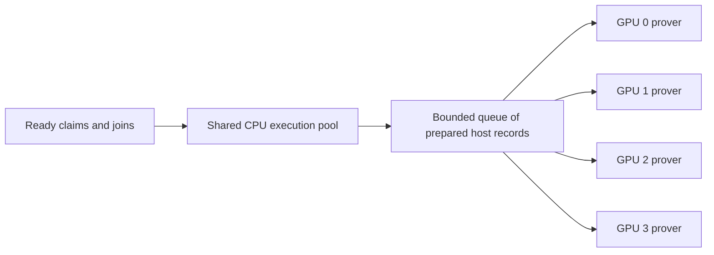

# Proving Mathlib on four GPUs: design

Written 2026-09-14 against ix `sb/aiur-trace-sharding-gpu` (8057152c) and
multi-stark `sb/trace-sharding-gpu` (f15a6c4, the rev ix pins); revised
the same day after a review of the first draft. The single-GPU pipeline
it extends is the Handoff section of
[aiur-gpu-plan-status.md](aiur-gpu-plan-status.md): env-shard claims from a
min-cut manifest, trace shards per claim, direct structural joins, root
wraps. Its measured result is Mathlib in 2:45:22 on one RTX PRO 6000
(Stage 1 1:39:16, Stage 2 1:06:06).

Target box: 4 × RTX PRO 6000 Blackwell Server (97,887 MiB each, driver
595.91.07, CUDA 13.3), one Xeon 8559C socket (48 cores / 96 threads, one
NUMA node), 999 GB RAM, 447 GB free disk. GPUs 0/1 and 2/3 are PIX pairs;
that does not matter here because the lanes never exchange device data.
The single-GPU box had 16 cores for one device; this one has 12 per device.

§1–§2 are the first design, one process per device coordinated through
the persisted artifacts; it was built and measured (§4, §6: Mathlib
1:06:12), and §3.4 then replaced its process-per-task scheduler with
resident workers in one process, which is what `ix prove --lanes` runs
today. §4 holds every measurement; the §6 estimate for the resident
workers on Mathlib comes from a ten-minute sample, not a full run.

**Shared execution (2026-09-15):** [§3.6](#36-shared-execution-and-memory-budget)
describes a shared CPU execution pool, assignment to the next available GPU,
and a process-wide record budget with waiting during memory pressure,
implemented on this branch. The per-GPU preparation queues and resident-worker
fixed caps in §3.4–§3.5 describe the preceding runtime. The later
[111-shard Mathlib run](../bench/mathlib-seed-2026-09-15/README.md)
provides a full-run measurement for that runtime and informs §3.6.

## 1. Principle: one process per GPU, artifacts as the only coordination

Every unit of work in the current pipeline is persistent and
content-addressed, and every stage already resumes from those artifacts:

- Stage 1 persists each claim proof to `~/.ix/store` and records it in the
  shard-proof index (`~/.ix/cache/shard-proofs/<claim-digest>` → address).
  `ix prove --ixes` takes a `--shards` selection (`K`, `a-b`, comma list)
  and `--skip-proven` reuses indexed proofs after verifying them natively.
- Stage 2 persists every join under a cache key that is a function of the
  node's own statement (its subject tree, assumptions and the verifying
  keys), not of the run, and a hit is re-verified natively before use.

So four processes that own disjoint parts of the work can share one
store, one index and one cache, and a final process sees their output as
ordinary cache hits. Nothing crosses a process boundary except files, and
a crashed lane restarts from what it has persisted.

What the file layer does and does not guarantee, precisely, because the
design leans on it:

- Store objects are written directly to their final path
  (`write_store`, `crates/ffi/src/aiur/aggregate.rs:1002`; `Store.write`,
  `Ix/Store.lean:64`). They are content-addressed, so a torn object is
  detected on read (the digest check in `load_cached` and
  `load_input_proofs`) but not repaired. Two writers of the same object
  write the same bytes.
- Index and cache pointers are published by rename. The aggregate cache's
  temp name carries the pid and slot; the shard-proof index's is
  `<digest>.tmp` in both writers (`protocol.rs:1367`,
  `Ix/Cli/ShardProofIndex.lean:45`).
- `persist_cached` logs a warning and returns `None` when it cannot write
  (`aggregate.rs:1220`); a run does not fail for it today.

With strictly disjoint lanes no two processes write the same object or
pointer, so this is enough for §2 as long as a lane's success is made to
mean its outputs were published (§3.1). Any overlap between runs, which a
retry after a kill is, wants write-then-rename for store objects and
pid-unique temp names in the index; both are a few lines and should land
with §3.

This is the design: **four lanes, one per device, each proving the claims
under one subtree of the manifest's tree and then joining that subtree;
then one short final run that joins the subtree roots and wraps.**

### Why not several devices in one process

(As first written. §3.4 and the multi-stark changes it names have since
made every entry here per-device, and one process now drives all four
GPUs; this section records what had to change and why the first design
avoided it.)

multi-stark fixes the device once per process: `CudaMmcs::new` reads
`MULTI_STARK_CUDA_DEVICE` when the `GoldilocksBlake3Config` is built
(`src/cuda/mmcs.rs:392`, `src/types.rs:1055`), and `AiurSystem::build`
constructs that config once (`crates/aiur/src/synthesis.rs:283`). Every
kernel entry point does take a `device_id` and calls `cudaSetDevice`, so
threading a device through the config is mechanical, but the CUDA layer
also has process-wide state that was written for one device:

- the four persistent 64 MiB pinned upload slots (`cuda/kernels.cu:515`)
  are one pool for the process; four provers would lease from the same
  four slots;
- the managed-memory slab of `ResidentLde` control blocks
  (`cuda/kernels.cu:596`) is one `cudaMallocManaged` region for the
  process, with no placement advice; how the driver serves control blocks
  read from two devices depends on its placement policy and would need
  measuring before relying on it;
- residency decisions read `cudaMemGetInfo` for the config's device with
  no reservation, fine across processes and untested within one.

None of this is hard to fix, and §7 lists it as a follow-up, but the
process-per-device topology needs none of it and has nothing to validate
beyond what already ran. Isolate each lane with `CUDA_VISIBLE_DEVICES=<g>`
and `MULTI_STARK_CUDA_DEVICE=0`, so the lane's only device is device 0
whatever the config reads.

## 2. The partition: the manifest's own bisection tree

`ix shard --shards 128` (min-cut) writes its recursive-bisection tree into
the manifest (`ShardManifest.tree`, `crates/kernel/src/shard.rs:1347`),
and Stage 2 joins in exactly that tree (`prepare_run`,
`crates/ffi/src/aiur/aggregate.rs:552`). The four nodes at depth 2 are the
lanes' subtrees:

```
                         root  (final run: 3 joins + wraps, GPU 0)
                 /                         \
            d1-left                       d1-right
          /        \                    /         \
       T0           T1               T2            T3      (depth 2)
     n0 ids       n1 ids           n2 ids        n3 ids
   lane 0        lane 1           lane 2        lane 3
```

The leaf counts `n_g` are not 32 each. `rec_bisect` allocates each
split's leaf budget in proportion to the two sides' weight, clamped to
`[1, side size]`, and says so: the tree is "a (possibly unbalanced)
binary tree" (`shard.rs:575`). Without a profile that weight is the
static, byte-based one, followed by a predicted-cost rebalance that moves
blocks between shards (`shard.rs:1964`, `crates/ffi/src/kernel.rs:2270`),
not measured heartbeats. So the subtrees balance a static estimate and
say nothing about execution time or record size, which varied 116 s mean
/ 282 s max and 14–42 GB across the 128 Mathlib claims. On the Mathlib
manifest cut here the four depth-2 subtrees hold 38, 32, 32 and 26
leaves. What does hold for any disjoint subtrees covering the leaves: a
lane with `n` leaves proves `n` claims and `n − 1` joins per subtree, and
the final run proves one join per internal node above the frontier.

Rather than one subtree per lane, `ix prove --lanes` cuts the tree until
no frontier node exceeds a lane's fair share of leaves, packs the subtrees
largest first onto the emptiest lane, and takes a further cut only while
it lowers the fullest lane by at least two leaves (each extra subtree
costs its lane one more Stage 2 process and the final run one more serial
join; each leaf of imbalance costs the slowest lane a claim proof and a
join). On the Mathlib tree that is six subtrees packed 33 / 32 / 32 / 31
(slots 73+251, 137, 201, 32+228) for two extra final joins, against
38 / 32 / 32 / 26 with four. The spread in time is still unknown until
measured; §7 has the remedies if it is large.

Lane `g` proves the claims under `T_g` (Stage 1), then runs Stage 2 over
`T_g` alone, ending at `T_g`'s root, which lands in the aggregate cache
under its ordinary key. The final run is the full command over all 128
proofs; with the top-down cache check of §3.3 it loads the four subtree
roots, verifies them, and proves the two depth-1 joins, the root join and
the wraps without visiting anything below.

Aligning the Stage 1 stripe with the Stage 2 subtree is what removes the
barrier between stages: a lane starts its joins the moment its own claims
exist, whatever the other lanes are doing.

## 3. Code changes

All in ix; none in multi-stark. Status: §3.1, §3.2's temp names, §3.3,
write-then-rename for store objects, and the `--lanes` orchestrator of
§3.4 are implemented on the branch and built with `IX_CUDA=1`; §3.1–3.3
are validated on the Init fixture (§4, results there).

### 3.1 `ix aggregate --subtree <slot>`

Restrict a Stage 2 run to the subtree rooted at plan slot `N` (the slot
numbers `--plan-only` prints), and make its success mean that `N`'s proof
is published. This is more than a mask on the scheduler:

- **Selection.** After `build_specs`, compute the slot set under `N` by
  walking `specs[N].op` down through `PlanOp::Join`. Reject `N` out of
  range or a raw leaf.
- **Sparse input.** `load_input_proofs` requires exactly `prepared.len()`
  proofs today; in subtree mode it requires exactly the proofs of the
  leaves under `N` and leaves the rest `None`.
- **Sparse scheduling and return.** `run_scheduler` admits only selected
  slots and completes when all of them are done; its return changes from
  "every slot has a result" (`aggregate.rs:2437`, which would fail every
  proper subtree) to a sparse `Vec<Option<Arc<Slot>>>`, or the target slot
  alone.
- **Verification.** Verify `N`'s proof natively before reporting it, as
  `run_replay` does for a replayed slot and the full run does for the
  root (`aggregate.rs:2707`). Skip `validate_root_statement` and
  `--wrap-root`, which are root-only.
- **Publication is part of success.** In subtree mode a `persist_cached`
  failure is an error, not a warning: the lane exists to leave that cache
  entry and store object behind, and the final run has nothing else to
  find. (Arguably the same should hold whenever `--no-write` is off; that
  is a one-line change in `finish_aggregate` and is worth making
  generally.) Print `[aggregate] subtree N root: <address>` on success.
- **Plumbing.** One flag in `Ix/Cli/AggregateCmd.lean`, one argument
  through `aggregateStage2` in `Ix/Aiur/Protocol.lean:229` and
  `rs_aiur_stage2_aggregate`. The Lean command only forwards flags; the
  native controller is the only CLI path.
- **`--plan-only --subtree N`** prints one line, `subtree N shards:
  <comma list>`, to stdout: the `--shards` argument the lane's Stage 1
  needs. Stdout also carries the setup timing line
  (`AggregateCmd.lean:961`), so scripts select the `subtree` line rather
  than assuming a single line.

### 3.2 `ix prove`: nothing required

`--shards <list>` plus `--skip-proven` are the per-lane Stage 1 as it
stands. Disjoint lanes never write the same index digest. Before any
overlapping run is allowed (a retry racing a wedged predecessor, §8
item 3), suffix the pid on the index temp name in both writers.

### 3.3 Final run: check the cache top-down

Today a slot's cache entry is consulted only once its children are
complete (`prepare_aggregate` runs after `dependencies_complete`), so the
final run would visit every leaf and every lower join, each a cache hit
that costs a native verification on the prepare lane. Add a pre-pass in
`run_scheduler` (or just before it): walk the specs from the root down,
`load_cached` each join, and on a hit mark that slot and everything under
it complete without admitting any of it. The four subtree roots are then
the only loads, each verified natively as `load_cached` already does, and
the scheduler proves exactly the slots above them. Full-manifest statement
reconstruction and `validate_root_statement` are untouched, since
`prepare_run` builds the statements from the manifest regardless.

The existing replay path (`load_replay_child`, `aggregate.rs:2115`) shows
the loading half of this for one slot's immediate children; the pre-pass
generalizes it to the whole plan. All 128 leaf proofs are still passed
and matched to the manifest, which is cheap and keeps the composed
verdict step and the final run on the same inputs.

### 3.4 `ix prove --lanes N`: resident workers and the scheduler

One command runs the whole pipeline in one process. Lean compiles the
IxVM and aggregation systems once and makes one FFI call (`proveLanes`);
everything else is native (`crates/ffi/src/aiur/aggregate/lanes.rs`, a
child module of the aggregate controller so it drives that code's
preparation and proving halves directly).

- **One resident worker per GPU.** Each holds an IxVM and an aggregation
  prover system built on its device (`AiurSystem::on_device`, sharing the
  bytecode of the systems Lean built through an `Arc`; nothing is copied
  across the FFI), a pool of `--exec-jobs` preparation threads and one
  proving thread. Preparation is the CPU half of a task (a claim's
  witness, execution and trace-shard plan; a join's child verification,
  advice and execution); proving is the GPU half. A bounded hand-off of
  one prepared item between them keeps a worker executing its next task
  while proving the current one, and bounds what it holds to `--exec-jobs`
  executions, one prepared item and one proof.
- **One ready queue.** The scheduler on the calling thread holds the
  plan. A claim is ready from the start, a join when both children have
  proofs, the root when its children do and every claim is done. Every
  worker event (an item prepared, a preparation failed, a proof finished)
  frees capacity and the scheduler hands the next unit of work, a ready
  join first, then the root, then the next claim, to the least-loaded
  worker with a free preparation slot (fewest executions plus prepared
  items in flight, lowest index on a tie), so joins bubble up while
  claims are still proving and a ready join lands on an idle device
  rather than behind the claims of whichever worker comes first; the
  serial tail is the chain from the last claim to the root. Nothing is
  assigned ahead of time and nothing is spawned.
- **Memory** is the record cap of §3.5, one share per execution with the
  divisor `exec_jobs + 2` for the prepared and proving items beside the
  executions. Every execution runs under it, a join's and the root's as
  much as a claim's, so what the queue bounds in count the cap bounds in
  bytes; whichever unit goes over its share reruns alone on a drained
  worker under the whole budget, and one that fails even alone stops the
  run naming itself.
- **Persistence** is unchanged (claims to the store and the shard-proof
  index, joins to the aggregate cache, the root wrapper to the store), so
  rerunning the same command resumes: indexed claim proofs are verified
  and reused, cached joins retire their subtrees (their leaves' proofs
  are still loaded when the index holds them, for the verdict). The
  persisted artifacts are no longer the coordination path.
- **Verification.** The root is wrapped until it is one trace shard and
  verified; every claim proof the run holds, proved or reused, is
  verified natively in parallel (the composed verdict) on a thread
  started when the root is dispatched, beside the wraps. A claim retired
  under a cached join whose proof the index no longer holds rests on that
  join's native verification at load, and the verdict line says how many
  such claims there were.
- **Accounting.** A worker's load is the units dispatched to it and not
  yet proven. Preparation reports itself to the scheduler before the
  prepared item is visible to the proving thread, so a proof can never be
  reported before its preparation.

multi-stark's part: `GoldilocksBlake3Config::with_device` binds a
configuration to a device, and the host-side pools that were one per
process (the two-slot pinned host pool, the four upload staging slots,
the managed slab of LDE control blocks) are one per device, indexed by
the calling thread's current device, which every entry point sets first.
`cudaFree` is device-agnostic; the audit found no entry point that
launches without selecting its device.

The process-per-task scheduler this replaces cost a cold execution wave
per Stage 1 task and a process start per join; the per-lane scripts in
`bench/multi-gpu-2026-09-14/` remain as the manual equivalent for
experiments that need to vary one device.

### 3.5 The record cap: memory enforced where it is allocated

A claim's execution record is not predictable from anything static, and
this branch's history shows what an estimate does (the chunk driver's
execution-RSS model charged ~30 GB against 10–23 GB measured and was
removed). So no size is predicted or remembered. Instead every execution
runs under a hard cap on its record's retained bytes. The bytes are
counted at the one place every record grows, `QueryMap::insert`, into a
per-thread total (memory stores, function queries, deferred calls and the
big-integer helper's rows all pass through it), and the total is checked
against the cap at every memory store (`aiur::execute::check_store`, which
the codegen emits in place of the bare pointer-limit test) and at every
function entry (`check_record_cap`, emitted as each generated function's
first statement, and in the interpreter's call path). These checks do not
bound overshoot to one entry: consecutive recursive returns and the
big-integer helper can insert multiple entries before another check.
§3.6 requires reserving growth before allocation. A detected cap failure is a clean
`ExecError::RecordBudgetExceeded`; `prepare_ixvm_within_budget` returns
it as `GatedProve::Failed` instead of aborting the process (the profile is
`panic = "abort"`).

The Stage 1 driver (`prove_shards_ahead`) derives the record budget from
first principles: the host budget less the prover's working set (two
shard witnesses at the cell budget plus upload staging), and gives each
execution ahead an equal share of it, `record_budget / (exec_jobs + 1)`,
as its cap. A shard that reaches its share is queued to rerun alone:
nothing new starts ahead, the lane drains, and it executes by itself
under the whole record budget. A shard that fails even alone stops the
run with the instruction to cut it finer or raise `--max-ram`. The resident
`--lanes` driver divides by `exec_jobs + 2`, accounting for one queued and
one proving record beside the executions. Both drivers use fixed caps.
Retry counts, execution time, GPU idle time and total wall time all matter
when choosing a coarser manifest. The proposed policy below lets larger
records use otherwise available memory before a retry becomes necessary.

### 3.6 Shared execution and memory budget

**Status: implemented on this branch, 2026-09-15.** Focused allocation,
waiting, shutdown and cross-device proof checks pass. Init measurements are
recorded in the [validation report](../bench/shared-execution-init-2026-09-15/README.md).

#### Objective

Choose the environment shard count to minimize complete proving time.
For example, 50 environment shards produce 50 claims and 49 binary joins,
plus any final wrapping. Fewer joins can justify longer individual
executions and occasional waits for memory. Fifty is a candidate count,
not a measured optimum.

Environment shards and trace shards remain separate choices. A large
environment shard produces one execution record; its proof can still use
several trace shards bounded by the existing GPU cell budget. Reducing
the environment shard count therefore does not require a larger maximum
GPU matrix. It can change total trace work and duplicated execution, so
the number of claims and joins alone does not predict the speedup.

Fixed equal record caps should cease to determine the environment cut.
Keep normal execution concurrency for small records, and reduce it
temporarily when the combined live records consume the available RAM.

#### One execution pool feeding four GPU workers



Use one CPU preparation pool for claims, join advice and join execution.
Preserve the total execution-thread ceiling initially: three threads per
GPU becomes twelve shared threads. Assign a prepared item to a GPU when
a proving worker takes it. A slow execution then does not strand a
particular GPU while prepared work waits in another worker's queue.

Keep one resident proving worker per device, owning its IxVM and
aggregation systems, CUDA resources and device-memory admission. Once a
worker takes a job, that job's proving rounds stay on its GPU. Proof
completion makes dependent joins ready through the existing task graph.
Prefer ready joins in both CPU and GPU scheduling so the aggregation
tree advances while claims finish.

The existing boundary supports this:
[PreparedProve](../crates/aiur/src/synthesis.rs)
owns a query record, IO, inputs, outputs and a trace-shard plan, with no
GPU buffers or device identifier. Prepared joins contain the same type.
The workers already construct matching systems and
[check verifying-key equality](../crates/ffi/src/aiur/aggregate/lanes.rs).
Passing a prepared item between threads transfers ownership without
copying its host allocations.

Bound the prepared queue by item count as well as the shared memory
budget. Start with four queued items total, preserving today's aggregate
one-per-GPU lookahead. Completed items held by producers waiting to
enqueue also retain their memory charges.

#### One host-record budget for the process

Establish one effective process host limit. Reserve workspace for all
concurrent provers, shared data and other host overhead; use the remainder
for records. GPU VRAM admission remains per device. A large execution
can borrow record capacity that other workers are not using.

The current `--max-ram` and `--exec-jobs` settings are per worker. Translate
and report their process-wide totals explicitly, checking the effective
host limit against the cgroup allowance. Avoid silently interpreting an
old per-worker value as the whole-process limit. Keep enough prover
workspace outside the pool to finish existing proofs and release records.

Each record owns a reservation through execution, the prepared queue and
proving. The invariants are:

```text
sum of outstanding record grants <= process record budget
each record's counted retained bytes <= its grant <= per-record ceiling
```

Acquire memory in modest chunks to reduce synchronization. Every query
insertion charges its bytes before allocating. If local credit is
insufficient, request enough additional credit to cover the insertion,
including an entry larger than the normal chunk size. Unused granted
credit counts against the pool. Return surplus credit when execution
finishes; release the retained charge when its storage is dropped.

The current counter measures field payloads plus fixed per-entry overhead.
It counts that model exactly, rather than measuring exact RSS. IO buffers,
execution stacks, allocator overhead and temporary hash-table growth need
headroom outside the pool. The process memory limit remains a backstop.
[Current accounting](../crates/aiur/src/execute.rs).

#### Waiting and progress

1. While credit is available, executions grow and run concurrently.
2. When a growth request cannot be granted, pause that execution and stop
   admitting new executions while growth requests remain outstanding.
   Existing proofs continue, and executions with granted credit can finish.
3. Select one waiting execution and retain its growth priority until its
   execution finishes or is cancelled. Grant released memory to it first.
   Plain FIFO ordering of individual requests can spread successive grants
   among several unfinished large records and does not provide this rule.
4. Record completion, release and cancellation wake waiters. Resume new
   admissions when the selected execution finishes and capacity permits.
5. If all remaining executions are waiting and no prepared/proving record
   can release memory, cancel the youngest waiter other than the selected
   execution. Wait for its storage to drop, grant the released credit and
   requeue the cancelled work for later. Repeat only if necessary.

Waiting alone cannot resolve the last case. In a 100 GiB pool, a paused
record holding 40 GiB leaves another record at most 60 GiB. If the second
record needs 64 GiB, it fits alone but cannot finish while both remain
resident. Report the victim's retry as memory contention. A record whose
own next insertion would exceed the per-record ceiling requests
refinement immediately, without waiting for other records to drain.

Pool state can remain small: available credit, record identities,
used/granted bytes, execution/prepared/proving/waiting states, one preferred
execution and cancellation state. A mutex and condition variable provide
coordination; the existing dependency scheduler still decides which work
is ready.

#### Implementation

- CPU workers share preparation and prepared queues. GPU identity is
  attached when proving starts, independently of the execution thread.
- Records and query maps own shared reservations. The thread-local
  binding attaches a reservation during construction; it does not own
  the reservation's lifetime after handoff.
- Every query insertion reserves capacity first. Function returns and
  BigUint list construction propagate allocation and cancellation errors
  through ordinary results; the release build does not rely on unwinding.
- Each final root wrap gets a reservation on the proving thread.
- Planning checks reserved proving workspace separately from the record,
  preserving the requested GPU trace-cell bound.
- Failure and shutdown wake waiters and close both queues. Charges are
  released after their storage drops. Contention retries and records
  exceeding their individual ceiling have different outcomes.

The runtime preserves `--max-ram` as a per-GPU value and `--exec-jobs`
as threads per GPU, combining both across the process. With
`--lanes 4 --exec-jobs 3 --max-ram 230` and 1.5 billion trace cells, it sets:

- 920 GiB effective host limit, clamped to the visible cgroup allowance;
- 24.2 GiB workspace per GPU and 92 GiB (10%) process headroom;
- 730.8 GiB shared record capacity and 36.5 GiB initial admission credit;
- a 64 GiB ceiling on each individual record.

An execution can grow beyond its initial credit up to its individual
ceiling. `AIUR_RECORD_MAX_BYTES` overrides the 64 GiB default; it must be
positive and is clamped to the whole record pool. Both initial credit and
subsequent grants respect the ceiling, so the fast insertion path cannot
cross it. The pool grants further credit in 16 MiB chunks, or enough for a
larger single insertion. With no explicit host limit, detection runs once
for the process. The trace-cell bound is
`AIUR_TRACE_SHARD_MAX_CELLS`, defaulting to 1.5 billion for the shared driver.

The per-record ceiling limits the size of a single execution's data
structures independently of available host RAM. The 64 GiB default is a
provisional policy, not a measured threshold for cache behavior. Waiting
still handles aggregate memory pressure below that ceiling.

#### Automatic refinement at the record ceiling

When an environment claim exceeds its ceiling, the scheduler stops new
admissions and finishes work already in flight. It then bisects each
oversized leaf using a min-cut over that leaf's dependency edges. Atomic
blocks, including mutually recursive declarations, stay together. Part
zero keeps the original leaf ID; the second part gets a fresh ID. The
leaf's position in the aggregation tree becomes a two-child subtree.

The refined partition is written atomically under
`$AIUR_LANES_CACHE_DIR/refined-manifests/<source-manifest-hash>.ixes` (the
usual `~/.ix/cache` when no cache override is set). Preparation restarts
against that partition and verifies/reuses completed claim and aggregate
proofs. Unrelated claims keep their identities. A child that still exceeds
the ceiling is split again; every split has two nonempty children, so
refinement makes progress toward atomic blocks.

Rerunning the original command loads its checkpoint automatically.
`--out-ixes` writes the final partition after successful verification.
The source manifest remains an input unless it is explicitly also chosen
as the output. Pool statistics cover all refinement passes. A shard-count
candidate is omitted when only some claims of the current partition were
executed, since reused proofs do not supply those record measurements.

A single atomic block that exceeds the ceiling fails with a named error.
The ceiling also applies to join and root-wrap records; oversized
aggregation executions fail explicitly, since they cannot be bisected as
environment claims. The shared pool and trace-shard workspace policy do
not silently relax the ceiling for them.

Planning checks host workspace separately from the pooled record, so a
large admitted record does not hit the old per-worker planning ceiling.
CUDA workspace covers two host witnesses, preprocessing and staging;
shape-only lookup metadata contributes no materialized lookup payload.
Records regenerate their traces for round two. A plan exceeding reserved
workspace is cut into finer trace shards. Workspace accounting remains a
model: allocator behavior and device spills still need the reported
headroom and the cgroup backstop.

#### Init validation and refinement

The [Init validation](../bench/shared-execution-init-2026-09-15/README.md)
used automatic sharding, which selected five claims, and one four-claim
follow-up on the same binary and input. Both roots and composed verdicts
verified, including final wrapping. Five claims took 351.72 seconds and
178.85 GiB peak RSS; four took 341.35 seconds and 164.50 GiB. The 2.95%
wall-time difference comes from one trial per count and is provisional.

The first attempt exposed a workspace-model error: shape-only lookup
metadata was charged as fully materialized host lookup buffers. Correcting
that accounting preserved the 1.5-billion-cell bound and reduced plans
from 31–35 to 8–10 trace shards per claim on the same five-claim manifest.
A regression test checks both lookup modes.

The four-claim cut completed its larger claims six seconds later, but
removing one join let the root start 15 seconds earlier. This supports
measuring complete execution and aggregation time when refining a cut.
The automatic static-score seed remains a starting guess; the post-run
p90 candidate considers memory alone and is not an automatic optimizer.

Neither Init cut exhausted the shared memory pool. Waiting, mutual-block
recovery, charge lifetime and shutdown are covered by focused tests;
coarser Mathlib performance under memory pressure remains to be measured.

The [record-ceiling validation](../bench/record-ceiling-2026-09-15/README.md)
forced the four-claim fixture to exceed a temporary 22 GiB ceiling.
Claim 0 split into two records of 13.3 and 10.7 GiB; the other three proofs
were reused. The final five-claim partition verified in 477.74 seconds,
with 128.93 GiB peak RSS and one split. Restart loaded the checkpoint and
reused all five claims. A one-byte ceiling then rejected the first root
wrap, confirming its reservation binding. The default remains 64 GiB.

#### What the 111-shard Mathlib run establishes

The [2026-09-15 result](../bench/mathlib-seed-2026-09-15/README.md)
finished in 52:49 with zero cap trips, 522.4 GiB peak RSS and a verified
root over 111 claims. Claim records averaged about 21.4 GiB, with a
reported p90 of 25.1 GiB and a 38.2 GiB maximum. The 109 non-root join
records averaged 13.5 GiB and peaked at 18.2 GiB; the root record was
25.0 GiB. These sizes support charging each live record by its own usage
instead of reserving the same 41.4 GiB for every completed record.

Use the body of the claim distribution to propose candidate cuts. Under
the provisional assumption that record quantiles scale inversely with
the environment shard count:

| Environment shards | Binary joins including root | Estimated claim mean | Estimated claim p90 |
| ---: | ---: | ---: | ---: |
| 90 | 89 | 26.4 GiB | 31.0 GiB |
| 67 | 66 | 35.5 GiB | 41.6 GiB |
| 50 | 49 | 47.5 GiB | 55.7 GiB |

The p90/share calculation is `111 × 25.1 / 41.4 ≈ 67`. It is a starting
estimate, not an optimum or a limit under the shared budget. Fifty is a
useful aggressive candidate once waiting works. Ninety is a conservative
next measurement under the existing runtime, removing 21 binary joins
relative to 111 shards. None of these projections fixes the maximum at
38 GiB: compare the contents of the heavy shards across cuts before
concluding that one indivisible block explains it. The earlier compile
also differs, limiting the comparison with the 128-shard measurements.

Scheduling the final dependency chain matters alongside memory policy.
The raw completion log shows:

- The largest record, claim 70, was proved at +1762 s, well before the
  last claim at +2640 s. It did not cause this run's final tail.
- Twenty joins completed after the last claim, initially across all four
  workers. The last non-GPU-0 completion was at +2808 s.
- The root was dispatched at +2997 s and proved at +3164 s. The 524-second
  interval after the last claim includes 357 seconds before root dispatch
  and 167 seconds for root preparation, proving and wrapping.

Thus the tail begins with a parallel drain and narrows into the final
dependency chain. A shared queue can improve assignment while multiple
jobs are ready, but cannot create parallel work along a single dependency
chain. Fewer environment shards reduce total joins; they do not remove
the whole tail automatically. For a balanced tree, both 111 and 67 leaves
can have seven join levels, whereas 50 needs six. The actual manifest can
be unbalanced.

Retain join priority and record dispatch/ready/start/end timestamps to
identify avoidable queue delay. Use execution-cost estimates to start
expensive claims earlier when available; raw record size alone is not a
complete scheduling score. The 43% sampled mean GPU utilization does not
by itself identify how much time a new scheduler can recover.

The 52:49 run is a baseline with GPU trace generation enabled. Its gap
from the earlier 1:06:12 run combines a different cut, compile and trace
mode, so it does not isolate any one change's speedup.

#### Validation and measurement

Use small host-only tests for concurrent growth, release after proving,
growth priority, victim cancellation, whole-pool overflow and shutdown.
Cover reservations through recursive returns and BigUint inserts, and
release on both success and failure. Then verify that prepared claims
and joins can be consumed by another GPU with matching systems. Include
root wrapping in lifetime checks.

Compare a reference cut and one aggressive cut using the same binary,
Mathlib input, total CPU concurrency, GPU trace-cell bound and effective
host limit, with isolated proof caches. Record complete wall time, CPU
time, claim/join counts, execution waits, GPU idle time, live record bytes,
peak RSS and retries. Verify the same final environment statement;
different partitions need not produce identical proof bytes or addresses.
Completion timestamps must be keyed by both task kind and ID, because
claim numbers and join slot numbers overlap.

Select the next cut from complete wall time: fewer joins must save more
than is lost to longer executions, waits, retries and the final dependency
tail. A full benchmark sweep is unnecessary for the first comparison.

## 4. Runbook

Prerequisites on this box before any lane runs:

- THP: `enabled` is `always` here already; `defrag` is `madvise` and
  should be `defer+madvise` as on the single-GPU box, so allocations that
  do not madvise themselves (witness matrices, CUDA host buffers) get
  huge pages without allocation-time compaction stalls. Neither survives
  a reboot.
- Build: `IX_CUDA=1 LIBCLANG_PATH=/usr/lib/llvm-21/lib
  MULTI_STARK_CUDA_ARCHS=120 CFLAGS=-std=gnu17 lake build ix` (LLVM 21
  and CUDA 13.3 are what is installed; elan and the pinned Lean 4.33.1
  are at `~/.elan`, which is not on `PATH` because `~/.profile` is
  home-manager-managed, so prefix `PATH=$HOME/.elan/bin:$PATH`).
  `CFLAGS=-std=gnu17` is required: with the host's glibc 2.43 headers in
  C23 mode, mimalloc's `strtol` becomes `__isoc23_strtol`, which the
  sysroot of Lean's bundled `clang`/`ld.lld` does not have, and the final
  link fails on `libix_ffi_net.a`. Record the binary's SHA-256 and
  `nvcc --version`.
- Inputs: `mathlib.ixe` and `mathlib-mincut-128.ixes` (copy from the
  single-GPU box's `~/benchdata/mathlib-gpu/`, or recompile and re-shard
  with `ix shard mathlib.ixe --shards 128`, or let the CUDA build seed the
  count with `--max-ram 230 --exec-jobs 3` under the same
  `AIUR_TRACE_SHARD_MAX_CELLS`, §7 item 4;
  re-sharding changes the tree and every claim, so prefer the copy if the
  point is to compare against 2:45:22).

The run is one command from a run directory holding the inputs, under a
cgroup cap for the whole process (one process now holds every worker):

```sh
export AIUR_TRACE_ONLY_LOOKUPS=1 AIUR_MAX_PIECE_LOG_HEIGHT=24
export AIUR_TRACE_SHARD_MAX_CELLS=1500000000
systemd-run --user --scope -q -p MemoryMax=920G -- \
  ix prove --ixe mathlib.ixe --ixes mathlib-mincut-128.ixes --trace-shards \
    --lanes 4 --exec-jobs 3 --max-ram 230 > lanes.out 2> lanes.err
# root address on stdout; progress (claims, joins, root, verdict) in lanes.err
# --max-ram is per worker (its record budget, §3.5); 230 keeps the largest
# Mathlib records under one execution's share, and four workers peak well
# under the scope
```

Rerunning the same command resumes. The scripts below are the manual
per-device equivalent, kept for experiments that need to vary one
device; they are what the first fixture in §4 was run with.

Shared definitions, `lanelib.sh`, sourced by every script below:

```sh
export AIUR_TRACE_ONLY_LOOKUPS=1 AIUR_MAX_PIECE_LOG_HEIGHT=24
export AIUR_TRACE_SHARD_MAX_CELLS=1500000000
export IXE=mathlib.ixe IXES=mathlib-mincut-128.ixes
# run CPUS ARGS...: one proving command under the cgroup cap, pinned to
# CPUS (every thread pool sizes itself from the affinity mask, §5).
run() { local cpus=$1; shift
  systemd-run --user --scope -q -p MemoryMax=230G -p MemoryHigh=220G -- \
    taskset -c "$cpus" /usr/bin/time -v "$@"; }
```

Step 0, once: find the four subtrees and their shard lists.

```sh
. ./lanelib.sh
ix aggregate --ixe $IXE --ixes $IXES --direct-joins --structural-above 0 \
  --trace-shards --plan-only                # root R; children A, B; theirs T0..T3
for T in $T0 $T1 $T2 $T3; do
  ix aggregate --ixe $IXE --ixes $IXES --direct-joins --structural-above 0 \
    --trace-shards --plan-only --subtree $T | sed -n "s/^subtree $T shards: //p"
done                                        # IDS_0..IDS_3, n_g ids each
```

Step 1, four lanes at once, lane `g` on GPU `g`, `lane.sh g T_g IDS_g`:

```sh
#!/bin/sh
set -eu
. ./lanelib.sh
g=$1; T=$2; IDS=$3
export CUDA_VISIBLE_DEVICES=$g MULTI_STARK_CUDA_DEVICE=0
# twelve whole cores: CPU n and n+48 are hyperthread siblings on this host
CPUS="$((g*12))-$((g*12+11)),$((48+g*12))-$((48+g*12+11))"

# Stage 1: this lane's claims, 4 executions ahead of its prover
run $CPUS ix prove --ixe $IXE --ixes $IXES --trace-shards --retention regenerate \
  --max-ram 200 --exec-jobs 4 --skip-proven --shards "$IDS" \
  > lane$g-stage1.log 2> lane$g-stage1.err
grep -E '^[0-9a-f]{64}$' lane$g-stage1.log > lane$g-proofs.txt   # n_g addresses

# Stage 2: this lane's subtree, one join executing ahead of its prover
run $CPUS ix aggregate --ixe $IXE --ixes $IXES --direct-joins --structural-above 0 \
  --trace-shards --jobs 1 --max-ram 200 --subtree $T $(cat lane$g-proofs.txt) \
  > lane$g-stage2.log 2> lane$g-stage2.err
grep -q "subtree $T root:" lane$g-stage2.err     # success means it was published
```

The supervisor around `lane.sh` (timeouts, bounded reruns) is §8 item 3.

Step 2, after all four lanes exit 0, on GPU 0:

```sh
. ./lanelib.sh
cat lane?-proofs.txt > proofs.txt                                 # 128
ix verify --ixe $IXE --ixes $IXES $(cat proofs.txt)               # composed verdict, ~1 min
CUDA_VISIBLE_DEVICES=0 MULTI_STARK_CUDA_DEVICE=0 run 0-95 \
  ix aggregate --ixe $IXE --ixes $IXES --direct-joins --structural-above 0 \
  --trace-shards --jobs 1 --max-ram 200 --wrap-root $(cat proofs.txt) \
  > final.log 2> final.err
ix verify --aggregate --structural-above 0 --ixe $IXE --ixes $IXES <root>
```

Read the final run's log before its time: from an initial cache state it
must show the four subtree roots as cache hits and exactly three joins
proven. A resumed final run may legitimately hit higher nodes too; what
must never appear is a join below a subtree root being proven, which
means a lane's root did not land and the run is quietly redoing that
subtree on one GPU.

A killed lane is rerun with the same command: Stage 1 skips its proven
claims through the index, Stage 2 resumes at its last cached join.

### Validate on a fixture first

Before Mathlib, run the whole recipe on Init with an 8-way min-cut
manifest (`ix shard init.ixe --shards 8`): its four depth-2 nodes are
two-leaf joins, one per lane, which is the smallest tree where every lane
root is an internal node (`--subtree` rejects a raw leaf, so a 4-way
manifest gives only two lanes). Then:

- the final root must verify and equal, byte for byte, the root of a
  single-process run over the same manifest (cache keys are per-statement,
  so it should);
- kill a lane mid Stage 1 and mid Stage 2 and rerun it; the rerun must
  skip the proven claims and cached joins and the final root must be
  unchanged;
- run the final step with one lane's cache entry deleted; it must prove
  that subtree itself rather than fail, and the log must say so.

#### Fixture results, 2026-09-14

Binary `e4f0ef3f…` (this branch with §3 applied, `IX_CUDA=1`, CUDA 13.3,
`sm_120`), Init compiled to 65,994 constants, `ix shard --shards 8`
(min-cut), scripts in `bench/multi-gpu-2026-09-14/`, run directory
`~/benchdata/init-multigpu/`. Every step below passed.

| step | result |
|---|---|
| `--plan-only --subtree` for slots 2, 5, 9, 12 | shard lists `0,1` / `2,3` / `4,5` / `6,7`; a raw leaf, an out-of-range slot and `--wrap-root` are rejected with the intended messages |
| four lanes, one per GPU | all exit 0; Stage 1 1:59–2:14 wall (executions 53–67 s, proofs 26–32 s, 11–13 trace shards per lane, peak 49–54 GiB); Stage 2 join 51–54 s, peak 29–30 GiB; every subtree root published |
| final run | 4 cache hits retiring their subtrees, 3 joins proven, 2 root wraps (5 → 2 → 1 shards), 2:01 wall, peak 35 GiB; root `62216020…`, verified: 56,621/56,621 constants, 0 assumptions |
| single-process reference (`--no-cache`, same 8 proofs, one GPU) | the same root address, 3:53 wall |
| kill mid Stage 1 (SIGKILL to the prover after shard 5's proof was indexed, before shard 4's), rerun unchanged | shard 5 reused from the index, shard 4 re-executed and proven (1:30), join redone (50 s), subtree root identical to the first run's |
| final with subtree 9's entry and the two above it deleted | hits on 12 and on the cached depth-1 join 6; subtree 9 re-proven from its raw leaves, then 13, 14 and the wraps; every re-proven node got its original address; same root, verified; 2:28 wall |

The orchestrator (§3.4) then ran the same fixture from a cleared index
and cache as one command, `ix prove --ixe init.ixe --ixes
init-mincut-8.ixes --trace-shards --lanes 4 --exec-jobs 2 --max-ram 200
--lane-cap 230 --lane-timeout 15`: lane plan 2/2/2/2 (slots 2, 5, 9,
12), Stage 1 125–140 s per lane, Stage 2 55 s per lane, all lanes done at
+195 s, composed verdict OK, final aggregate 125 s with 4 cached subtree
roots, root verified, 5:31 end to end, the same root address as every
run above.

The dynamic scheduler and the record cap were then validated on the same
fixture:

| check | result |
|---|---|
| Lean scheduler (reference), `--lanes 3 --subtree-size 4`, cleared index and cache | four two-leaf subtrees over three devices; GPU 0 took the fourth subtree after its first; join 6 proven on GPU 1 while GPU 0 was still on claims; verdict in the background; 7:06 end to end; same root, verified |
| Rust scheduler, `--lanes 4 --subtree-size 8`, cleared index and cache | eight one-leaf subtrees published by their claim proofs; all four bottom joins in parallel; each upper join started within a second of its children; root at +296 s; 6:04 end to end; same root, verified. Slower than the lanes because a one-claim task pays a process warmup (proofs 34.1 s against 30.6 s) and overlaps no execution with a proof; the subtree count is now clamped so subtrees average at least two leaves |
| Rust scheduler, `--lanes 4 --subtree-size 4`, like for like against the original lanes | claims done at +124–141 s, bottom joins at +174–196 s, the two depth-1 joins in parallel at +233 and +239 s, root at +305 s; **5:06 against 5:31**, the gain being the tail (66 s from the last depth-1 join to the verified root against the old 125 s final process); same root, verified |
| record cap overhead | execution 60.1 s mean before the cap against 59.1 and 57.2 s with it; proofs 31.7 s against 30.4 and 30.6 s: no measurable cost |
| record cap, 2 shards, `--exec-jobs 2 --max-ram 33` (record budget 10.4 GiB, share 3.5) | both over their share by one entry (153–206 B), rerun alone, over the whole budget by 201 B, run stops naming the shard; exit 1 |
| record cap, 8 shards, `--exec-jobs 8 --max-ram 100` (share 8.6 GiB) | all eight over their share, each rerun alone under the whole budget, all eight proven; exit 0 |
| record cap, 3 shards, `--exec-jobs 12 --max-ram 120` | ceiling clamped to three, shares of 24 GiB fit, normal path unchanged |

The resident workers of §3.4 (one process, `--lanes 4 --exec-jobs 2
--max-ram 200`, cleared index and cache, `MemoryMax=900G`) on the same
fixture:

| run | result |
|---|---|
| first, dispatch in worker order | one process on all four devices (146 threads, 66 GB of VRAM on a busy device), record budget 177 GiB per worker, 44 GiB per execution; claims done at +82–137 s; but every join went to worker 0 or 1 (the loop filled worker 0's free slot first, so workers 2 and 3 idled from +129 s): depth-1 joins at +224 and +245 s, root at +245 s, **5:10** wall, 308 s end to end; same root, verified; peak RSS 194 GiB for the whole process |
| dispatch to the least-loaded worker | the four bottom joins on four workers (+150–191 s), both depth-1 joins in parallel (+233 s), root wrapped by +295 s: **4:58** wall, 295 s end to end, against 5:06 for the process-per-task scheduler and 5:31 for the orchestrator; same root, verified; peak RSS 193 GiB |
| composed verdict on a thread beside the root wraps | root proven and verdict done at +299 s together (the verdict is under a second on Init and ~1 min on Mathlib, where it used to follow the root): 5:02 wall, 299 s end to end; same root, verified |
| rerun on the finished run's cache (every join cached, every leaf retired) | 8 claims reused from the index, both depth-1 joins cached, only the root re-proven: root at +1 s, proven at +28 s, verdict OK over the 8 reused proofs, 30 s wall; before the fix this aborted at root dispatch |
| the same with two index entries deleted | 6 claims reused, "2 retired under cached joins without an indexed proof", root re-proven, "composed verdict OK (2 claims retired under verified cached joins have no indexed proof)", 30 s wall; same root |
| `--exec-jobs 8 --max-ram 100` on a cleared cache (7.7 GiB share; every Init record is ~8.3 GB) | all 8 claims, all 7 joins and the root reached the share within a few hundred bytes to 17 kB, were queued, and reran alone on worker 0 under the whole 77 GiB budget; the joins were dispatched to other workers first and came back over their share too; 16:44 wall, peak RSS 100 GB, same root, verdict OK. The ladder for joins and the root works; the serial rerun is why a share below the records is expensive |
| `ix shard mathlib.ixe --max-ram 230 --exec-jobs 3` (CUDA build, 1.5e9 cells) | trace-shard seed 111 shards (41.4 GiB share); `--max-ram 200` seeds 129 (35.4 GiB share); the CPU calibration would seed 459 |

Stage 1 alone was 133–137 s against 124–141 s per lane with the
process-per-task scheduler, so on eight claims the resident design gains
nothing there: each worker still pays its first execution wave cold. The
gain is the tail: 62 s from the last depth-1 join to the verified root,
and no process start before any join.

#### Mathlib sample under the resident workers, 2026-09-14

The runbook command (`--lanes 4 --exec-jobs 3 --max-ram 200`,
`MemoryMax=920G`, cleared index and cache, unit `ix-mathlib-resident`)
was run for 647 s and then stopped through its scope (SIGTERM, exit 143;
everything proven is in the index and the cache). Record budget 177.3 GiB
per worker, 35.4 GiB per execution with three ahead; one process on all
four devices; first proof at +105 s; 32 claims and 12 joins when
stopped, the joins on all four workers; cgroup peak 467 GB for the whole
process (~117 GB per worker, as the lanes' Stage 1 peaks). Per-worker
completion intervals, which are the proving thread's cost per unit
because preparation is overlapped:

| unit | intervals | mean |
|---|---:|---:|
| claim | 28 | 52.4 s |
| join | 12 | 42.8 s |

Occasional 60–69 s claim intervals are the prover waiting for a record:
three executions at 130–160 s each deliver one every 43–53 s, about the
proof time, so the supply is only just level with the prover.

Two things the fixture taught, both folded in above: killing the lane's
`time` wrapper instead of the prover leaves an orphan that keeps writing
(§8 item 3), and the first masks paired lanes 0/2 and 1/3 on sibling
hyperthreads (the timings in the table were taken that way; the scripts
now give each lane twelve whole cores). The fixture is too small to say
anything about §6: each lane spends most of its wall in environment
loads and the first execution wave.

## 5. Resource plan

| | per lane | four lanes | box |
|---|---:|---:|---:|
| Stage 1 host peak (measured on one GPU, `--exec-jobs 4`) | 170 GiB | 680 GiB if it extrapolates | 999 GB |
| Stage 2 host peak (measured, `--exec-ahead 1`) | 66 GiB | 264 GiB | |
| executions in flight | 4 | 16 | 48 cores |
| VRAM (measured, 1.5e9 cells) | 67 GB | | 4 × 96 GB |

**Memory.** 680 GiB is the single-GPU peak times four, not a bound:
`--max-ram` gates admission and retention on this path, it does not cap
the process, and the cgroup caps (230 GiB each, 920 GiB in sum, above
the box) are the only enforcement. Expect the first run to tell you the
real per-lane peak; if a Stage 1 lane is killed at its cap, rerun it with
`--exec-jobs 2`, or start every lane at 3.

**Host threads.** Every process sizes its pools from
`available_parallelism`, and there are more pools than the global Rayon
one. multi-stark builds a stage-one LDE pool of 3/8 or 5/8 of it and a
lookup pool of 1/4 (`src/types.rs:220`, `src/cuda/pcs.rs:743`), so on 96
threads each lane would run 36–60 plus 24 CUDA host threads beside its
96-thread Rayon pool and 4 single-threaded executions, and four lanes
would oversubscribe the box several times over during host transforms.
`RAYON_NUM_THREADS` does not touch the CUDA pools; their overrides are
`MULTI_STARK_CUDA_STAGE1_THREADS`, `MULTI_STARK_CUDA_DEFERRED_THREADS`
and `MULTI_STARK_CUDA_LOOKUP_THREADS`. The runbook instead pins each lane
to twelve whole cores (both hyperthreads of each; on this host CPU `n`
and `n+48` are siblings, so a contiguous block of 24 would share cores
with another lane) with `taskset`, which Rust's `available_parallelism`
honors, so every pool in the lane sizes itself to 24 (Rayon 24, stage-one
9 or 15, lookup 6) with no per-pool tuning. Whether 12 cores per device
is enough is the first thing the run measures: the single-GPU box had 16
cores for one device and its GPU was idle ~40 % of each proof on CPU
phases, so the CPU share per device here is smaller, not larger. Host
memory bandwidth and the PCIe uploads are shared regardless and are not
budgeted by anything.

## 6. What to expect

From the single-GPU measurements (43.8 s mean proof per claim, 116 s mean
execution four at a time, ~32 s per join at every level, 39 s of wraps,
about a minute of environment load per process), and assuming four
equal lanes, which §2 does not guarantee:

| | one GPU (measured) | four lanes (target) |
|---|---:|---:|
| Stage 1 | 1:39:16 | 32 claims × 43.8 s ≈ 23 min + first execution wave ≈ 27–30 min per lane |
| Stage 2 | 1:06:06 | 31 joins × 32 s ≈ 17 min per lane |
| final run | | 3 joins + wraps + startup ≈ 3–4 min |
| end to end | 2:45:22 | ≈ 50 min, about 3.3× |

These are targets, not forecasts: they assume the CPU share per device
(§5) does not stretch the per-claim and per-join times, and they take
the lane spread as zero. The gap from 4× is the final run's serial tail,
one environment load per process, and lane imbalance. Each lane's own GPU
is still idle ~40 % of each proof for the reasons the single-GPU status
lists (witness at the start of each round, regeneration, the barrier);
that lever is unchanged and orthogonal to this design.

### Mathlib, measured (2026-09-14)

`ix prove --ixe mathlib.ixe --ixes mathlib-mincut-128.ixes --trace-shards
--lanes 4 --exec-jobs 3 --max-ram 200 --lane-cap 230 --lane-timeout 90`,
binary `e4f0ef3f…` rebuilt with the orchestrator, inputs recompiled and
re-sharded on this box (so the claims differ from the single-GPU run's),
THP `always` / `defer+madvise`, lane plan 33 / 32 / 32 / 31 over six
subtrees (73+251, 137, 201, 32+228). **1:06:12 to a verified root**, 6.02 MB,
679,499 constants, 0 assumptions, against 2:45:22 on one GPU: **2.50×**.

| lane | Stage 1 (claims) | Stage 1 peak RSS | Stage 2 (joins) | done at |
|---|---:|---:|---:|---:|
| 3 | 29:43 (31) | 108 GiB | 8:39 + 10:41 (11 + 18) | 49:04 |
| 0 | 34:10 (33) | 113 GiB | 12:53 + 7:14 (18 + 13) | 54:17 |
| 1 | 38:33 (32) | 128 GiB | 19:37 (31) | 58:10 |
| 2 | 39:06 (32) | 137 GiB | 19:22 (31) | 58:35 |
| final | composed verdict 1:04; aggregate 6:21 (6 cached subtree roots, 5 joins, wraps 30 + 15 + 10 s); root verify | | 66:12 |

Against the ~50–60 min target, the per-unit costs were higher than on the
single-GPU box: claim proofs averaged 50–60 s (43.8 s there), executions
130–160 s (116 s), joins 33–43 s (32 s). That is the 12-cores-per-device
share (16 there) plus four lanes sharing memory bandwidth; three
executions in flight kept each lane's supply of records roughly level
with its prover (execution-to-proof ratio ~2.7). The lane spread was
9.5 min between the first and last lane to finish, all of it execution
cost, since the leaf counts were within two of each other: lane 3's
region executed fastest, lane 2's slowest (one 348 s claim). Host peak
was 137 GiB in the heaviest lane, ~392 GB box-wide during Stage 1. The
tail after the last lane was 7.6 min: the verdict (1:04, CPU, could
overlap the joins), five serial joins on one GPU, and the wraps.

### Where the Stage 1 / Stage 2 overlap is, and what four devices change

The single-GPU status names cross-command Stage 1/Stage 2 overlap as an
open lever. On four devices it is worth being precise about where that
overlap already is and what is left.

- **Within a lane there is none, and none is available.** A lane's device
  serves both stages and one prover fills it (67 GB of 96 GB at 1.5e9
  cells), so a join cannot run beside a claim proof on the same GPU.
  Overlap inside a lane would only fill the ~40 % idle inside each proof,
  the same CPU-phase problem as on one GPU.
- **Across lanes it is built in.** Lanes have no barrier: lane 0 can be
  deep into its joins while lane 3 is still proving claims. That is the
  Stage 1/Stage 2 overlap at the machine level.

What four devices change is the weight of the serial parts. Total GPU work
is fixed at about 162 GPU-minutes (128 claims at 43.8 s, 127 joins at
32 s, wraps); perfectly packed on four devices that is **40.5 min**. The
~50 min target loses the rest to idle time:

| idle source | one GPU (2:45 total) | four lanes (~50 min) |
|---|---|---|
| first execution wave, no record landed yet | ~2 min, 1 % | ~2 min on all four devices, 4 % |
| tail after the last leaf: the join chain to the root plus wraps, other devices idle | ~4 min, 2 % | ~4 min with three devices idle, plus a separate final process and its env load, ~10 % |
| lane imbalance | none | the slowest lane's excess, paid in full |

The tail and imbalance go from noise to the dominant loss. A scheduler
that claims joins as soon as both children exist, on whichever device is
free (§8 item 2), would collapse the tail to the unavoidable chain from
the last leaf to the root (seven joins plus wraps, ~4.4 min) with no
separate final process, about 46 min, and absorb most of any lane spread
rather than pay it in full. The first wave cannot be overlapped with
anything, since no proof exists yet to join; pre-executing records costs
more CPU than it saves.

The only way past 40.5 min is to fill the in-proof idle: two provers per
device at a smaller cell cap. The planner's shard count is driven by the
tallest circuits rather than the budget (§1 of the GPU plan), so halving
the cap may not halve the per-prover VRAM cleanly; a one-run trial on
Init decides it.

### Mathlib under the resident workers, estimated from the §4 sample

The proving thread is the bottleneck and everything else overlaps it, so
the run is the per-worker proving time plus the start and the tail:

| part | basis | time |
|---|---|---:|
| start | first proof at +105 s (environment, systems, first execution wave) | 1.8 min |
| claims | 32 per worker at 52.4 s | 27.9 min |
| joins | 31.75 per worker at 42.8 s, interleaved with the claims | 22.6 min |
| tail | the last claim's seven ancestors in series at ~43 s, then the wraps (30 + 15 + 10 s); the verdict overlaps the wraps | 6.0 min |
| | | **~58 min** |

Call it 57–62 min against the measured 66:12 with process-per-task
lanes; the spread is heavy claims landing late and the prover starving
for records. At the sampled rates the proving threads' work is 202
worker-minutes (128 claims at 52.4 s, 127 joins at 42.8 s), 50.6 min on
four devices; that is extrapolated completion time, which includes the
CPU half of each proof, persistence and any wait for a record, not
measured kernel time, so it bounds what scheduling can do, not what the
GPUs can. The joins are 45 % of it: the next levers are the join proof itself
(verifying two children inside the aggregation circuit costs 82 % of a
claim proof) and the claim proof's CPU half (52 s here against 43.8 s
with 16 cores per device), before witness generation on the GPU. Two
knobs for the full run: `--max-ram 230` (share 41 GiB against 35 GiB at
200, so the largest records, 38 GB in the lane run, cannot trip the
rerun-alone ladder; four workers peaked at 467 GB together, well under
the 920 GB scope), and `--exec-jobs 4` if the starvation shows again.

## 7. Follow-ups, in order of payoff

1. **Interleaved Stage 1 if lanes are unbalanced.** Prove claims `g, g+4,
   g+8, …` per lane instead of the subtree's ids. This equalizes claim
   counts, not execution time, and it costs a barrier before Stage 2
   (every subtree needs leaves from every lane). Decide from the first
   run's per-lane Stage 1 times.
2. **Dynamic claiming** (§8 item 2): balances on time rather than count
   and removes the barrier and the final tail, at the cost of a scheduler
   of its own.
3. **Persistent workers in one process.** Built, §3.4; measured in §4
   (Init 4:58 against 5:06 process-per-task; the Mathlib sample and the
   estimate in §6). Still open inside it: per-worker thread affinity
   (every worker's preparation threads and the one Rayon pool share all
   48 cores, so four proofs' CPU halves contend at once), and a smaller
   join proof, which at 42.8 s is 82 % of a claim proof and 45 % of the
   GPU time.
4. **The env-shard count.** Every Mathlib run so far was cut with an
   explicit `--shards 128`; the 128 records total 2.60 TB (20.35 GB mean,
   23.64 GB p90, 38.44 GB max) against a 41 GiB record share at
   `--max-ram 230` with three executions ahead, so 128 is close to the
   coarsest cut that share admits, and fewer shards would rerun their
   largest records alone. `ix shard --max-ram G` now seeds the count for
   the prover it was built with: a CUDA build seeds for the trace-shard
   regime, 128 shards scaled with the static score and against the record
   share (`--exec-jobs`, default the calibration's three, and
   `AIUR_TRACE_SHARD_MAX_CELLS` set the share as `ix prove --lanes` does),
   so `ix shard mathlib.ixe --max-ram 230` seeds about 111 and
   `--max-ram 200` about 129; a CPU build keeps the CPU prover's
   calibration (233 at 400 GiB with the fitted exponents), which is a
   whole-execution FFT-peak model and would seed 459 here. Both are seeds:
   the record cap of §3.5 names any shard whose record exceeds its share,
   and the shared driver's subsequent record-size refinement is described
   in §3.6. The separate `ix shard refine` command uses the CPU prover
   model.

   The seed as first calibrated aims the heavy tail at the cap: it fits
   the largest of the 128 records (35.8 GiB) to the share, so at a
   41.4 GiB share it seeds 111 shards whose largest record would sit at
   the share, and the tail is where the variance is. A trip on Mathlib
   costs a wasted partial execution plus a serial rerun on a drained
   worker, one to 2.5 min of one worker depending on where it lands; one
   fewer shard saves one join, about 85 s of worker time. So a coarser
   cut wins unless it trips more than about once per four to seven shards
   removed, which the tail decides, not a rule. (Measured 2026-09-15 at
   111 shards, `bench/mathlib-seed-2026-09-15/`: the largest claim record
   was 38.2 GiB, 92 % of the share, the next 28.4 GiB, and the largest
   record did not shrink from the 128-way cut's 35.8 GiB while the mean
   scaled approximately with 1/N. This supports trying a seed based on
   the body of the distribution with a pause-and-grow policy for outliers.
   The compile changed too, so the maximum's cause and scaling need more
   evidence; see §3.6.) The measurement we
   had first is "128 shards ran clean at a 41.4 GiB share", so calibrate on
   the reference share instead (128 at 230 GiB, 150 at 200 GiB, where the
   128-way cut's largest record already exceeds the 35.4 GiB share). The
   seed also ignores join records, which run under the same share; on
   Init every join's record equalled a claim's (8.31 GB), and on Mathlib
   they are unmeasured (none tripped at 35.4 GiB in the sample).

   **The next measurement**, in order:

   1. Log each unit's record size, claims and joins, as its execution
      finishes in the `[lanes]` output (the cap's counter already holds
      it), and rebuild.
   2. Clear the Mathlib entries the sample left behind (32 claims in
      `~/.ix/cache/shard-proofs`, 12 joins in `~/.ix/cache/aggregate`;
      the Init entries can go too), or the run resumes from them and
      neither the wall clock nor the logged sizes cover the manifest.
   3. Run the runbook command on the existing `mathlib-mincut-128.ixes`
      with `--max-ram 230 --exec-jobs 3`, about an hour on four GPUs.
      It gives the resident-worker Mathlib time (§6 estimates ~58 min),
      the claim record distribution by the cap's own measure, the join
      record sizes, and whether anything trips at a 41 GiB share.
   4. Only then a second cut at another count (the 150 the share-
      calibrated seed picks at 200 GiB, or a coarser 96) to measure how
      the largest record scales with the count, which the seed assumes
      linear from one point; boundaries change duplicated execution, so
      it is not simply 1/N. Two points fit an exponent as the CPU seed's
      were fitted.

## 8. What sp1-cluster adds

Read at `succinctlabs/sp1-cluster` 2d08609 (v2.8.3), cloned to
`~/repos/clones/zkvm/sp1-cluster`. The earlier
[SP1 audit](aiur-gpu-sp1-audit.md) covers its per-proof GPU ideas; this
section is only about how it runs many GPUs, and what of that transfers to
one box with four. sp1-cluster is a service (API and Postgres, a
coordinator holding the task graph in memory, Redis or S3 for artifacts,
gRPC workers with heartbeats). None of that stack is worth standing up for
four devices on one host, but five of its decisions are.

1. **One process per GPU is also their topology.** `run_gpu_worker`
   (`bin/node/src/lib.rs:137`) builds exactly one CUDA worker per process
   and registers it as one worker; a multi-GPU host runs several node
   processes. Their coordinator never places two device tasks in one
   process. This confirms §1's principle rather than changing it.

2. **Every task is assigned dynamically; nothing is striped in advance.**
   The balanced policy (`bin/coordinator/src/policy/balanced.rs:89`)
   hands each task to the worker whose predicted free time is earliest and
   whose weight budget has room; recursion joins are submitted as their
   children complete. Their per-task weights and durations are coarse
   constants (`crates/common/src/consts.rs:7`, `estimate_duration`), so
   balance comes from assigning late, not from predicting well. That is
   the case for dynamic claiming over §2's static subtrees, and §6 says
   what it is worth (~4 min of tail plus the lane spread).

   It is a scheduler design of its own, not a variation on `--subtree`.
   `O_EXCL` claim files give exclusive acquisition and nothing else; the
   rest has to be built: a lane discovering leaf proofs and cached joins
   incrementally (the loader takes every input proof up front,
   `aggregate.rs:1025`), telling "not ready yet" from "done" and from
   "failed", releasing the claims of a dead lane, and ending the run
   when the root is published. In outline: each lane loops over the plan
   bottom-up, claims any join whose two children are published (or any
   unproven claim, for Stage 1), proves it, publishes, and polls when
   nothing is claimable; a supervisor, not a peer, releases stale claims.
   Build it after §2 has been measured, and only if the lane spread or
   the tail justify it.

3. **Retry and timeout semantics for a supervisor.** Their coordinator
   gives a task three retries, does not charge a retry when the cause was
   a dead worker (heartbeat lost for 30 s), and their worker aborts a task
   that exceeds its timeout, waits a 10 s grace, then reports it failed and
   retryable (`bin/node/src/lib.rs:246`). A task type that keeps failing
   fails the proof rather than looping. Translated to a supervisor around
   `lane.sh`:

   - run each stage under `timeout` at about three times its §6 target,
     so a wedged CUDA call cannot hold a device for the rest of the run;
     kill the whole cgroup scope (`systemd-run --unit` and `systemctl
     --user kill --signal=KILL`), never a single pid: the lane's command
     is `systemd-run … taskset … time … ix`, and killing the wrapper
     leaves the prover running as an orphan that keeps writing to the
     store and index (observed on the fixture, §4);
   - on exit 137 (cgroup kill) rerun with `--exec-jobs` halved, at most
     twice, as the single-GPU recipe already does; on a timeout, confirm
     the process is gone (the index temp-name fix in §3.2 is what makes a
     rerun beside a straggler safe) and rerun once unchanged; anything
     else, or a third failure, fails the lane and the run, with the log
     kept;
   - every rerun is the same command, and correctness rests on
     `--skip-proven` and the cache, not on the supervisor.

4. **Budget from the cgroup, not the host.** Their limiter
   (`crates/worker/src/limiter.rs:66`) reads the cgroup's hard
   `memory.max` before `/proc/meminfo`, because inside a limit the host
   figure over-schedules. Our `detected_ram_budget`
   (`crates/ffi/src/aiur/protocol.rs:769`) reads `MemAvailable` of the
   whole box, so a lane that omits `--max-ram` under a 230 GiB scope would
   plan against 999 GB. The runbook passes `--max-ram 200` explicitly,
   which sidesteps it; the fix is a dozen lines (resolve the process's
   cgroup path from `/proc/self/cgroup`, read its `memory.max`, take the
   smaller of that and `MemAvailable`), and it makes the lanes correct by
   default.

5. **Publication is first-writer-wins with unique staging names, and
   completion reports are idempotent.** Their artifact publish stages
   under a unique key and renames in one server-side step, treating a
   partial object at the final key as debris
   (`crates/artifact/src/redis.rs:624`), and `complete_task` tolerates
   duplicate reports. §1 lists where our file layer falls short of that
   (direct object writes, a shared index temp name, persistence failures
   that do not fail the run) and §3 has the fixes; none of them bites
   while lanes are disjoint and no lane is rerun beside a live one.

Not adopted: the byte-budgeted artifact admission with reservations held
through upload (our per-proof objects are tens of MB on a local disk),
heartbeats and the coordinator service (a single host has `wait` and
exit codes), and `/dev/shm`-bounded execution children (our executions
are in-process and `--exec-jobs` is that bound). Their per-task GPU-busy
accounting (`gpu_ms` in `TaskResult`) is worth copying only as a summary
line per lane, which the existing `--texray` spans already provide the
data for.
