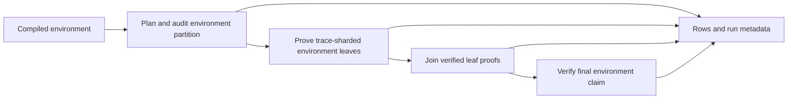

# Bencher benchmarks for environment joins and trace sharding

Status: proposal. Source baseline: `32fddd5e`, 2026-09-23.

Make trace sharding the default proof policy for every Aiur benchmark uploaded
to bencher.dev. Add a whole-environment proof workload that measures proving
environment shards and joining their proofs, with dashboard plots for the
number of environment shards and the number of trace shards in each leaf proof.

The intended dashboard answers:

- How many environment shards did proving Mathlib require at the benchmark's
  fixed memory budget?
- How many trace shards did each environment shard's proof contain?
- How much time, memory, and proof data did joining those environment shards
  require, independently of producing the leaf proofs?
- How do these quantities change across commits?

“Every benchmark” applies to every Aiur **proof-producing stage**, including
recursive verifiers and aggregation. Compile, decompile, out-of-circuit checks,
and the currently scheduled ZisK execution benchmarks do not produce Aiur
proofs. Their existing behavior and metrics remain applicable.

## Existing behavior

The implementation, rather than older descriptions in the benchmarking docs,
is the baseline for this proposal.

| Surface | Current behavior | Gap |
|---|---|---|
| [`BenchCmd.lean`](../Ix/Cli/BenchCmd.lean), `aiur` | Per-constant recursive pipeline; the InitStd prove cell also schedules `Nat.add_comm + String.append` in a separate process. | The pair is already a real join benchmark, but does not measure a complete environment's aggregation tree. |
| [`Typecheck.lean`](../Benchmarks/Typecheck.lean) | `--trace-shards` or `BENCH_TRACE_SHARDS=<GiB>` enables trace sharding for the IxVM proof. Successful proofs report `ixvm-trace-shards`, including one-shard proofs. | Opt-in; the standalone recursive-verifier and pair-join proof calls remain unbudgeted, unsharded paths. |
| `aiur-sharded-env` in `BenchCmd.lean` | Scheduled for ISLB only: `ix shard` then `ix check --ram-budget 100`; reports `shards` for the audited leaf partition. | Execution only. Mathlib is not in this backend's scheduled env set, and there are no leaf proofs or aggregate timing rows. |
| [`ProveCmd.lean`](../Ix/Cli/ProveCmd.lean), [`AggregateCmd.lean`](../Ix/Cli/AggregateCmd.lean) | Production environment proving and aggregation support trace sharding. Aggregation supports wrap-first and direct joins, range trees, and proof caches. | They do not expose the benchmark rows needed for this pipeline. |
| [`BenchReport.lean`](../Ix/Cli/BenchReport.lean) | BMF conversion preserves flat numeric metrics and drops non-`ok` rows; nested numeric maps become `<name>/shard-N` benchmarks. | Nested metadata would accidentally become measurements. Baseline fetching also needs to understand the new row families. |
| [`BenchPlots.lean`](../Ix/Cli/BenchPlots.lean) | Generates plots from static registry row names and explicitly excludes dynamic shard rows. | Per-environment-shard trace counts cannot appear merely by uploading them. `trace-shards` also lacks canonical units and integer formatting. |

There is a claim-scope issue to resolve before enabling the existing flag by
default: ordinary per-constant execution checks the full closure, while the
trace-sharded prove branch calls `shardProveWithEnv` with a singleton owned set.
Without `--join`, this can put full-closure execution measurements and a
singleton `CheckEnv` proof in the same row. A default-policy change must preserve
the measured claim and coverage.

## Two independent shard counts

An **environment shard** owns a nonempty subset of the environment's checkable
constants and proves a `CheckEnv` claim with its boundary assumptions. The
final manifest partitions the owned set; aggregation joins these claims and
discharges the assumptions. Count the final, nonempty leaves actually proven,
after any setup-time refinement, rather than the seed manifest's requested size.

A **trace shard** is a partition of the execution trace inside one proof batch.
For environment leaf `i`, let `K_i` be the verified proof's shard count, read
through `Aiur.Proof.shardCount` or the equivalent native proof accessor. A proof
that fits without splitting has `K_i = 1`. Planning estimates and requested
shard counts are not substitutes for this measurement.

For a successful environment run:

```text
env-shards               = N, the number of nonempty environment leaves
ixvm-trace-shards-total  = sum(K_i), i in [0, N)
ixvm-trace-shards-max    = max(K_i)
```

Wraps, environment joins, trace-range joins, and root wraps can themselves
produce trace-sharded proofs. Record these separately from the IxVM leaf
counts. A trace-range join is not an environment join.

The distributed one-claim mode of `ix prove --distributed` is a different
workload: its execution chunks do not represent independent environment
claims. It must not populate this environment-join series. A future distributed
benchmark would use its own testbed and worker-count metric.

## Default proof policy

Resolve a benchmark proof profile in `ix bench run`, shared by local runs,
main CI, and PR comparisons. The profile contains trace sharding enabled,
explicit memory budgets, retention policy, proof parameters, and aggregation
policy. Resolve it once and pass it to every applicable proof-producing call.

For the existing 128 GB runner class, use **100 GiB as the initial fixed total
prover budget**, matching the current environment benchmark's budget. Keep the
watchdog's process-tree ceiling separate and verify that the profile fits under
it with room for orchestration. A smaller host must select an explicit local
profile; silently shrinking the canonical budget would change shard counts.
This value needs qualification before the new workload is scheduled.

The budget covers live records, retained commitments, buffers, and executions
prepared ahead of proving. Concurrent tasks must reserve from that total;
100 GiB is not a grant to each simultaneous task. Keep normal CPU parallelism
and let memory admission control bound in-flight work. Do not introduce thread
caps to make the benchmark fit.

Pin per-proof planning limits for leaves and recursive stages in the profile
as well. They must not vary with momentary free memory or the number of ready
jobs. The admission gate delays work until its reservation fits; it does not
change a proof's trace count by assigning a smaller budget mid-run.

Apply the policy to:

1. Per-constant full-closure IxVM proofs.
2. Their recursive Multi-STARK verifier proofs.
3. Both singleton children and the proof of the existing pair join.
4. Whole-environment leaf proofs and every proof generated by aggregation,
   including range trees and optional root wraps.

Extend the full-closure native proving path to accept the trace policy while
preserving its original claim. Keep the pair's intentionally singleton claims.
Execution statistics, `constants`, proof production, and native verification
must refer to the same claim within each row. Trace sharding changes the proof
layout, not which constants are checked.

Use the planner's normal one-shard path for small proofs; enabling trace
sharding does not require forcing `K > 1`. If no trace partition fits, report
the failure. Never retry the measured stage unsharded or omit its recursive
stage while presenting the row as complete.

Preserve `BENCH_TRACE_SHARDS=<GiB>` as a local/on-demand budget override, with
strict value validation. Its absence means the canonical trace policy is on;
`0` continues to mean auto-detection locally, not “off.” Add an explicit local
opt-out such as `--no-trace-shards`. Auto-detected budgets, opt-outs, altered
query counts, and other noncanonical profiles must not upload to the canonical
testbed or reuse its baseline. Record any device-cell cap explicitly; the CPU
profile must not inherit an accidental `AIUR_TRACE_SHARD_MAX_CELLS` setting.

Retain the production `auto` retention policy initially and record the selected
policy per proof. Pin its policy version and the current proof parameters in
the profile. Do not lower FRI query counts to make a canonical benchmark fit.

## Whole-environment workload

Add an `aiur-env` backend, with `inputs := perEnv`, default mode `prove`, and
testbed `aiur-env-prove-x64-32x`. Keep `aiur-sharded-env` as the existing
execution-only measurement. The new backend owns the full proof pipeline;
adding aggregation after the execution-only backend would not supply the
required child proofs.

Proposed entry point:

```console
ix bench run --backend aiur-env --env Mathlib --mode prove --ixe Mathlib.ixe
```

The command follows this sequence:



Partition setup starts from the production seed planner at the fixed budget.
Keep its seed policy explicit and versioned. Audit trace feasibility: a
monolithic projected proof exceeding the budget is not itself a reason to
create another environment shard. Refine an environment leaf only when its
execution or retained-record floor prevents any trace plan from fitting.
This needs a trace-aware audit; the existing `ix check --ram-budget` audit
tests monolithic proof fit and cannot be reused unchanged.

Freeze the audited manifest before proof measurement. Validate exact coverage,
unique ownership, and the aggregation tree. Record both seed and final counts
in metadata; only the final proven count becomes `env-shards`. If a frozen
leaf subsequently fails to fit, fail that sample rather than silently changing
the partition during measurement. Initial conservative seed partitions are
acceptable; optimizing the partitioner is separate work.

Prove every nonempty leaf with the trace policy and verify its exact manifest
claim. Then aggregate those proofs through the production controller. Use the
production wrap-first policy initially, with its structural threshold and range
policy recorded. The fixed pair benchmark continues measuring its direct flat
join. Enabling trace sharding alone does not switch either workload's join
policy. Leave optional root wrapping disabled in the initial environment
profile and report the actual root batch size.

Measured leaf and aggregate proofs must be fresh. Bypass proof-index skips and
aggregate cache reads; an isolated run store can hold the fresh leaves consumed
by aggregation. Reusing the compiled `.ixe` and a correctly keyed partition is
setup reuse, not proof reuse. Partition cache identity includes environment
content, planner/profile version, and budget; provenance records the final
manifest digest.

## Rows and measurement boundaries

Use flat, top-level rows for each workload component. Bencher represents the
environment shard in the **benchmark name**; it remains one shared measure
named `ixvm-trace-shards`, not a new measure for every shard index.

| Row key | Meaning | Principal measures |
|---|---|---|
| `Mathlib` | Completed environment pipeline | `constants`, `env-shards`, `ixvm-trace-shards-total`, `ixvm-trace-shards-max`, `total-time`, `pipeline-throughput`, `pipeline-peak-rss` |
| `Mathlib/env-shard-7` | One manifest leaf's verified IxVM proof | `constants`, `ixvm-trace-shards`, `ixvm-prove-time`, `ixvm-peak-rss`, `ixvm-proof-size`, `ixvm-verify-time` |
| `Mathlib/aggregate` | Production aggregation over all verified leaves | `aggregate-prove-time`, `aggregate-peak-rss`, `aggregate-proof-size`, `aggregate-verify-time`, `aggregate-trace-shards`, `aggregate-trace-shards-total`, `join-nodes`, `join-sum-prove-time`, `join-trace-shards-total` |

Per-constant rows additionally gain `fri-verifier-trace-shards`; the existing
pair row gains `join-trace-shards`. Read each from that stage's output proof.

Measurement definitions:

- **Leaf prove time:** execution, trace planning, witness generation, and proof
  production for that leaf. Exclude environment loading and partition setup.
  If execution is prepared ahead of proving, attribute that execution to its
  leaf; measuring only the consumer's final STARK call understates the work.
- **Aggregate prove time:** elapsed time from entry into the fresh aggregation
  controller with verified leaf inputs available until the final proof is
  produced. Include statement/advice preparation, wraps, all joins, scheduling,
  and any range-tree work. Exclude leaf proof generation, initial leaf loading
  and native verification, and the final root verification timed separately.
- **Join sum prove time:** sum of environment-join slot production times inside
  aggregation. This is accumulated slot time, potentially overlapping across
  workers; it is not the aggregation wall time. Internal range work belongs to
  its owning slot and must not be added a second time.
- **Join nodes:** actual binary joins of environment claims. For a complete
  binary aggregation of `N` nonempty leaves, this is `N - 1`. Count leaf wraps,
  range joins, and root wraps separately in detailed metadata.
- **Aggregate trace shards:** trace shards in the final root proof.
  `aggregate-trace-shards-total` sums trace shards across all fresh recursive
  proof batches produced during aggregation, counting each once.
  `join-trace-shards-total` is the subset attributable to environment-join
  slots. Neither includes the input IxVM leaf proofs.
- **Proof size:** serialized output proof bytes for the named leaf or final
  aggregate, using the existing raw-proof convention. Intermediate and input
  proof bytes belong in detailed metadata, not in the root-size metric.
- **Pipeline total:** leaf-production wall time plus aggregation-production wall
  time. The first version has a barrier between these stages. Do not sum
  concurrently produced leaves or add separate diagnostic executions/native
  verification to production time. Report the environment's unique checked
  constants over this duration as pipeline throughput.
- **Peak RSS:** a process-tree high-water mark over the named stage, not a sum
  of individual shard peaks. Pipeline peak includes setup and retained inputs,
  so it describes the memory required to run the workload.

The parent's `constants` counts distinct checkable subjects in the validated
environment union. Boundary dependencies and repeated execution work must not
inflate it. Keep each leaf's owned-set size in metadata alongside its measured
checked-constant count.

An environment with one leaf still has a valid aggregate workload under the
wrap-first policy: `join-nodes` and join work totals are zero, while wrap and
root measurements remain real. Zero is appropriate for no joins, not for a
failed or unmeasured stage.

## Structured output and failure handling

Expose typed measurements from the native leaf and aggregation controllers
through the FFI. Extend the production commands or provide a thin benchmark
adapter over those same controllers. Do not build another aggregation engine
or scrape `[aggregate]`, `[trace-shards]`, or texray log text.

Keep numeric rows at the requested `--out` path and write a versioned
`<out>.meta.json` sidecar (for example, `bench.json.meta.json`) containing:

- Commit, environment identity, benchmark profile, actual budgets, proof
  parameters, planner version, and seed/final manifest digests.
- The expected row set and each row's kind: environment, environment leaf,
  aggregate, constant, or fixed pair.
- Each leaf's manifest ID, owned-set digest, claim digest, proof address, and
  planned versus verified trace count.
- Each aggregate node's operation kind, child identities, owning environment
  slot, proof identity, selected retention, trace count, and timing window.
- Run completion and verification outcomes, including the final coverage and
  assumption-discharge check.

Keep this metadata outside the rows file: the current BMF converter treats
nested numeric objects as shard measurements. A single coordinator writes
rows/metadata atomically as events arrive; concurrent workers must not race
read-modify-write updates to one JSON file.

Introduce `status: incomplete` for flushed in-flight rows. Change a row to
`ok` only after its required measurements and verification succeed. Existing
`rejected`, `oom`, and `crash` outcomes remain visible in local/PR reports and
are excluded from BMF, as is `incomplete`. An unresolved incomplete row or a
missing required row fails the run.

Completed leaves can upload even when a later leaf or aggregation fails. The
aggregate row becomes `ok` only after the root verifies against the expected
environment statement, including coverage and discharged assumptions. The
parent becomes `ok` only after all leaves and aggregation complete. Thus an
environment-count plot has a gap when the full proof fails; planned counts
remain available in the artifact without masquerading as completed work.
Teardown kills preserve success only when these completion conditions were
already recorded.

## Dashboard plots and shard identity

Add the following registry-derived plots:

| Plot | Selected rows | Measure |
|---|---|---|
| Aiur Environment Shards | Environment parents, including Mathlib | `env-shards` |
| Aiur IxVM Trace Shards | Existing per-constant pipelines | `ixvm-trace-shards` |
| Aiur FRI Verifier Trace Shards | Existing per-constant pipelines | `fri-verifier-trace-shards` |
| Aiur Pair Join Trace Shards | Existing fixed pair | `join-trace-shards` |
| Aiur Environment Leaf Trace Shards, Total / Maximum | Environment parents | `ixvm-trace-shards-total` / `ixvm-trace-shards-max` |
| Aiur Mathlib Trace Shards per Environment Shard | Mathlib's active leaf rows | `ixvm-trace-shards` |
| Aiur Environment Aggregation Time / Peak RAM / Root Size | Aggregate rows | `aggregate-prove-time` / `aggregate-peak-rss` / `aggregate-proof-size` |
| Aiur Environment Join Work | Aggregate rows | `join-sum-prove-time` |
| Aiur Environment Aggregate Trace Shards | Aggregate rows | `aggregate-trace-shards-total` |

Generate the per-leaf plot for each registered environment; Mathlib is one
instance, not a special case in the plotting code. Support selecting exact
manifest leaf IDs for a readable chart of a large partition, while the total
and maximum plots always cover every leaf. Never silently truncate a plot's
leaf set. Keep the existing pair join timing plots and distinguish their
titles from environment aggregation.

Extend plot specs with row-family selectors rather than using the backend's
entire row list for every measure. Select parent rows for environment counts,
leaf rows for leaf trace counts, and aggregate rows for aggregation costs.
Register canonical units (`shards`, `nodes`, seconds, bytes) and integer
formatting for all count measures; include `aggregate-` in the stage-prefix
handling and explicit units for summed timings/counts.

For dynamic leaves, `ix bench plots` needs the row index from the most recent
completed main-branch environment run for the selected profile. Publish the
rows and metadata as CI artifacts even on failure, but advance the dashboard's
active leaf set only from a complete run. The plot-sync workflow downloads
that index and resolves its names to Bencher benchmark UUIDs. Do not select
every historical benchmark whose name starts with `Mathlib/` or infer the leaf
set from a maximum shard number. Newly uploaded leaves appear on the next
sync; absent leaves are removed from active plot dimensions without deleting
their history. If the index is unavailable, retain the last managed per-leaf
plot and report the missing input rather than replacing it with an empty plot.
This requires protecting those unresolved plots from the sync's current
deletion of plots outside its desired set.

Use manifest leaf IDs consistently; normalize ordering before upload. An ID
such as `env-shard-7` identifies a slot in that run's partition, not a permanent
set of constants. Its line shows the trace count assigned to that slot over
time. Retain owned-set and manifest digests so partition changes are visible
in the run artifact. Per-leaf base/PR performance ratios require matching
owned-set identity; otherwise show “partition changed” and compare parent
totals instead. Do not fill missing leaf samples with zero or give changing
slot membership automatic per-leaf regression thresholds.

## CI, baselines, and rollout

Keep scheduling, proof profiles, measures, expected row families, and testbed
identity in the typed benchmark registry. Both workflows must use the same
resolution as local `ix bench run`; setting an environment variable only in
`bench-main.yml` would leave PR and local results inconsistent.

Maintain per-push per-constant and pair workloads. Qualify ISLB as the first
environment proof workload, then Mathlib. The proposed steady-state cadence
for whole-environment proof runs is nightly, with explicit dispatch available;
enable that schedule only after measuring its runner/time cost. These are
uploading workloads, so the current `unscheduled` flag, which excludes a mode
from plots, is not a suitable representation. Add a cadence distinction for
uploading cells and keep Mathlib in the plot registry even when it is not a
per-push cell. Dispatches upload only measurements of the specified main SHA;
PR runs remain comparison-only. Qualification and scheduled runs require
separate authorization when implementation reaches that point; this document
does not start them.

Introducing default trace sharding changes proving cost even when claim scope
is preserved. Start `aiur-trace-v1-x64-32x` for the per-constant and pair
pipeline, preserving the old history and mapping the new workload key to its
dashboard titles. The environment pipeline uses its new testbed. Changes to
budget, FRI settings, claim scope, or aggregation policy also require a
deliberate profile boundary. Update the workload reset list in
`bencher-thresholds-reset.yml` alongside the registry.

For PR comparisons, fetch only baselines with the same profile. A base binary
that cannot express the required trace policy is an unsupported baseline,
reported as such; do not silently measure it unsharded and report a speedup.
Use local base runs when compatible measurements are missing. If a new
environment row or shard row is missing, rerun the environment cell rather
than passing names such as `Mathlib/aggregate` through `--consts`. Restore
baseline metadata with metric rows so compatibility checks survive Bencher
round trips. Missing provenance makes per-leaf ratios unavailable.

Initially collect shard counts without alert thresholds. They depend on the
partition, memory profile, and prover policy; fewer shards can trade against
other costs. Keep coverage checks strict. Add timing/size/RAM thresholds after
the new profiles have a usable baseline, with environment aggregate wall time
as the primary join regression signal. Planned counts must never fill gaps in
actual-count series.

After the first successful upload, sync plots with an `ix` binary matching the
new registry and the corresponding row index, first using `--dry-run`. Repeat
the sync when the active partition changes. The workflow's current fallback
to an older cached binary must not silently apply an outdated registry.

## Implementation sequence and acceptance criteria

1. **Policy and claim parity.** Add the shared proof profile and trace policy to
   the full-closure, recursive-verifier, and pair-join proof paths. Verify that
   enabling trace sharding preserves each stage's intended claim and checked
   constants. Require exact output proof shard counts, including `1`.
2. **Production measurements.** Add typed leaf/node measurements, trace-aware
   partition audit, completion rules, and metadata. Instrument the existing
   controllers so child setup is excluded from aggregate timings and cached
   proofs cannot produce fresh timing samples.
3. **Environment backend.** Register `aiur-env`, produce parent/leaf/aggregate
   rows, and validate the final manifest and root. A tiny multi-leaf fixture
   must exercise assumption discharge and successful root verification.
4. **Reporting and plots.** Extend units, formatting, row-family selection,
   baseline compatibility, and active-index discovery. BMF fixtures must show
   a leaf as `Mathlib/env-shard-7` with the shared `ixvm-trace-shards` measure,
   while metadata and incomplete rows stay out of uploads.
5. **Qualification and rollout.** Validate the fixed budget on the scheduled
   runner, collect ISLB and Mathlib samples with recorded cost, then enable the
   agreed cadence and sync the dashboard.

Use small fixtures for automated checks: one-leaf aggregation; a multi-leaf
join; a forced multi-trace proof; per-stage claim equality; no fitting trace
plan; a partial leaf failure; aggregate verification failure; teardown kills;
changed shard membership; missing/expired row indexes; and base binaries
without the new policy. Check count sums against actual verified proof headers
and timing aggregation with synthetic overlapping events. Plot dry-run tests
must cover changed active leaves and preserve unrelated static plot behavior.
Full Mathlib proving is an explicitly scheduled acceptance run, not a unit test.

Rollout is complete when a successful Mathlib sample produces a verified
environment root, an environment-shard-count point, per-leaf trace-count
points, and independently measured aggregation costs, with all Aiur proofs in
that sample and the existing pipeline using the canonical trace policy.
