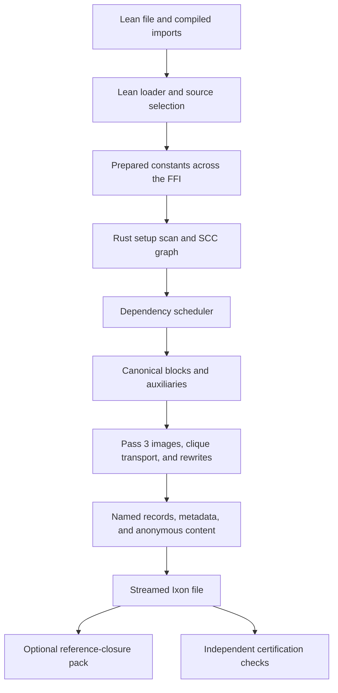

# The Rust compiler: architecture, parity, and trust

`ix compile` loads and selects Lean declarations, then calls the Rust compiler
to write an Ixon artifact. `ix compile-lean` runs the Lean compiler and provides
the byte reference. The pass design and output contract are described in
[compiler passes](compiler-passes.md); the conditions under which an artifact
is certified are described in [compiler certification](compiler-certification.md).

This guide describes source revision
`76231903b4cb79533b4d2f51a227cf3e189932a2`. Its compiler implementation is the
Pass 3-only pipeline tested at `881c2b86`; its certification configuration includes
the separately tested default value-level S checks from `cfe49cb9`. The recorded
results below keep those tested revisions distinct from later documentation
updates and from work that has not landed.

## What is trusted

The Rust compiler is an untrusted producer. Its implementation is not covered
by a compiler-correctness theorem. A function-by-function port, a successful
Rust kernel check, and equality with the Lean compiler's bytes provide different
kinds of evidence; none is a semantic proof of the Rust compiler.

The Lean [Pass 1 theorem library](../Ix/CompileCert/Canon.lean) proves properties
of the Lean canonicalization code, under the hypotheses of its individual
statements. Those theorems do not establish refinement of the Rust functions.
Nor does the presence of a pass called “proof-justified” mean that the Rust
implementation of that pass has a machine-checked correctness proof.

The [certification lane](compiler-certification.md) checks an artifact and its
association with the source regardless of which producer made it. W checks the
source-to-reader correspondence. W+ uses checked theorem and equation rows for
supported changes; an equation route alone need not identify a unique function
value. S checks the documented model pull-back: `StrongCone.sound` preserves
the strong-model structure for unchanged cones, while `StrongCone'.sound` gives
the public value-model conclusion for supported changed cones. The latter does
not additionally transport annotations, graded readings, projection towers or
native Nat laws.

Each conclusion retains its source-domain, reader, receipt, and audit
hypotheses. A successful compiler exit, matching Merkle root, or matching
reference file is not a W, W+, or S verdict. A certificate for an input is not a
proof of all executions of either compiler, and the general compiler image,
rewriting and source-to-model proof obligations remain open. At this revision,
`--strong` includes the value-level changed checks by default;
`--strong-changed` is an enabling alias. Programmatic `Config.strongChanged :=
false` retains the direct/raw-only control; it does not silently give the same
S coverage. A plain certifier invocation without a strong option runs W.

The Rust compiler, the Rust executable checker, and the certified checker are
separate components. See [the kernel guide](kernel.md) for the certified checker's
boundary and runtime trust. This document does not extend it to the Rust
compiler, the FFI, source loading, or the scheduler.

## From a Lean file to an artifact

The diagram summarizes data flow; it does not imply that each box is a single
pass over the environment. In particular, Pass 3 surrounds block compilation
and can introduce canonical constants that require further compile rounds.

1. [The CLI](../Ix/Cli/CompileCmd.lean) builds and loads the input, selects its
   constant list, and calls `prepareRegisteredConstants` before entering Rust.
   [The loader](../Ix/Meta.lean) uses full private-level import content, including
   theorem bodies. For module-mode files, visibility controls selection rather
   than replacing imported proofs with bodyless exported declarations.
2. [EnvScope](../Ix/EnvScope.lean) owns source selection. Selected closures use
   `collectSelectedDeps`: source references, whole logical units, recursors,
   compiler/checker support, and the support declarations introduced by image
   and clique generation. A classic file's unfiltered default retains the full
   import environment; module defaults have their own visible-name closure.
   Rust receives the selected declarations, not a request to rediscover this
   source scope.
3. [The FFI decoder](../crates/ffi/src/lean_env.rs) exposes that input to Rust.
   [The setup scan](../crates/compile/src/graph.rs) gathers references,
   immediate groundedness, and inductive groups. Groundedness propagates along
   dependencies; [condensation](../crates/compile/src/condense.rs) forms the SCC
   blocks used by [the scheduler](../crates/compile/src/compile/env.rs).
4. [The block compiler](../crates/compile/src/compile.rs) canonicalizes and
   serializes declarations, generates auxiliaries, and invokes
   [Pass 3's driver](../crates/compile/src/compile/pass3/driver.rs). Pass 3 creates
   faithful images of changed recursors and auxiliaries, transports supported
   definition cliques, rewrites uses, and emits canonical forms and their
   decompile records.
5. [The production FFI writer](../crates/ffi/src/compile.rs) sorts the constant
   addresses and computes the header root once, then streams the environment
   through `Env::put_file_with_header`. It writes `<out>.tmp` and renames it to
   the requested path. With the default `allow_partial = false`, any reported
   ungrounded requested constant prevents this write. `--allow-partial` writes
   the grounded subset and reports omissions; such an output must not be
   described as successful compilation of the entire request. Use fresh output
   paths when checking this condition, since an older file is not a new result.

The production writer returns the root, omission and decline lists, byte count,
named count, and anonymous constant count. It does not return an environment-sized
Lean `ByteArray`. Its one-shot CLI path deliberately retains the Rust input and
compile state until process exit instead of running their large destructors.
That lifetime choice matters if this entry point is embedded in a long-lived
process.

## Modes and FFI entry points

[Lean's naming module](../Ix/Compile/Pass/Names.lean) and
[Rust's naming module](../crates/compile/src/compile/pass3/names.rs) implement
the same retired-switch contract:

| `IX_PASS3` | Behavior at this revision |
|---|---|
| Unset | Pass 3, the only compiler mode. |
| `images` | Pass 3, with a deprecation note; the variable has no effect. |
| `off` | Refused because the legacy call-site surgery has been deleted. |
| Any other value | Refused as an unknown mode. |

An old `IX_PASS3=off` benchmark is historical evidence about a different
pipeline. It is not an alternate mode that can be selected here. Internal
compatibility parameters are not a supported route to the deleted compiler.

| Lean caller / Rust symbol | Purpose |
|---|---|
| `CompileM.rsCompileEnvBytesFFI` / `rs_compile_env` | Production `ix compile`: compile and stream a named artifact. |
| `CompileM.rsCompileEnvBytesAnonFFI` / `rs_compile_env_anon` | `ix compile --anon`: finalize anonymous hints first, then omit the name, metadata, and commitment sections. |
| `CompileM.rsCompileEnvFFI` / `rs_compile_env_to_ixon` | Return a materialized `Ixon.RawEnv` for in-process consumers and comparisons. |
| `CompileM.rsCompileEnvProfileFFI` / `rs_compile_env_to_ixon_profile` | The materialized path with an explicit validated resource profile, declared in `CompileDriver.lean`. |
| `CompileM.rsCompilePhasesFFI` / `rs_compile_phases` | Expose phase results to diagnostic and comparison code. |
| `Ixon.rsPackEnv` / `rs_pack_env` | Pack a named root from an existing file by reference closure. |

The declarations and callers are in [CompileM](../Ix/CompileM.lean),
[CompileDriver](../Ix/CompileDriver.lean), and the
[pack command](../Ix/Cli/PackCmd.lean); their Rust bodies are in
[FFI compilation](../crates/ffi/src/compile.rs) and
[FFI packing](../crates/ffi/src/lean_ixon/pack.rs). These are ordinary FFI calls,
not proof-producing interfaces.

`ix compile-lean --rust-check` invokes the production Rust byte path on the same
prepared constants and compares complete serialized output. Its `ALIGNED` line
means exact byte equality for that run, using Lean's `Ixon.serEnv` and Rust's
writer. This exercises more than a comparison of root hashes. Both sides still
share the input loader and parts of the runtime/FFI infrastructure; agreement
does not prove either implementation correct. The comparison and its serial
resource-control option are in
[CompileLeanCmd](../Ix/Cli/CompileLeanCmd.lean).

## Module map

The main Rust modules outside Pass 3 are:

| Rust module | Responsibility / Lean point of comparison |
|---|---|
| [`graph.rs`](../crates/compile/src/graph.rs), [`ground.rs`](../crates/compile/src/ground.rs), [`condense.rs`](../crates/compile/src/condense.rs) | Input reference graph, groundedness, and SCCs; compare the Lean graph/ground/condensation work driven by `CompileDriver`. |
| [`compile.rs`](../crates/compile/src/compile.rs) | Block state, expression and universe compilation, canonical comparisons, name claims, and metadata. Compare `CompileM` and `Compile/Canon/**`; this is not a line-for-line correspondence. |
| [`compile/aux_gen.rs`](../crates/compile/src/compile/aux_gen.rs), [`aux_gen/nested.rs`](../crates/compile/src/compile/aux_gen/nested.rs), [`aux_gen/recursor.rs`](../crates/compile/src/compile/aux_gen/recursor.rs) | Canonical auxiliary generation, including nested inductives and recursors. |
| [`compile/env.rs`](../crates/compile/src/compile/env.rs) | Whole-environment setup, scheduling, publication, status, and hint finalization. |
| [`compile/admission.rs`](../crates/compile/src/compile/admission.rs), [`memory.rs`](../crates/compile/src/compile/memory.rs), [`validation.rs`](../crates/compile/src/compile/validation.rs) | Memory telemetry, worker admission, and cooperative validation retry. These are resource controls, not semantic validation theorems. |
| [`compile/block_txn.rs`](../crates/compile/src/compile/block_txn.rs) | Journal newly published names and defer dependent releases for the normal scheduled-block path. |
| [`decompile.rs`](../crates/compile/src/decompile.rs) | Reconstruct declarations from Ixon content and metadata. |
| [`ixon/env.rs`](../crates/ixon/src/env.rs) | Output environment operations, serialization support, and reference-closure pruning; this module is in the `ixon` crate. |

The following paths are relative to `Ix/Compile/` on the Lean side and
`crates/compile/src/compile/pass3/` on the Rust side. The source's own
[Pass 3 map](../crates/compile/src/compile/pass3/mod.rs) is the starting point:

| Lean | Rust | Role |
|---|---|---|
| `Pass/Names.lean` | [`names.rs`](../crates/compile/src/compile/pass3/names.rs) | Reserved names, image display names, and switch handling. |
| `Canon/Expr.lean`, `Image/Expr.lean`, selected `Clique/Dag.lean` helpers | [`expr.rs`](../crates/compile/src/compile/pass3/expr.rs) | Locally nameless expression operations, substitutions, and DAG walks. |
| `Image/Develop.lean` | [`develop.rs`](../crates/compile/src/compile/pass3/develop.rs) | Image development and hereditary substitution. |
| `Image/Spec.lean` | [`spec.rs`](../crates/compile/src/compile/pass3/spec.rs) | Canonical block descriptions consumed by image generation. |
| `Image/Build.lean` | [`build.rs`](../crates/compile/src/compile/pass3/build.rs) | Construct recursor images and their rule terms. |
| `Pass/ImageView.lean` | [`view.rs`](../crates/compile/src/compile/pass3/view.rs) | Reconstruct a changed block's canonical view and expansion lookup. |
| `Pass/Translate.lean` | [`translate.rs`](../crates/compile/src/compile/pass3/translate.rs) | Rewrite occurrences, collect declines and source records, emit canonical constants. |
| `Pass/SideCar.lean` | [`sidecar.rs`](../crates/compile/src/compile/pass3/sidecar.rs) | Rename display metadata while retaining computational addresses. |
| `Pass/Driver.lean` | [`driver.rs`](../crates/compile/src/compile/pass3/driver.rs) | Integrate views, images, pass hooks, canonical compile rounds, and sidecar edits. |
| `Pass/Opt/{Core,Engine,O1..O6,O11a}.lean` | [`opt.rs`](../crates/compile/src/compile/pass3/opt.rs) | Definitional optimization shapes, checks, and engine dispatch. |
| `Pass/Opt/{Packed,O7,O8,O9,CollapseRec,O10,O12,O11b}.lean` | [`pj.rs`](../crates/compile/src/compile/pass3/pj.rs) | Proof-justified rewrites, handler retyping, and the O11b unit pass. |

The [clique map](../crates/compile/src/compile/pass3/clique/mod.rs) refines the
transport part:

| Lean | Rust under `pass3/clique/` |
|---|---|
| `Clique/Basic.lean` and shared DAG helpers | [`basic.rs`](../crates/compile/src/compile/pass3/clique/basic.rs) |
| `Clique/{Packing,PackingMatch}.lean` | [`packing.rs`](../crates/compile/src/compile/pass3/clique/packing.rs) |
| `Clique/{Telescope,Whnf}.lean` | [`telescope.rs`](../crates/compile/src/compile/pass3/clique/telescope.rs) |
| `Clique/{WF,WFSchema,WFMatcher,WFConjugation}.lean` | [`wf.rs`](../crates/compile/src/compile/pass3/clique/wf.rs) |
| `Clique/Structural.lean` | [`structural.rs`](../crates/compile/src/compile/pass3/clique/structural.rs) |
| `Clique/{PartialFixpoint,PFConjugation}.lean` | [`pf.rs`](../crates/compile/src/compile/pass3/clique/pf.rs) |
| `Clique/{Transport,Plan}.lean` | [`transport.rs`](../crates/compile/src/compile/pass3/clique/transport.rs) |
| `Clique/Recover.lean` | [`recover.rs`](../crates/compile/src/compile/pass3/clique/recover.rs) |
| `Canon/{Order,Classes,Clique}.lean` for clique order | [`order.rs`](../crates/compile/src/compile/pass3/clique/order.rs) |
| `Pass/Cliques.lean` | [`hook.rs`](../crates/compile/src/compile/pass3/clique/hook.rs) |

[`Clique/FixPerm.lean`](../Ix/Compile/Clique/FixPerm.lean) is a proof module and
has no Rust port. The Rust crate also does not port the compiler-certification
theorem library. Source closure producers remain Lean code called before the
compile FFI. There is no `ixon::unit` module or whole-unit output pack in this
revision.

## Names, ownership, and decompilation

The `_ix` prefix is reserved for compiler components; an input name with a
string component starting with `_ix` is rejected. The changed block's canonical
Ix auxiliaries are displayed as `x._ix.S`, with nested recursors named by
canonical position. The Lean name `x.S` retains the contract's faithful image.
Proof-justified rewrites normally retain the faithful form under the Lean name
and emit the canonical form under an `_ix` name. Handler helpers use
`_ix_retyped`; O12 also has a pair-valued helper. The detailed name/output
contract belongs to [compiler passes](compiler-passes.md).

Transported clique members and carried lemmas have ownership checks of their
own. “Ownership” here concerns where recursive uses may occur in the transport;
it is distinct from ownership of a published name in the shared compile state.
The structural transport's memo includes the binder-context digest and the
ownership mode. That distinguishes member visits from visits to carried lemmas
with the check disabled; it is not a proof that every possible layout sharing
the transport state is interchangeable.

The source occurrence behind a rewritten call site is retained through
`_ix.inline` / `_ix.inline_meta` records and compiled into metadata. Named records
also carry hints and optional `original` provenance. The anonymous content
address is not an identity for this entire display record: parity must compare
metadata, original provenance, and hints as well as addresses. Strict-anonymous
output intentionally excludes the display layer after deriving its anonymous
hints.

## Scheduling and publication

The Rust scheduler releases a block when its required dependencies have
completed, using the setup graph plus auxiliary and clique scheduling edges.
`IX_COMPILE_WORKERS=N` sets its worker ceiling, capped by available parallelism;
without it, the default is available parallelism. Adaptive admission can lower
the active count in response to memory pressure. `IX_COMPILE_ADAPTIVE=0` selects
fixed admission. `RAYON_NUM_THREADS` controls Rayon work and is not a substitute
for `IX_COMPILE_WORKERS`. Lean's `compile-lean --workers` controls the separate
Lean driver.

With `IX_VERBOSE` or `IX_COMPILE_DBG` present, Rust prints phase/progress output
and logs its scheduler ceiling as `[compile_env] starting:`. Use that line when
recording a worker-count experiment. `IX_LOG_BLOCKS` enables per-block
diagnostics. `IX_COMPILE_EAGER=1` selects eager input decoding and
`IX_COMPILE_DEMOTE=0` retains materialized accumulator caches. Resource controls
can change memory use and timing; finite byte gates do not prove all settings
equivalent. Admission and cooperative validation retry are soft controls, not
hard allocator limits.

A block gets a fresh kernel context. The cache addresses used by that context
erase names, while generated metadata must retain the current block's names;
reusing it across unrelated blocks could replay a different alias's display
name. The driver uses dedicated large-stack threads for recursive rewrite and
transport work, bypassing that work for blocks that do not need it.

For scheduled compilation, `BlockTxn` records newly published `Named`,
compiled-name, auxiliary-name, and Pass 3 head/block entries. Original metadata
and reducibility-hint writes are staged until all compilation and promotion
claims succeed. Failure removes newly recorded bindings; failed original-form
promotion also withdraws that source block's earlier provisional bindings from
both address maps and the named registry. An identical existing claim is not
newly owned or logged by the normal transaction. Anonymous content and blobs
remain in their content-addressed tables.

A source auxiliary releases dependents only when its own scheduled block has
finished original-form validation. Failed blocks settle those edges too, so
dependents report missing reads and independent blocks can continue. Generated
names without a source block can still release immediately after their producer.

This mechanism is not a proved atomic-publication guarantee for every path;
identical claims shared with a concurrently failing owner still need the general
ownership argument. Lean checks claims using a block snapshot plus its own state
and later merge; Rust consults live shared tables. A conflict can therefore be
detected at a different point. The claim-conflict fixtures below exercise concrete
cases; they do not discharge a general failed-block theorem.

The scheduler contains `catch_unwind`, but the workspace's
[`Cargo.toml`](../Cargo.toml) selects `panic = "abort"` for both development and
release profiles. The source's catch is therefore not a promise that a panic
in those production builds becomes a recoverable block failure. It also cannot
recover process aborts, stack overflow, or out-of-memory termination.

## Cache boundaries

These tables have different lifetimes and admission rules. Calling all of them
“the cache” obscures which input and context a hit reuses.

| Table / owner | Key and lifetime | Boundary |
|---|---|---|
| `BlockCache.exprs`, expression metadata arena | Expression address, current constant within a block | Expression results and metadata roots are reused together; these are not cross-constant display records. |
| `BlockCache.univ_cache` | Level plus universe-parameter-context key, per block | A named universe parameter's index depends on the constant's parameter list. `canon_cache` separately handles positional universe trees. |
| `Pass3State.heads`, `blocks`, `canon_recs`, `components` | Names, one compilation | Records connecting source blocks to their compiled canonical forms; not arbitrary context-free expression memos. |
| `Pass3State.cliques`, `clique_roots`, `clique_refs`, `block_refs` | Member/block names, one compilation | Scheduling, encoding-reference, and clique membership information. |
| `Pass3State.views` | Block key, one compilation | Shared only if every original block member was already compiled **before** the view was built. |
| `Pass3State.opt_blocks`, `image_exps` | Block / raw recursor name, one compilation | Use the same admitted stable view, checked by `Arc::ptr_eq`. Shared image entries are restricted to raw recursors; other expansions keep local context. |
| `Pass3State.clique_plans` | First clique member, one compilation | First computed outcome retained. Rust inserts at plan time; Lean merges a block's memo with its state. |
| `Pass3State.non_canonical` | Constant name, one compilation | A later recorded cause can replace an earlier one; this table is not insert-once. |
| `RwState.cache`, `decline_cache`, `exps`, `level_cache` | Rewrite-local expression/mode/site or name/level keys | Reuse a rewritten term with its recorded declines; shared expansions are rewritten without a definition site. |
| `DevState` | Rewrite/development-local expression, depth, and substitution keys | Holds loose-range, lifting, lowering, occurrence, and substitution tables. Its tables have different dependencies from a whole block view. |
| Clique DAG and WF-walk memos | Call-local subterm keys, with binder depth and fuel where the walk depends on them | New WF memoized visits retain the fuel key and do not cache a visit that advances the fresh-variable counter. |
| Structural transport `Tm.cache_own` | Term digest, context digest, ownership mode, within the transport state | The layout and fuel are not in this key. Its existing reuse scope must not be generalized to arbitrary layouts or fuel values. |

[`Clique/Dag.lean`](../Ix/Compile/Clique/Dag.lean) explicitly separates two
implementation requirements: constructor-consistent cached hashes justify
identity shortcuts, while run-local key faithfulness is needed to justify
hash-only memo hits. Constructor consistency does not rule out collisions.
The Rust expression and transport memos likewise use content hashes in their
keys; a full-size digest is still a digest, not structural confirmation.
Agreement of hash-valued regression outputs is not a proof of structural
equivalence on arbitrary expressions. These implementation qualifications do
not add a hidden assumption to the certified checker's theorem statements.

Lean has a recomputation/corruption-control mode,
`IX_PASS3_CHECK_PLANS=1`, for its plan memos. Rust has no corresponding mode.
The `pass3-plan-cache` suite exercises Lean drivers, not Rust's tables.

## Packing follows output references

[`ix pack`](../Ix/Cli/PackCmd.lean) operates on an existing artifact and a
displayed root name. The Rust
[`Env::prune_to_closure`](../crates/ixon/src/env.rs) semantics carry the root's
transitive value references, blobs, and anonymous hints. The named form also
carries required display metadata, name components, metadata DAG references,
and constants named by metadata such as mutual `all` members and constructors.
Metadata can introduce new work, so pruning runs to a fixed point.

A metadata `original` address is followed when the source actually stores it
or it is an assumed cut point; an unstored auxiliary original remains
provenance. A declared assumption stops traversal only if reached, and the
main root cannot itself be assumed. The result is checked for value-reference
closure before writing. This closure check is not a semantic certificate.

The production named path uses `prune_to_closure_streaming` over a memory-mapped
input rather than materializing all metadata. `--anon` uses
`prune_to_closure_anon`, carrying the value closure and hints without display
metadata. Neither mode completes an output compilation unit. Metadata edges
can still cause sibling records to be carried, so “reference closure” is not
synonymous with “only references visible in the root's value expression.”

The independent Lean oracle is
[`PackParity.packOracle`](../Tests/Ix/Compile/PackParity.lean). The historical
suite name `pack-units` does not restore the removed unit-packing semantics.

## Port differences and test limits

The following differences must be accounted for when extending the port:

| Topic | Actual scope at this revision |
|---|---|
| Block views | Rust reads the classes and nested permutation recorded when each component compiled; Lean reconstructs its canonical view. The `canon-pass1` and parity gates test their agreement on selected inputs, not a Rust refinement theorem. |
| Iteration order | Lean uses its set order for some clique record numbering and first-refusal selection; Rust uses pretty-name order. Record placeholders are resolved to compiled metadata locations. Tested byte equality does not prove arbitrary malformed inputs have identical diagnostic text. |
| Stable clique scheduling sort | Rust caches each full pretty-name string before a stable sort. Equal pretty keys retain their input-relative order. The test exercises three structurally different `F.1` names and neighboring keys; it is not a proof of arbitrary scheduler determinism. |
| Plan insertion and checks | Rust fills plans at computation time; Lean merges them with block state. Only Lean has plan recomputation/corruption checks. |
| Bounds and failure | Lean's `get!` and Rust indexing do not have the same out-of-bounds behavior. Do not infer an all-input failure-equivalence result from valid fixture runs or from the presence of `catch_unwind`. |
| Inductive comparator keys | Rust's `compare_indc` still compares `is_rec` and `is_unsafe` before the remaining fields. This guide does not claim the proposed removal happened or settle whether it should happen. |
| Reserved-name claims | Snapshot/merge checks in Lean and live-table checks in Rust differ as described above. O12's `p._ix.fg` helper can share a spelling family with clique canonical names; the clash checks remain relevant. |
| Generic optimization callbacks | The public `rewrite_block` keeps the no-site retry after a proof-justified result. Only the production definitional-first engine uses `rewrite_block_ordered` to omit the redundant retry. |
| PJ preconditions | O9, O10, and O12 now test `pj_allowed` before their expensive reading/retyping. The earlier late-check implementation is not the current port. |
| Schedule coverage | `compile-schedule-identity` has sequential, wave, and whole-pipeline **Lean** legs. It contains no Rust scheduler leg. Repeated Rust byte checks on selected inputs are narrower evidence. |

The comparison suite's “slice-2/3/4 checked” counters are coverage diagnostics,
not disjoint categories or pass-activation counters. A transported clique's
canonical names can be included in more than one count.

## What the gates check

See [compiler gates and records](compiler-gates.md) for suite selection, record
consumers, CI/manual status, and re-recording. The Rust-relevant comparisons are:

| Check | Assertion and scope |
|---|---|
| [`pass3-rust-parity`](../Tests/Ix/Compile/Pass3RustParity.lean) | Compiles the same prepared constants with both compilers. Excluding synthetic `Muts` entries, compares address, metadata, optional original, and hints; one-sided names fail. Compares failure-name membership and non-canonical `(name, cause)` entries. Failure messages are printed, not compared. Synthetic `Muts` counts and whole-file `BYTE-IDENTICAL` are diagnostics, not independent exit predicates. |
| The parity suite's pack leg | On the **Lean artifact**, enforces Rust/Lean-oracle pack byte equality for selected roots, with metadata and the first root anonymously. Defaults to 10 roots per compile unit; explicit root selection and budget must be recorded. It is not exhaustive packing of the library. |
| [`compile-lean --rust-check`](../Ix/Cli/CompileLeanCmd.lean) and frozen library byte gates | Enforce whole serialized-file equality, separately from parity's per-name checks. `ALIGNED` identifies the compared run; the frozen-reference gate also needs the exact input, binary, mode, reference, size, and `cmp` evidence. |
| [`pack-units`](../Tests/Ix/Compile/PackUnits.lean), [`PackParity`](../Tests/Ix/Compile/PackParity.lean) | Exercise reference-closure bundles, reachable cut points, and the independent Lean oracle. The retained suite name is historical. |
| [`clique-ownership`](../Tests/Ix/Compile/CliqueOwnership.lean) and parity's `co-*` units | The ownership suite tests transport behavior; the parity compile-unit legs run the corresponding inputs through the actual Rust compiler as well. An ownership helper test alone does not establish full compilation parity. |
| [`compile-closure-whole`](../Tests/Ix/Compile/ClosureWhole.lean) | Compares selected Lean source closures with the whole compile, tests omitted support, and runs Rust on the same closures. This is input selection coverage, not output unit packing. |
| [`compile-claim-conflict`](../Tests/Ix/Compile/ClaimConflict.lean) | Exercises conflicting/identical claims, promotion and wave controls, and Rust/Lean refusal/cascade behavior on constructed inputs. |
| [`ixon-corpus`](../Tests/Ix/Compile/Corpus/Run.lean) parity phase | Implements complete serialized Rust/Lean comparison on the corpus units selected by the invocation. A recorded run over one selection does not cover all possible corpora. |
| Rust workspace tests and compiler controls | Exercise implementation details, including stable equal-key scheduling order, generic callback retry, memo/fuel/fresh-counter controls, serialization, and packing. The release test command and CI feature/profile choices are documented in the gates guide. |
| [`compile-schedule-identity`](../Tests/Ix/Compile/ScheduleIdentity.lean), [`pass3-plan-cache`](../Tests/Ix/Compile/PlanCache.lean) | Lean schedule and cache controls; useful to the reference compiler, but not Rust scheduler/cache verification. |

### Recorded source-specific results

These receipts are dated 2026-10-08 and use Lean 4.34.1. The combined compiler
and default-S follow-up have their own gates; earlier worker results retain
their original scope. Subsequent documentation commits do not create new test
or timing observations. None of these runs establishes quiet-machine
performance. The [gate guide](compiler-gates.md#recorded-runtime-observations)
also distinguishes coarse command intervals from instrumented timings.

| Tested revision | Recorded scope |
|---|---|
| Combined `881c2b86be98ab77fa29d58daef7a6a798a556d7` | Full 63-stage compiler integration gate and seven supplemental suites passed, including the full Lean schedule/cache controls, release Rust checks, certification/kernel/model/fidelity checks, and Init+Std mode/byte/pin controls. Both default Mathlib compilers matched the frozen artifact with exact size, SHA-256 and `cmp`; full source/native/import postchecks passed. The earlier attempt that added a previously absent benchmark import is a retained provenance failure, not the accepted gate. |
| Default-S follow-up `cfe49cb95ee8f0f953e253a4a47a50181dbc390f` | Strict build, primary tests, certification and lint passed. Both Init+Std compiler outputs remained exact. With `--strong --strong-global` and no `--strong-changed`, all 117,694 per-name results match the explicit-flag baseline: W and S each report 116,768 certified, 926 unsupported, 0 blocked and 0 rejected; S reports 0 not reached and 41 value-certified. Non-timing cone/equation multisets also match. This is the configured Init+Std result, not a completed Mathlib S result. |
| M6 `9c28e0eeb2dcaf23288672435d50fad267d0f83b` | Full fixture parity: 124 units, 0 defects, 0 unit failures; whole Init+Std parity green. Primary tests: 4,032 checks, 0 failures. Rust workspace tests: 1,731 passed, 0 failed, 20 ignored. Full Lean schedule/cache controls and the named packing/closure/ownership suites passed. Both default compilers matched the frozen Init+Std and Mathlib files; Init+Std also reported `ALIGNED`. |
| PERF `bae05065` | Full fixture and Init+Std parity, Lean cache/schedule controls in the recorded scope, certification checks, and four before/after Mathlib byte legs were sealed before the final sort follow-up. |
| PERF `3a889b60251f3d3c8742ba9aa88a5f3dbf7ade7e` | Stable cached-key sort follow-up: focused equal-key ordering control, Rust formatting, Clippy, release workspace tests, and exact Init+Std/Mathlib byte gates. The earlier full-suite run was not repeated on this tip. |

The frozen named-output references in those library receipts are:

| Input reference | Bytes | SHA-256 |
|---|---:|---|
| Init+Std `initstd-a3.ixe` | 256,128,289 | `a2e22ee7f8d0fcf0d607047dda7d83749f20886f2d03f1cbaf2ede3a7d1ba676` |
| Mathlib `mathlib-a3.ixe` | 2,376,572,399 | `d0427adf7b995f7f48c6fe5fa069c5d3a3d5c10c6f061425729e87339f6bf6db` |

These identify the compared artifacts; a hash alone does not preserve the
loaded-input provenance or establish meaning. Keep the complete command,
source and binary identities, toolchain/import identities, failure/decline
summaries, output size, and exact comparison in a gate receipt. A new source or
toolchain revision needs its own gate rather than inheriting the table's result.

Performance comparisons must retain each timer's scope. Rust's CLI benchmark
includes compilation, serialization and writing; Lean reports its compile and
serialization phases separately, and whole-command timing additionally includes
input preparation and its cached dependency-build call. Workers, imported inputs,
source/binary identities, RSS and concurrent load belong with the result. The
older tables in [pipeline benchmarks](../BENCHMARKS.md) are explicitly historical
and predate Pass 3; they are not fresh measurements of this revision. The Rust
checker, Lean `Ix.Tc`, and certified per-record checker are different paths, so
their timings must not be substituted for one another.
